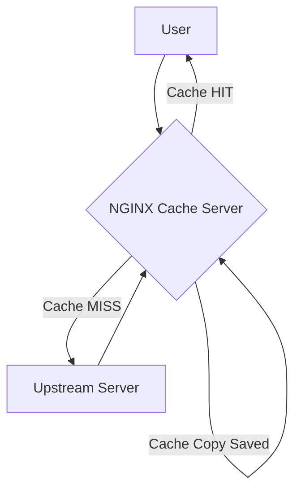

# NGINX Caching Summary

## Introduction

Caching is like a memory for your website. When someone visits a page, the server saves a copy. The next time someone visits that page, the server gives them the saved copy instead of creating a new one from scratch. This makes the website faster and uses fewer resources.

## Main Benefits

- **Faster website:** Content is delivered quicker.
- **Less load:** Your main servers don't have to work as hard.
- **Better user experience:** Visitors are happier with a fast site.

---

## Traffic Diagram

This diagram shows how caching works between a user, NGINX, and the main server (upstream).



**Explanation:**

1.  **User** makes a request to the **NGINX Cache Server**.
2.  **NGINX** checks if it has a saved copy (Cache HIT).
    - If **YES**, it sends the copy directly to the user.
    - If **NO** (Cache MISS), it asks the **Upstream Server** for the content.
3.  **Upstream Server** sends the content back to **NGINX**.
4.  **NGINX** saves a copy of the content and sends it to the user.

---

## Problems and Solutions

This section lists common caching problems and how to solve them using NGINX.

### 1. Problem: Where to store the cache?

You need to tell NGINX where to save the cached files and how much memory to use.

**Solution:** Use `proxy_cache_path` to define the storage location and memory zone.

### 2. Problem: The "Thundering Herd"

Many users request the same uncached file at the same time. This causes a huge load on the upstream server.

**Solution:** Use `proxy_cache_lock` so that only one request goes to the upstream server. Other requests wait for the first one to finish.

### 3. Problem: Showing wrong content to the wrong user

Sometimes, you need to cache dynamic content, but you must make sure User A doesn't see User B's data.

**Solution:** Create a custom cache key using `proxy_cache_key`. For example, you can include a user's ID or cookie in the key to separate their data.

### 4. Problem: You need to bypass the cache for testing

When you are debugging or testing, you don't want to see old, cached data.

**Solution:** Use `proxy_cache_bypass`. You can set a special header in your request, and NGINX will skip the cache.

### 5. Problem: How to make caching even faster?

You can ask the user's browser to save a copy of the files. This means they don't even have to ask NGINX again.

**Solution:** Use the `expires` and `add_header` directives to tell the browser how long to keep the files.

### 6. Problem: How to remove a specific file from the cache?

Sometimes you update a file and need to remove the old version from the cache.

**Solution (NGINX Plus only):** Use the `proxy_cache_purge` directive. You can send a special request (like `PURGE`) to remove a specific cached item.

### 7. Problem: Big files are inefficient to cache

Caching a whole large video file is slow. If a user only wants a small part of it, you might be wasting time and space.

**Solution:** Use the `slice` directive to cache the file in smaller pieces. This is great for video streaming.

---

## Configuration Syntax

Here are the main configuration blocks you'll use.

### 1. Defining a Cache Zone

This goes inside the `http` block.

```nginx
http {
    proxy_cache_path /var/nginx/cache # Where to save the files on the disk
                     keys_zone=CACHE:60m  # Name of the cache zone and memory size
                     levels=1:2           # How to organize the files in folders
                     inactive=3h          # Remove files if not used for 3 hours
                     max_size=20g;        # Maximum total size of the cache on disk

    proxy_cache CACHE; # Use the cache zone named "CACHE"
}
```

### 2. Cache Locking

This is used inside a `server` or `location` block.

```nginx
location / {
    proxy_cache_lock on;          # Only one request goes to the upstream
    proxy_cache_lock_age 10s;     # If the first request is too slow, another can try
    proxy_cache_lock_timeout 3s;  # If a request waits too long, let it go to the upstream
}
```

### 3. Custom Cache Key

This defines what makes a cache item unique. Use it inside a `server` or `location` block.

```nginx
location / {
    # Cache based on host, URL, and a user cookie
    proxy_cache_key "$host$request_uri $cookie_user";
}
```

### 4. Cache Bypass

This tells NGINX to skip the cache. Use inside a `server` or `location` block.

```nginx
location / {
    # If the HTTP header "Cache-Bypass" is set to a non-zero value, skip the cache
    proxy_cache_bypass $http_cache_bypass;
}
```

### 5. Client-Side Caching (Browser Caching)

This is used inside a `location` block to tell the browser to save files.

```nginx
location ~* \.(css|js)$ {  # For CSS and JS files
    expires 1y;            # The browser should keep them for 1 year
    add_header Cache-Control "public"; # Allow any intermediate cache to store it
}
```

### 6. Cache Purging (NGINX Plus Only)

This is used in a `server` block to allow removing items from the cache.

```nginx
map $request_method $purge_method {
    PURGE 1;   # If the request method is "PURGE", set the variable to 1
    default 0; # Otherwise, set it to 0
}

server {
    # ...
    location / {
        proxy_cache_purge $purge_method; # Purge the cache if the variable is set to 1
    }
}
```

### 7. Cache Slicing (For Large Files)

This is used to cache big files in chunks.

```nginx
http {
    proxy_cache_path /tmp/mycache keys_zone=mycache:10m;

    server {
        proxy_cache mycache;        # Use the cache zone
        slice 1m;                   # Break the file into 1MB pieces
        proxy_cache_key $host$uri$is_args$args$slice_range; # Key includes the slice range
        proxy_set_header Range $slice_range; # Ask the upstream for that specific piece
        proxy_http_version 1.1;      # Need HTTP 1.1 for byte ranges
        proxy_cache_valid 200 206 1h; # Cache successful responses for 1 hour

        location / {
            proxy_pass http://origin:80;
        }
    }
}
```
