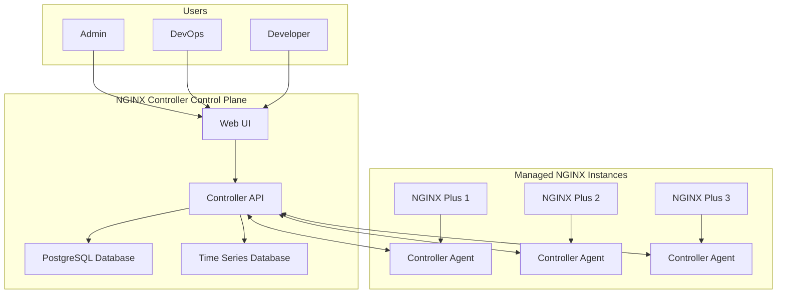
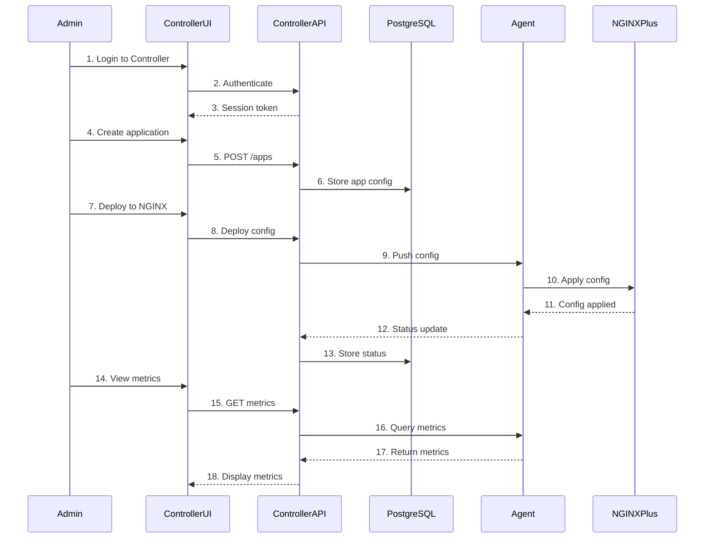

# Introduction to NGINX Controller Summary

## Introduction

NGINX Controller is an **application-centric control plane** for managing multiple NGINX Plus servers from a single interface. It allows teams to focus on applications rather than raw NGINX configuration.

### Key Features

| Feature | Description |
|---------|-------------|
| **Single Control Plane** | Manage all NGINX Plus instances from one place |
| **Application-Centric** | Organize by applications, not servers |
| **Multi-Environment** | Dev, staging, production in one view |
| **WAF Integration** | App Protect security management |
| **API-Driven** | Everything is configurable via API |
| **Analytics** | Metrics and dashboards for all instances |

---

## NGINX Controller Architecture



---

## Controller Views

### 1. Platform View
- **User Management**: Add/remove users, permissions
- **Agent Management**: Monitor connected NGINX instances
- **System Settings**: SMTP, certificates, global settings

### 2. Infrastructure View
- **NGINX Instances**: All connected servers
- **Metrics**: CPU, memory, network, NGINX-specific
- **Health Status**: Up/down, performance

### 3. Services View
- **Applications**: Group components by app
- **Environments**: Dev, staging, production
- **Gateways**: API gateways and routing
- **APIs**: API definitions and policies

### 4. Analytics View
- **Metrics Dashboard**: Visualize application performance
- **Security Events**: WAF violations and attacks
- **Trends**: Historical analysis

---

## Traffic Diagram: Controller Management Flow



---

## Problems and Solutions

### 1. Problem: You need to install and set up NGINX Controller

**Solution:** Follow the official installation guide. NGINX Controller installs as a Kubernetes stack. Key requirements include:
- External PostgreSQL database
- Time series database volume
- SMTP server for user invites
- Valid SSL/TLS certificates

---

### 2. Problem: You need to connect NGINX Plus instances to Controller

**Solution:** Install the Controller Agent on each NGINX Plus instance. The agent communicates with Controller via API.

---

### 3. Problem: You want to automate Controller configuration

**Solution:** Use the Controller API. Everything you can do in the UI is available via API.

---

### 4. Problem: You need to enable WAF through Controller App Security

**Solution:** Install App Protect on NGINX Plus, then enable WAF in the App component configuration.

---

## Configuration Syntax

### 1. Controller Installation Overview

#### Prerequisites

```bash
# Required tools
- Kubernetes (minikube or production)
- kubectl
- jq
- PostgreSQL (external)
- SMTP server (for email invites)

# Minimum requirements
- 4 vCPU
- 16 GB RAM
- 50 GB storage
```

#### Installation Steps

```bash
# 1. Download the installation tarball
wget https://downloads.nginx.com/controller/controller-3.x.tar.gz

# 2. Extract the tarball
tar -xzf controller-3.x.tar.gz

# 3. Run the installer
cd controller-installer
./install.sh

# 4. Provide required information during installation
# - PostgreSQL connection details
# - Time series database volume
# - SMTP server settings
# - FQDN for Controller
# - Admin user credentials

# 5. After installation, access Controller
# https://{controller-fqdn}/
```

#### Helper Script Commands

```bash
# Check prerequisites
./helper.sh prereqs

# Build support package for NGINX Support
./helper.sh supportpkg

# View Controller logs
./helper.sh logs

# Configure SMTP after installation
./helper.sh config smtp
```

---

### 2. Connecting NGINX Plus with Controller

#### Install Controller Agent

```bash
# 1. Generate API key in Controller UI
# Platform → API Keys → Create

# 2. Download and run the agent installer
curl -k https://{controller-fqdn}:8443/install/agent | \
    sudo bash -s -- \
    -fqdn {controller-fqdn} \
    -key {api-key}

# 3. Start the agent service
sudo systemctl start controller-agent
sudo systemctl enable controller-agent

# 4. Verify agent is running
sudo systemctl status controller-agent
```

#### Agent Configuration File

```yaml
# /etc/nginx-controller-agent/agent.conf
controller:
  endpoint: https://controller.example.com:8443
  verify_host: false
  api_key: "your-api-key-here"

agent:
  hostname: "nginx-node-01"
  tags:
    - environment:production
    - region:us-west-2
    - team:platform

logging:
  level: info
  file: /var/log/controller-agent/agent.log
```

#### Verify Connection in Controller UI

1. Navigate to **Infrastructure → Instances**
2. The new NGINX Plus instance should appear
3. Click on it to view metrics and configuration

---

### 3. Driving NGINX Controller with the API

#### API Authentication

```bash
# Login to get access token
curl -X POST https://{controller-fqdn}:8443/api/v1/auth/login \
    -H "Content-Type: application/json" \
    -d '{
        "username": "admin@example.com",
        "password": "your-password"
    }'

# Response includes access token
{
    "access_token": "eyJhbGciOiJIUzI1NiIsInR5cCI6IkpXVCJ9..."
}
```

#### Using the API

```bash
# Set token in environment
TOKEN="eyJhbGciOiJIUzI1NiIsInR5cCI6IkpXVCJ9..."

# Get all applications
curl -X GET https://{controller-fqdn}:8443/api/v1/applications \
    -H "Authorization: Bearer $TOKEN"

# Get all NGINX instances
curl -X GET https://{controller-fqdn}:8443/api/v1/instances \
    -H "Authorization: Bearer $TOKEN"

# Get metrics for an instance
curl -X GET https://{controller-fqdn}:8443/api/v1/instances/{instance-id}/metrics \
    -H "Authorization: Bearer $TOKEN"

# Create a new application
curl -X POST https://{controller-fqdn}:8443/api/v1/applications \
    -H "Authorization: Bearer $TOKEN" \
    -H "Content-Type: application/json" \
    -d '{
        "name": "my-app",
        "description": "My Application",
        "team": "platform"
    }'

# Create a gateway
curl -X POST https://{controller-fqdn}:8443/api/v1/gateways \
    -H "Authorization: Bearer $TOKEN" \
    -H "Content-Type: application/json" \
    -d '{
        "name": "my-gateway",
        "applications": ["my-app"],
        "environments": ["production"]
    }'
```

#### API Reference Location

```
# API Overview
https://{controller-fqdn}/docs/api/overview/

# API Reference
https://{controller-fqdn}/docs/api/api-reference/
```

#### View API Spec in UI

1. Navigate to any entity in the Controller UI
2. Click **Edit** or **Create**
3. Click the **API Spec** tab
4. View the API call being made

---

### 4. Enable WAF Through Controller App Security

#### Step 1: Install App Protect on NGINX Plus

```bash
# For RHEL/CentOS
sudo yum install nginx-plus-app-protect

# For Ubuntu/Debian
sudo apt-get install nginx-plus-app-protect

# Verify installation
nginx -t
```

#### Step 2: Enable WAF in Controller UI

1. Navigate to **Services → Applications**
2. Select your application
3. Go to the **App Component** configuration
4. Scroll to **Security → WAF**
5. Toggle **WAF Enabled** to ON
6. **Save** the configuration

#### Step 3: Test WAF

```bash
# Normal request (should pass)
curl https://{app-endpoint}/?query=search%20term

# SQL Injection attempt (should be blocked)
curl https://{app-endpoint}/?query=9999999%20UNION%20SELECT%201%2C2

# XSS attempt (should be blocked)
curl https://{app-endpoint}/?search=<script>alert('xss')</script>

# Path traversal attempt (should be blocked)
curl https://{app-endpoint}/../../etc/passwd
```

#### Step 4: View Security Events

1. Navigate to **Analytics → Security Events**
2. View flagged and blocked requests
3. Click on an event for details

#### WAF Policy Configuration in Controller

```json
{
    "waf": {
        "enabled": true,
        "policy": {
            "name": "default-policy",
            "template": "POLICY_TEMPLATE_NGINX_BASE",
            "enforcementMode": "blocking",
            "applicationLanguage": "utf-8",
            "blockingSettings": {
                "violations": [
                    {
                        "name": "VIOL_SQL_INJECTION",
                        "alarm": true,
                        "block": true
                    },
                    {
                        "name": "VIOL_XSS",
                        "alarm": true,
                        "block": true
                    },
                    {
                        "name": "VIOL_PATH_TRAVERSAL",
                        "alarm": true,
                        "block": true
                    }
                ]
            }
        }
    }
}
```

---

## Controller API Examples

### Create an Application

```bash
curl -X POST https://controller.example.com:8443/api/v1/applications \
    -H "Authorization: Bearer $TOKEN" \
    -H "Content-Type: application/json" \
    -d '{
        "name": "shopping-cart",
        "description": "E-commerce shopping cart service",
        "team": "ecommerce",
        "repository": "https://github.com/company/shopping-cart"
    }'
```

### Create an Environment

```bash
curl -X POST https://controller.example.com:8443/api/v1/environments \
    -H "Authorization: Bearer $TOKEN" \
    -H "Content-Type: application/json" \
    -d '{
        "name": "production",
        "description": "Production environment",
        "type": "production"
    }'
```

### Create a Gateway

```bash
curl -X POST https://controller.example.com:8443/api/v1/gateways \
    -H "Authorization: Bearer $TOKEN" \
    -H "Content-Type: application/json" \
    -d '{
        "name": "api-gateway",
        "applications": ["shopping-cart", "user-service"],
        "environments": ["production"],
        "domains": ["api.example.com"],
        "tls": {
            "certificate": "/etc/nginx/ssl/api.crt",
            "key": "/etc/nginx/ssl/api.key"
        }
    }'
```

### Create an App Component

```bash
curl -X POST https://controller.example.com:8443/api/v1/app-components \
    -H "Authorization: Bearer $TOKEN" \
    -H "Content-Type: application/json" \
    -d '{
        "name": "cart-service",
        "application": "shopping-cart",
        "image": "shopping-cart:latest",
        "ports": [8080],
        "healthCheck": {
            "path": "/health",
            "interval": 30
        }
    }'
```

### Get Application Metrics

```bash
curl -X GET "https://controller.example.com:8443/api/v1/applications/shopping-cart/metrics?start=-1h&end=now" \
    -H "Authorization: Bearer $TOKEN"
```

---

## Controller UI Navigation

### Platform View
```
Platform
├── Users & Teams
│   ├── Create User
│   ├── Roles & Permissions
│   └── SSO Configuration
├── API Keys
│   ├── Generate Key
│   └── Revoke Key
├── Agents
│   ├── Connected Instances
│   └── Agent Configuration
├── System Settings
│   ├── SMTP Configuration
│   ├── SSL/TLS Certificates
│   └── License Management
└── Audit Logs
    ├── User Activity
    └── Configuration Changes
```

### Infrastructure View
```
Infrastructure
├── Instances
│   ├── NGINX Plus Servers
│   ├── Health Status
│   └── Metrics
├── Graphs
│   ├── CPU/Memory
│   ├── Network Traffic
│   ├── NGINX Connections
│   └── Request Rates
└── Analysis
    ├── Configuration Analysis
    ├── Security Recommendations
    └── Performance Insights
```

### Services View
```
Services
├── Applications
│   ├── Create Application
│   ├── App Components
│   └── Deployments
├── Environments
│   ├── Development
│   ├── Staging
│   └── Production
├── Gateways
│   ├── API Gateways
│   ├── Routing Rules
│   └── TLS Settings
└── APIs
    ├── API Definitions
    ├── Rate Limiting
    └── Authentication
```

### Analytics View
```
Analytics
├── Application Metrics
│   ├── Request Rates
│   ├── Error Rates
│   └── Latency
├── Security Events
│   ├── WAF Violations
│   ├── Blocked Requests
│   └── Attack Patterns
├── Trends
│   ├── Historical Analysis
│   └── Capacity Planning
└── Custom Dashboards
```

---

## Summary Table

| Task | UI Path | API Endpoint |
|------|---------|--------------|
| Add User | Platform → Users | `/api/v1/users` |
| Generate API Key | Platform → API Keys | `/api/v1/api-keys` |
| View Instances | Infrastructure → Instances | `/api/v1/instances` |
| Create App | Services → Applications | `/api/v1/applications` |
| Create Gateway | Services → Gateways | `/api/v1/gateways` |
| Enable WAF | Services → App Component | `/api/v1/app-components/{id}` |
| View Metrics | Analytics → Application | `/api/v1/metrics` |
| View Security Events | Analytics → Security Events | `/api/v1/security-events` |

---

## Key Takeaways

1. **NGINX Controller is a control plane** for managing multiple NGINX Plus instances
2. **Everything is API-driven** - the UI uses the same API
3. **Application-centric approach** - organize by applications, not servers
4. **Installs as Kubernetes stack** - requires Kubernetes, PostgreSQL, and TSDB
5. **Controller Agent** connects each NGINX Plus instance to Controller
6. **WAF integration** with App Protect is simple and powerful
7. **Multi-environment support** - manage dev, staging, production
8. **Analytics dashboards** provide application-level visibility

## Controller Best Practices

1. **Use the API for automation** - the UI is for exploration and debugging
2. **Organize by applications** - group components logically
3. **Use environments** - separate dev, staging, production
4. **Enable WAF** on all public-facing endpoints
5. **Monitor security events** regularly
6. **Use the API spec view** to learn the API
7. **Set up SMTP** for user invites and notifications
8. **Use strong API keys** and rotate them regularly
9. **Configure proper TLS** for Controller communication
10. **Back up the PostgreSQL database** regularly