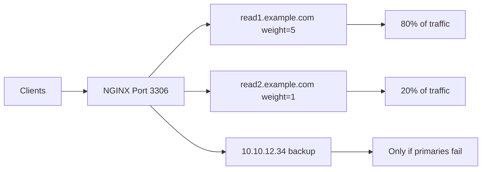
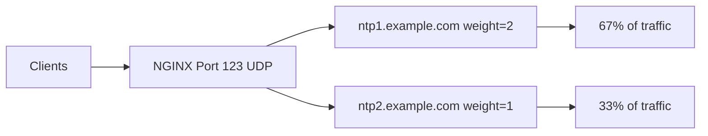
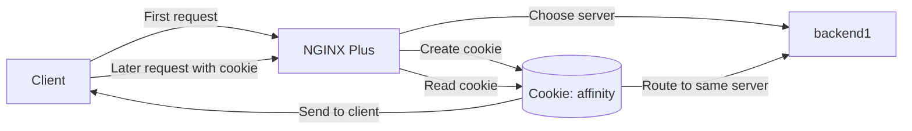
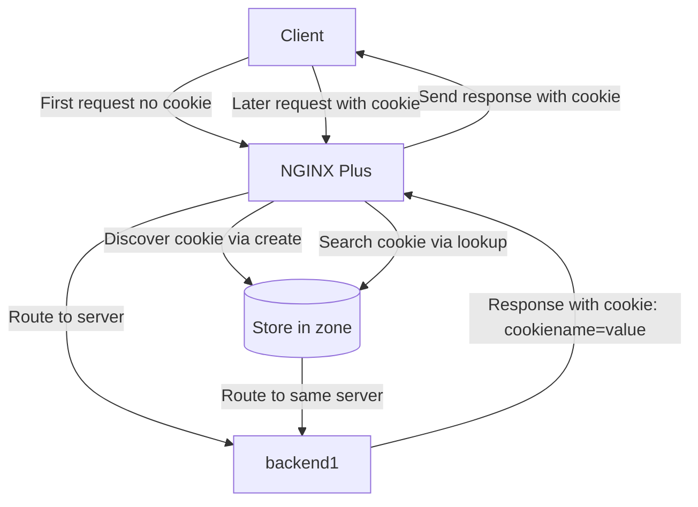
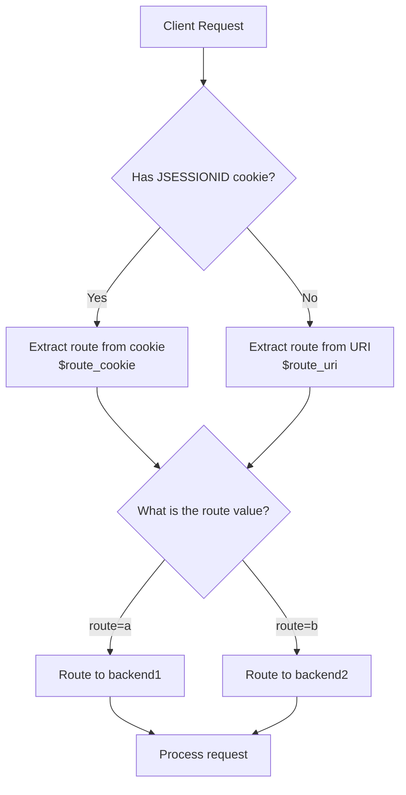
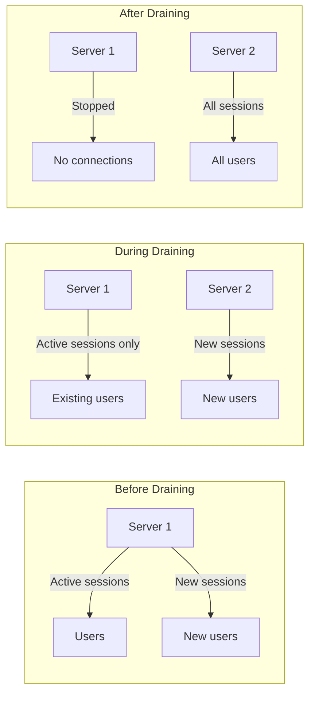
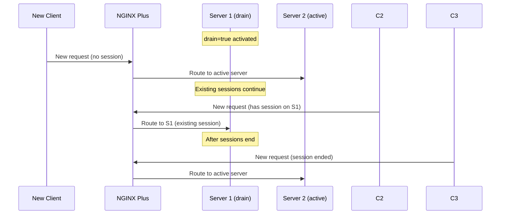
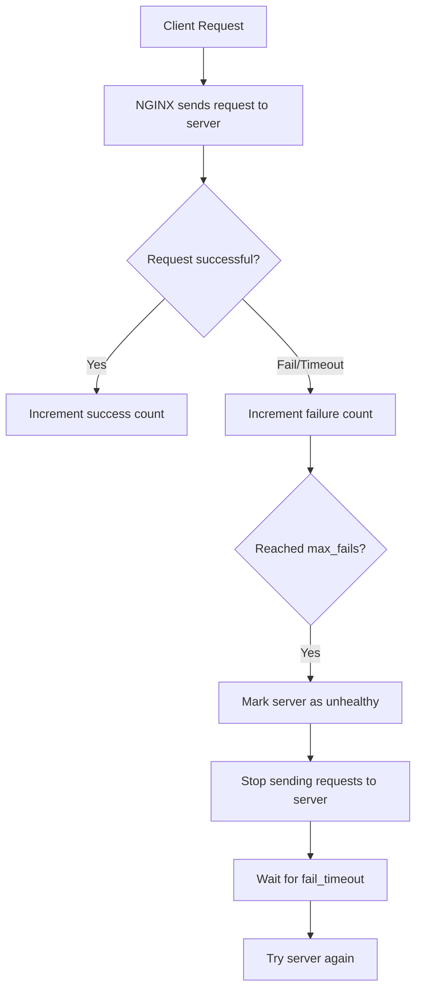
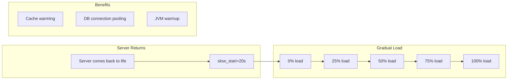

# NGINX Load Balancing - Complete Guide

## Table of Contents
1. [TCP Load Balancing](#1-tcp-load-balancing)
2. [UDP Load Balancing](#2-udp-load-balancing)
3. [Sticky Cookie with NGINX Plus](#3-sticky-cookie-with-nginx-plus)
4. [Sticky Learn with NGINX Plus](#4-sticky-learn-with-nginx-plus)
5. [Sticky Routing with NGINX Plus](#5-sticky-routing-with-nginx-plus)
6. [Connection Draining with NGINX Plus](#6-connection-draining-with-nginx-plus)
7. [Passive Health Checks](#7-passive-health-checks)
8. [Active Health Checks with NGINX Plus](#8-active-health-checks-with-nginx-plus)
9. [Slow Start with NGINX Plus](#9-slow-start-with-nginx-plus)

---

## 1. TCP Load Balancing

### The Problem
You need to distribute load between two or more TCP servers (like MySQL databases).

### The Solution
Use NGINX's stream module to load balance over TCP servers using the upstream block:

```nginx
stream {
    upstream mysql_read {
        server read1.example.com:3306 weight=5;
        server read2.example.com:3306;
        server 10.10.12.34:3306 backup;
    }
    server {
        listen 3306;
        proxy_pass mysql_read;
    }
}
```

### How It Works



### Important Configuration Note
- **DO NOT** put this in the `conf.d` folder (it's inside an HTTP block)
- **DO** create a folder called `stream.conf.d`
- **DO** include it in the main `nginx.conf` file

### Main Configuration File (`/etc/nginx/nginx.conf`)

```nginx
user nginx;
worker_processes auto;
pid /run/nginx.pid;

stream {
    include /etc/nginx/stream.conf.d/*.conf;
}
```

### Application Configuration File (`/etc/nginx/stream.conf.d/mysql_reads.conf`)

```nginx
upstream mysql_read {
    server read1.example.com:3306 weight=5;
    server read2.example.com:3306;
    server 10.10.12.34:3306 backup;
}

server {
    listen 3306;
    proxy_pass mysql_read;
}
```

### Explanation of Components

| Component | Meaning |
|-----------|---------|
| **`stream { }`** | Configuration block for TCP/UDP protocols |
| **`upstream mysql_read { }`** | Defines the group of servers |
| **`weight=5`** | This server gets 5 times more traffic than others |
| **`backup`** | Only used when primary servers fail |
| **`listen 3306`** | NGINX listens on port 3306 |
| **`proxy_pass`** | Forwards traffic to the upstream group |

### Benefits
- Distributes database read traffic
- Prevents overloading a single server
- Provides backup server for high availability

---

## 2. UDP Load Balancing

### The Problem
You need to distribute load between two or more UDP servers (like NTP time servers).

### The Solution
Use NGINX's stream module with the `udp` parameter:

```nginx
stream {
    upstream ntp {
        server ntp1.example.com:123 weight=2;
        server ntp2.example.com:123;
    }
    server {
        listen 123 udp;
        proxy_pass ntp;
    }
}
```

### How It Works



### Example: OpenVPN with Multiple Packets

Some services need multiple packets exchanged (OpenVPN, VoIP, DTLS). Use `reuseport`:

```nginx
stream {
    server {
        listen 1195 udp reuseport;
        proxy_pass 127.0.0.1:1194;
    }
}
```

### When to Use `reuseport`

| Service Type | Why `reuseport` is Needed |
|--------------|---------------------------|
| **OpenVPN** | Multiple packet exchanges |
| **VoIP** | Voice calls need consistent routing |
| **DTLS** | Datagram Transport Layer Security |
| **Virtual Desktop** | Multiple UDP streams |

### Important Directives for UDP

| Directive | Purpose |
|-----------|---------|
| **`proxy_response`** | Limits number of expected responses |
| **`proxy_timeout`** | Time between read/write operations before closing |

### Why Use UDP Load Balancing Instead of DNS?

| Feature | Load Balancer | DNS |
|---------|--------------|-----|
| **Balancing algorithms** | Many (weighted, least connections) | Simple round-robin |
| **Weight control** | Precise | Not available |
| **Failure detection** | Instant | Slow (TTL dependent) |
| **Dynamic changes** | Without DNS changes | Needs record updates |
| **Load balance DNS itself** | Yes | No |

### Common UDP Services

| Service | Default Port | Use Case |
|---------|-------------|----------|
| **DNS** | 53 | Domain name resolution |
| **NTP** | 123 | Time synchronization |
| **VoIP** | Various | Voice calls |
| **OpenVPN** | 1194 | VPN connections |
| **QUIC/HTTP/3** | 443 | Modern web protocols |
| **DTLS** | Various | Secure UDP |

### Comparison: TCP vs UDP in NGINX

| Feature | TCP | UDP |
|---------|-----|-----|
| **Definition in `listen`** | `listen 3306;` | `listen 123 udp;` |
| **`reuseport`** | Optional | Important for multi-packet services |
| **`proxy_response`** | Not used | Used to limit expected responses |
| **Connection type** | Connection-oriented | Connectionless |

---

## 3. Sticky Cookie with NGINX Plus

### The Problem
You need to bind a downstream client to an upstream server using NGINX Plus.

### The Solution
Use the `sticky cookie` directive:

```nginx
upstream backend {
    server backend1.example.com;
    server backend2.example.com;
    
    sticky cookie
        affinity
        expires=1h
        domain=.example.com
        httponly
        secure
        path=/;
}
```

### How It Works



### Step-by-Step Process

1. **First request**: Client reaches NGINX Plus
2. **Server selection**: NGINX chooses a server (e.g., `backend1`)
3. **Cookie creation**: NGINX creates a cookie named `affinity`
4. **Send cookie**: The cookie is sent with the response
5. **Later requests**: Client sends the cookie with each new request
6. **Sticky routing**: NGINX reads the cookie and routes to the same server

### Detailed Parameter Explanation

| Parameter | Value | Meaning |
|-----------|-------|---------|
| **`sticky cookie`** | - | Enable session stickiness using cookies |
| **`affinity`** | Cookie name | The cookie will be named `affinity` |
| **`expires=1h`** | 1 hour | Cookie expires after 1 hour |
| **`domain=.example.com`** | Domain | Works for all subdomains |
| **`httponly`** | - | Can't be accessed by JavaScript |
| **`secure`** | - | Only sent over HTTPS |
| **`path=/`** | Path | Valid for all paths |

### Security Parameters Explained

#### `httponly`
- **Purpose**: Prevent XSS (Cross-Site Scripting) attacks
- **Effect**: JavaScript cannot read the cookie

#### `secure`
- **Purpose**: Ensure cookie is never sent over unencrypted connections
- **Effect**: Protects against MITM (Man-in-the-Middle) attacks

#### `expires=1h`
- **Purpose**: Limit cookie lifetime
- **Effect**: After 1 hour, a new cookie is created, helping with:
  - Periodic load distribution
  - Avoiding long-term stickiness to failed servers

#### `domain=.example.com`
- **Purpose**: Define which domains can use the cookie
- **Effect**: Works on all subdomains:
  - `api.example.com`
  - `app.example.com`
  - `www.example.com`

### When to Use Sticky Cookie

| Use Case | Why |
|----------|-----|
| **User Sessions** | Keep shopping cart data |
| **Caching** | Improve cache performance |
| **WebSocket Apps** | Maintain stable connection |
| **Stateful Apps** | Applications that store state locally |
| **Distributed Databases** | Route to same node for consistency |

### Comparison of Load Balancing Algorithms

| Algorithm | Description | When to Use |
|-----------|-------------|-------------|
| **Round Robin** | Distributes requests in sequence | Stateless applications |
| **Least Connections** | Routes to least busy server | When request loads vary |
| **IP Hash** | Routes based on client IP | When cookies aren't supported |
| **Sticky Cookie** | Routes based on custom cookie | Stateful applications |

### Important Notes

- **NGINX Plus Only**: This feature is NOT in open-source NGINX
- **Balance vs Stickiness**: Stickiness can reduce load balancing efficiency
- **Session Management**: Expired cookies may cause session loss
- **Security**: Always use `httponly` and `secure` for protection

---

## 4. Sticky Learn with NGINX Plus

### The Problem
You need to bind a client to a server using an **existing cookie** created by the application itself, not by NGINX.

### The Solution
Use the `sticky learn` directive:

```nginx
upstream backend {
    server backend1.example.com:8080;
    server backend2.example.com:8081;
    
    sticky learn
        create=$upstream_cookie_cookiename
        lookup=$cookie_cookiename
        zone=client_sessions:2m;
}
```

### How It Works



### Step-by-Step Process

1. **First request**: Client reaches NGINX without a session cookie
2. **Server routing**: NGINX routes to a server (e.g., `backend1`)
3. **Cookie creation**: The application creates a session cookie
4. **Cookie discovery**: NGINX detects the cookie using `create`
5. **Store information**: NGINX saves the binding in shared memory (`zone`)
6. **Later requests**: Client sends the cookie with each request
7. **Search and route**: NGINX uses `lookup` to find and route to the same server

### Parameter Explanation

| Parameter | Value | Meaning |
|-----------|-------|---------|
| **`sticky learn`** | - | Enable learning to track existing cookies |
| **`create=$upstream_cookie_cookiename`** | NGINX variable | Which cookie to track from upstream response |
| **`lookup=$cookie_cookiename`** | NGINX variable | Which cookie to search for in client requests |
| **`zone=client_sessions:2m`** | name:size | Shared memory (2MB ≈ 16,000 sessions) |

### NGINX Variables Used

#### `$upstream_cookie_cookiename`
- **Source**: From upstream server response headers
- **Purpose**: Discover the cookie when first created
- **Example**: If app sends `Set-Cookie: JSESSIONID=abc123`, then `$upstream_cookie_JSESSIONID` contains `abc123`

#### `$cookie_cookiename`
- **Source**: From client request headers
- **Purpose**: Search for the cookie in incoming requests
- **Example**: If client sends `Cookie: JSESSIONID=abc123`, then `$cookie_JSESSIONID` contains `abc123`

### Difference: `sticky cookie` vs `sticky learn`

| Feature | `sticky cookie` | `sticky learn` |
|---------|-----------------|----------------|
| **Who creates cookie?** | NGINX Plus | Application (Upstream Server) |
| **Cookie control** | NGINX controls name and properties | Application controls name and properties |
| **Best for** | Apps that don't create session cookies | Apps that create their own cookies |
| **Memory required** | No shared memory needed | Needs `zone` for session storage |
| **Cookie discovery** | Created directly | Learned from server responses |

### Common Cookie Names

| Application/Platform | Typical Cookie Name |
|----------------------|---------------------|
| **Java (JSF, JSP)** | `JSESSIONID` |
| **PHP** | `PHPSESSID` |
| **ASP.NET** | `ASP.NET_SessionId` |
| **Django (Python)** | `sessionid` |
| **Ruby on Rails** | `_session_id` |
| **Node.js (Express)** | `connect.sid` |

### Practical Example: Java Application with `JSESSIONID`

```nginx
upstream java_app {
    server app1.example.com:8080;
    server app2.example.com:8081;
    
    sticky learn
        create=$upstream_cookie_JSESSIONID
        lookup=$cookie_JSESSIONID
        zone=java_sessions:4m;
}
```

### Memory Zone Sizing

| Size | Approximate Sessions |
|------|---------------------|
| **1 MB** | ≈ 8,000 sessions |
| **2 MB** | ≈ 16,000 sessions |
| **4 MB** | ≈ 32,000 sessions |
| **8 MB** | ≈ 64,000 sessions |

### Additional Directives

```nginx
sticky learn
    create=$upstream_cookie_sessionid
    lookup=$cookie_sessionid
    zone=sessions:2m
    timeout=1h          # Session lifetime in memory
    sync;               # Sync sessions between NGINX nodes
```

| Directive | Purpose |
|-----------|---------|
| **`timeout`** | How long sessions stay in memory before removal |
| **`sync`** | Sync session data between multiple NGINX nodes |

### When to Use `sticky learn`

| Situation | Why |
|-----------|-----|
| **Java apps with JSESSIONID** | App controls sessions, NGINX learns them |
| **PHP apps with PHPSESSID** | Don't want to modify app for NGINX cookies |
| **Legacy applications** | Can't change code to create new cookies |
| **Multi-app environments** | Each app has its own session system |
| **SSO integration** | Maintain authentication sessions |

### Comparison: All Sticky Methods in NGINX Plus

| Method | Cookie Creation | Cookie Tracking | Shared Memory | Use Case |
|--------|----------------|-----------------|---------------|----------|
| **`sticky cookie`** | NGINX | NGINX | Not required | Simple, stateless apps |
| **`sticky learn`** | Application | NGINX | Required (zone) | Apps that manage own sessions |
| **`sticky route`** | NGINX | NGINX | Required | Advanced routing control |

---

## 5. Sticky Routing with NGINX Plus

### The Problem
You need granular control over how your persistent sessions are routed to upstream servers.

### The Solution
Use the `sticky route` directive with variables:

```nginx
map $cookie_jsessionid $route_cookie {
    ~.+\.(?P<route>\w+)$ $route;
}

map $request_uri $route_uri {
    ~jsessionid=.+\.(?P<route>\w+)$ $route;
}

upstream backend {
    server backend1.example.com route=a;
    server backend2.example.com route=b;
    
    sticky route $route_cookie $route_uri;
}
```

### How It Works



### Detailed Component Explanation

#### First `map` Block: Extract Route from Cookie

```nginx
map $cookie_jsessionid $route_cookie {
    ~.+\.(?P<route>\w+)$ $route;
}
```

| Component | Meaning |
|-----------|---------|
| **`$cookie_jsessionid`** | Contains the JSESSIONID cookie value from client |
| **`$route_cookie`** | Output variable containing the extracted route |
| **`~.+\.(?P<route>\w+)$`** | Regex to extract the last part after the dot |

**Example**:
- Cookie value: `abc123def.route_a`
- Regex extracts: `route_a`
- Stored in: `$route_cookie`

#### Second `map` Block: Extract Route from URI

```nginx
map $request_uri $route_uri {
    ~jsessionid=.+\.(?P<route>\w+)$ $route;
}
```

| Component | Meaning |
|-----------|---------|
| **`$request_uri`** | Full request path (e.g., `/app/page?jsessionid=abc123.route_b`) |
| **`$route_uri`** | Output variable containing the extracted route |
| **`~jsessionid=.+\.(?P<route>\w+)$`** | Regex to find jsessionid in URI |

**Example**:
- URI: `/app/dashboard?jsessionid=xyz789.route_b`
- Regex extracts: `route_b`
- Stored in: `$route_uri`

#### Upstream Block with Route Definition

```nginx
upstream backend {
    server backend1.example.com route=a;
    server backend2.example.com route=b;
    
    sticky route $route_cookie $route_uri;
}
```

| Component | Meaning |
|-----------|---------|
| **`server backend1.example.com route=a;`** | Server 1 is associated with route `a` |
| **`server backend2.example.com route=b;`** | Server 2 is associated with route `b` |
| **`sticky route $route_cookie $route_uri;`** | Use first non-empty variable for routing |

### Scenarios

#### Scenario 1: Request with Cookie
```
Client sends: Cookie: JSESSIONID=abc123.route_a
↓
NGINX extracts: $route_cookie = "route_a"
↓
Uses sticky route $route_cookie (first non-empty)
↓
Routes to: backend1.example.com (route=a)
```

#### Scenario 2: Request without Cookie (with jsessionid in URI)
```
Client sends: /app/page?jsessionid=xyz789.route_b
↓
NGINX extracts: $route_uri = "route_b"
↓
Uses sticky route $route_uri (because $route_cookie is empty)
↓
Routes to: backend2.example.com (route=b)
```

#### Scenario 3: First Request (No Routing Info)
```
Client sends: First request with no cookie or jsessionid
↓
$route_cookie = "" (empty)
$route_uri = "" (empty)
↓
sticky route $route_cookie $route_uri ← both empty
↓
NGINX uses default load balancing (Round Robin)
↓
Random server chosen (e.g., backend1)
↓
New session created and stored in shared memory
```

### Comparison: Sticky Methods

| Method | Routing Source | Control Level | Use Case |
|--------|---------------|---------------|----------|
| **`sticky cookie`** | NGINX-created cookie | Medium | Simple applications |
| **`sticky learn`** | Application cookie | Medium | Apps with own sessions |
| **`sticky route`** | Custom variables | **Very High** | Advanced routing control |
| **`hash`** | Hash value | Low | Simple distribution |

### Advanced Use Cases

#### 1. Route Based on User Type
```nginx
map $http_user_agent $route_browser {
    ~*chrome  a;
    ~*firefox b;
    ~*safari  c;
}

upstream backend {
    server chrome_pool route=a;
    server firefox_pool route=b;
    server safari_pool route=c;
    sticky route $route_browser;
}
```

#### 2. Route Based on Geographic Location
```nginx
map $geoip_city $route_geo {
    default     a;
    "New York"  b;
    "London"    c;
    "Tokyo"     d;
}

upstream backend {
    server us_pool route=a;
    server ny_pool route=b;
    server uk_pool route=c;
    server jp_pool route=d;
    sticky route $route_geo;
}
```

#### 3. A/B Testing
```nginx
map $cookie_ab_test $route_ab {
    ~version-(?P<route>\w+)$ $route;
    default a;
}

upstream backend {
    server v1_pool route=a;
    server v2_pool route=b;
    sticky route $route_ab;
}
```

### How `sticky route` Works with Shared Memory

```nginx
upstream backend {
    zone backend_zone:2m;  # Shared memory for tracking
    
    server backend1.example.com route=a;
    server backend2.example.com route=b;
    
    sticky route $route_cookie $route_uri;
}
```

| Step | Description |
|------|-------------|
| **1. Initial routing** | Client routed based on extracted route value |
| **2. Session storage** | Routing info stored in shared memory (`zone`) |
| **3. Continuous tracking** | All subsequent requests go to same server |
| **4. Session expiry** | Session expires automatically (default or via `timeout`) |

### Additional Directives

```nginx
sticky route $route_cookie $route_uri
    timeout=1h          # Session lifetime
    sync;               # Sync between NGINX nodes
```

### Full Comparison: All Sticky Methods

| Feature | `sticky cookie` | `sticky learn` | `sticky route` |
|---------|-----------------|----------------|----------------|
| **Who creates ID?** | NGINX | Application | NGINX or Application |
| **Routing source** | NGINX cookie | Application cookie | Custom variables |
| **Flexibility** | Medium | Medium | **Very High** |
| **Control** | Limited | Limited | **Full** |
| **Variable support** | No | No | **Yes** |
| **Regex support** | No | No | **Yes** |
| **Use case** | Simple apps | Session apps | **Complex apps** |

### Complete Example: Multi-Service Application

```nginx
# Extract route from multiple sources
map $cookie_sessionid $route_from_cookie {
    ~.+\.(?P<route>[a-z])$ $route;
}

map $arg_sessionid $route_from_arg {
    ~.+\.(?P<route>[a-z])$ $route;
}

map $http_x_route $route_from_header {
    ~(?P<route>[a-z])$ $route;
}

upstream microservices {
    zone micro_zone:4m;
    
    server svc-a.internal route=a;
    server svc-b.internal route=b;
    server svc-c.internal route=c;
    server svc-d.internal route=d;
    
    # Priority: cookie ← URI param ← custom header ← Round Robin
    sticky route $route_from_cookie $route_from_arg $route_from_header;
}
```

---

## 6. Connection Draining with NGINX Plus

### The Problem
You need to gracefully remove servers for maintenance while still serving existing sessions.

### The Solution
Use the `drain` parameter through NGINX Plus API:

```bash
$ curl -X POST -d '{"drain":true}' \
  'http://nginx.local/api/3/http/upstreams/backend/servers/0'
```

### API Response
```json
{
  "id": 0,
  "server": "172.17.0.3:80",
  "weight": 1,
  "max_conns": 0,
  "max_fails": 1,
  "fail_timeout": "10s",
  "slow_start": "0s",
  "route": "",
  "backup": false,
  "down": false,
  "drain": true
}
```

### What is Connection Draining?

Connection Draining (or connection draining) is the process of:
- **Stopping** new sessions from going to a specific server
- **Continuing** to serve existing sessions until they naturally end
- **Removing** the server safely after all active sessions complete



### When to Use Connection Draining

| Scenario | Why |
|----------|-----|
| **Application Deployment** | Avoid service interruption during updates |
| **Server Maintenance** | Perform maintenance without user impact |
| **Server Replacement** | Swap servers smoothly |
| **Configuration Changes** | Apply changes that need server restart |
| **Performance Optimization** | Gradually remove slow servers |
| **Pool Expansion** | Redistribute load between old and new servers |

### How to Enable Connection Draining

#### Method 1: Via NGINX Plus API (Dynamic)

```bash
# Enable draining for a specific server
curl -X POST -d '{"drain":true}' \
  'http://nginx.local/api/3/http/upstreams/backend/servers/0'

# Disable draining
curl -X POST -d '{"drain":false}' \
  'http://nginx.local/api/3/http/upstreams/backend/servers/0'
```

| Parameter | Meaning |
|-----------|---------|
| **`/api/3/http/upstreams/backend/servers/0`** | API path: server 0 in `backend` group |
| **`{"drain":true}`** | Enable drain mode |
| **`{"drain":false}`** | Disable drain mode |

#### Method 2: Via Configuration File (Static)

```nginx
upstream backend {
    server backend1.example.com drain;  # Enable draining
    server backend2.example.com;
    server backend3.example.com;
}
```

After editing, reload configuration:
```bash
nginx -s reload
```

### Difference Between States

| State | Behavior | When to Use |
|-------|----------|-------------|
| **`drain: true`** | Stops new sessions, continues existing | Gradual maintenance |
| **`down: true`** | Stops ALL connections immediately | Emergency failures |
| **`backup: true`** | Backup server, used when others fail | High availability |
| **`weight: 0`** | Receives no traffic | Temporary stop |

### How Connection Draining Works



### Practical Examples

#### Example 1: Blue-Green Deployment

```nginx
upstream app {
    zone app_zone:10m;
    
    server app-v1.example.com weight=100;  # Old version
    server app-v2.example.com weight=0;    # New version (disabled)
}

# Step 1: Enable draining on old version
curl -X POST -d '{"drain":true}' \
  'http://nginx.local/api/3/http/upstreams/app/servers/0'

# Step 2: Gradually increase weight of new version
curl -X POST -d '{"weight":10}' \
  'http://nginx.local/api/3/http/upstreams/app/servers/1'

# Step 3: After old sessions end, remove old server
curl -X DELETE \
  'http://nginx.local/api/3/http/upstreams/app/servers/0'
```

#### Example 2: Scheduled Maintenance

```nginx
upstream backend {
    server db1.example.com;   # To be maintained
    server db2.example.com;
    server db3.example.com;
}

# Enable draining 30 minutes before maintenance
curl -X POST -d '{"drain":true}' \
  'http://nginx.local/api/3/http/upstreams/backend/servers/0'

# Monitor remaining sessions
curl 'http://nginx.local/api/3/http/upstreams/backend' | jq '.'

# After confirming all sessions ended, stop the server
curl -X POST -d '{"down":true}' \
  'http://nginx.local/api/3/http/upstreams/backend/servers/0'
```

### Monitoring Drain Status

```bash
# View all servers in the group
curl 'http://nginx.local/api/3/http/upstreams/backend' | jq '.'

# View a specific server
curl 'http://nginx.local/api/3/http/upstreams/backend/servers/0' | jq '.'

# Example response:
{
  "id": 0,
  "server": "172.17.0.3:80",
  "weight": 1,
  "drain": true,
  "down": false,
  "backup": false,
  "active": 42,           # Active connections
  "requests": 1250,       # Total requests
  "responses": {
    "1xx": 0,
    "2xx": 1200,
    "3xx": 30,
    "4xx": 15,
    "5xx": 5
  }
}
```

### Best Practices

| Tip | Explanation |
|-----|-------------|
| **Enable draining early** | Activate before maintenance with enough time |
| **Monitor sessions** | Use API to track active sessions |
| **Set timeout limits** | Use `proxy_timeout` to prevent very long sessions |
| **Gradual removal** | Use `weight` to reduce load before draining |
| **Test in staging** | Always test draining in non-production first |
| **Log operations** | Track draining operations for analysis |

### Manual vs Automatic Draining

| Method | Advantages | Disadvantages |
|--------|------------|---------------|
| **Manual (API)** | Full control, flexible | Requires human intervention, slower |
| **Automatic (config)** | Automated, consistent | Less flexible, needs reload |
| **With Health Checks** | Automatic failure detection | Can be abrupt for sessions |

### Complete Example with Health Checks

```nginx
upstream backend {
    zone backend_zone:10m;
    
    server backend1.example.com max_fails=2 fail_timeout=30s;
    server backend2.example.com max_fails=2 fail_timeout=30s;
    server backend3.example.com max_fails=2 fail_timeout=30s;
    
    # Active health checking
    health_check interval=5s fails=3 passes=2;
}

# When server 1 is detected as failing
# Enable draining for server 3 for maintenance
curl -X POST -d '{"drain":true}' \
  'http://nginx.local/api/3/http/upstreams/backend/servers/2'
```

---

## 7. Passive Health Checks

### The Problem
You need to passively check the health of upstream servers.

### The Solution
Use NGINX health checks with load balancing:

```nginx
upstream backend {
    server backend1.example.com:1234 max_fails=3 fail_timeout=3s;
    server backend2.example.com:1234 max_fails=3 fail_timeout=3s;
}
```

### How Passive Health Checks Work



### Parameter Explanation

| Parameter | Default | Meaning |
|-----------|---------|---------|
| **`max_fails`** | 1 | Number of failed attempts before marking server unhealthy |
| **`fail_timeout`** | 10 seconds | How long server is considered unhealthy |

### When to Use Passive Health Checks

| Situation | Why |
|-----------|-----|
| **Open-source NGINX** | This feature is available for free |
| **Bandwidth saving** | No extra traffic for checks |
| **Simple applications** | When you don't need precise checks |
| **All protocols** | Works for HTTP, TCP, and UDP |

### Comparison: Passive vs Active Health Checks

| Feature | Passive | Active |
|---------|---------|--------|
| **Availability** | Open-source NGINX | NGINX Plus only |
| **Extra requests** | No | Yes (sends test requests) |
| **Resource usage** | Low | Medium to high |
| **Detection accuracy** | Medium | Very high |
| **Early detection** | After request fails | Before request fails |
| **Content validation** | No | Yes (body, headers) |
| **Protocols** | HTTP, TCP, UDP | HTTP, TCP, UDP |

---

## 8. Active Health Checks with NGINX Plus

### The Problem
You need to actively check your upstream servers for health.

### Solution for HTTP

```nginx
http {
    server {
        location / {
            proxy_pass http://backend;
            health_check interval=2s
                          fails=2
                          passes=5
                          uri=/
                          match=welcome;
        }
    }
    
    match welcome {
        status 200;
        header Content-Type = text/html;
        body ~ "Welcome to nginx!";
    }
}
```

### Parameter Explanation

| Parameter | Value | Meaning |
|-----------|-------|---------|
| **`interval=2s`** | 2 seconds | Time between checks |
| **`fails=2`** | 2 | Consecutive failures to mark unhealthy |
| **`passes=5`** | 5 | Consecutive successes to mark healthy |
| **`uri=/`** | `/` | Path to request for the check |
| **`match=welcome`** | welcome | Match block name for acceptance criteria |

### HTTP `match` Block

```nginx
match welcome {
    status 200;
    header Content-Type = text/html;
    body ~ "Welcome to nginx!";
}
```

| Directive | Meaning | Example |
|-----------|---------|---------|
| **`status`** | Required status code | `200`, `201`, `204` |
| **`header`** | Required header value | `Content-Type = application/json` |
| **`body`** | Required body content (supports Regex) | `~ "success"` |

### Solution for TCP/UDP

```nginx
stream {
    server {
        listen 1234;
        proxy_pass stream_backend;
        health_check interval=10s
                      passes=2
                      fails=3;
        health_check_timeout 5s;
    }
}
```

### TCP/UDP `match` Block

```nginx
match response {
    send "PING\r\n";           # Data to send to server
    expect "PONG\r\n";         # Expected response (exact match)
    # Or using Regex
    expect ~ "^PONG";          # Starts with PONG
}
```

| Directive | Meaning |
|-----------|---------|
| **`send`** | Raw data to send to the server |
| **`expect`** | Expected response (exact string or regex) |

### Comparison: Passive vs Active Health Checks

| Feature | Passive | Active |
|---------|---------|--------|
| **Availability** | Open-source NGINX | NGINX Plus only |
| **Extra requests** | No | Yes |
| **Resource usage** | Low | Medium to high |
| **Detection accuracy** | Medium | Very high |
| **Early detection** | After request fails | Before request fails |
| **Content validation** | No | Yes |
| **Protocols** | HTTP, TCP, UDP | HTTP, TCP, UDP |

---

## 9. Slow Start with NGINX Plus

### The Problem
Your application needs to ramp up before taking on full production load.

### The Solution
Use the `slow_start` parameter on the server directive:

```nginx
upstream backend {
    zone backend 64k;
    server server1.example.com slow_start=20s;
    server server2.example.com slow_start=15s;
}
```

### How Slow Start Works



### When Does Slow Start Happen?

- When a server **fails health checks and then passes again**
- **NOT** when NGINX first starts

### Limitations

| Cannot Use With | Why |
|-----------------|-----|
| **`hash`** | Distribution based on hashing, no gradual control |
| **`ip_hash`** | Distribution based on client IP |
| **`random`** | Random distribution |

### Complete Example: All Features Together

```nginx
http {
    upstream app {
        zone app_zone:10m;
        
        server app1.example.com slow_start=30s max_fails=2 fail_timeout=10s;
        server app2.example.com slow_start=30s max_fails=2 fail_timeout=10s;
        server app3.example.com backup;
    }
    
    server {
        listen 80;
        location / {
            proxy_pass http://app;
            
            health_check interval=5s
                          fails=3
                          passes=2
                          uri=/health
                          match=healthy;
        }
    }
    
    match healthy {
        status 200;
        header Content-Type = application/json;
        body ~ '"status":"ok"';
    }
}
```

### Scenario Explanation

1. **Active health check**: Every 5 seconds, NGINX requests `/health`
2. **Health criteria**: Status 200, JSON content, `"status":"ok"`
3. **Mark healthy**: After 2 successful consecutive checks
4. **Mark unhealthy**: After 3 consecutive failures
5. **Slow start**: When a server returns, load increases gradually over 30 seconds
6. **Backup server**: `app3` used only when primary servers fail

### Best Practices

| Tip | Explanation |
|-----|-------------|
| **Set appropriate `interval`** | Too short = wastes resources, too long = slow detection |
| **Balance `passes` and `fails`** | Not too strict (rejects healthy) nor too lenient (accepts sick) |
| **Use proper `uri`** | Lightweight endpoint like `/health` or `/ping` |
| **Appropriate `slow_start`** | Give app enough time to warm up (10-30 seconds) |
| **Monitor logs** | Track health checks to diagnose issues |

---

## Summary

| Feature | Purpose | NGINX Version |
|---------|---------|---------------|
| **TCP Load Balancing** | Distribute TCP traffic | Open-source |
| **UDP Load Balancing** | Distribute UDP traffic | Open-source |
| **Sticky Cookie** | Session persistence with NGINX cookies | Plus |
| **Sticky Learn** | Session persistence with app cookies | Plus |
| **Sticky Route** | Advanced routing control | Plus |
| **Connection Draining** | Graceful server removal | Plus |
| **Passive Health Checks** | No-extra-cost health monitoring | Open-source |
| **Active Health Checks** | Precise proactive monitoring | Plus |
| **Slow Start** | Gradual load introduction | Plus |

These features together ensure:
- **High Availability** (High Availability)
- **Improved Performance** (Performance)
- **Application Stability** (Application Stability)
- **Early Failure Detection** (Early Failure Detection)
- **Session Persistence** (Session Persistence)
- **Zero-Downtime Maintenance** (Zero-Downtime Maintenance)
