# NGINX Traffic Management - Complete Guide

## Table of Contents
1. [A/B Testing](#1-ab-testing)
2. [GeoIP Module](#2-geoip-module)
3. [Restricting Access by Country](#3-restricting-access-by-country)
4. [Finding the Original Client IP](#4-finding-the-original-client-ip)
5. [Limiting Connections](#5-limiting-connections)
6. [Limiting Request Rate](#6-limiting-request-rate)
7. [Limiting Bandwidth](#7-limiting-bandwidth)

---

## 1. A/B Testing

### What is A/B Testing?

A/B Testing is a method used to compare two or more versions of an application or file to determine which performs better with users. A percentage of users are directed to the new version (B) while others stay on the old version (A).

### Basic Example

```nginx
split_clients "${remote_addr}AAA" $variant {
    20.0% "backendv2";
    * "backendv1";
}

location / {
    proxy_pass http://$variant
}
```

### How It Works

| Component | Description |
|-----------|-------------|
| `split_clients` | NGINX directive to split clients based on hash value |
| `"${remote_addr}AAA"` | String to hash (IP address + extra text) |
| `$variant` | Variable that gets assigned a value based on the split |
| `20.0% "backendv2"` | 20% of clients go to backendv2 |
| `* "backendv1"` | Remaining 80% go to backendv1 |

### Internal Working Mechanism

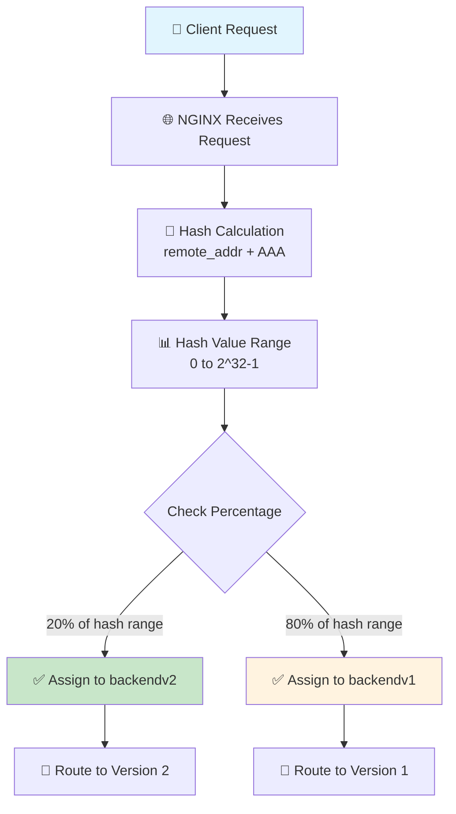

### Use Cases

#### 1. Canary Release (Gradual Deployment)

```nginx
split_clients "${remote_addr}" $variant {
    5.0% "backend-v2";    # Start with small percentage
    * "backend-v1";        # Most users stay on old version
}
```

#### 2. Blue-Green Deployment

```nginx
split_clients "${remote_addr}" $variant {
    100.0% "backend-green";    # All users to new version
    * "backend-blue";           # Keep old version as backup
}
```

#### 3. Static Website Testing

```nginx
http {
    split_clients "${remote_addr}" $site_root_folder {
        33.3% "/var/www/sitev2/";
        * "/var/www/sitev1/";
    }
    
    server {
        listen 80;
        root $site_root_folder;
        location / {
            index index.html;
        }
    }
}
```

### Benefits

| Benefit | Description |
|---------|-------------|
| **Stateless** | No need to store user session information |
| **Consistent** | Same user always gets the same version |
| **Easy Setup** | Simple configuration changes |
| **Flexible** | Can split based on any variable |

### Important Notes

- The `*` (asterisk) must be the last item
- Total percentages should not exceed 100%
- Use multiple variables for better distribution
- Same client always gets same version (consistent hashing)

---

## 2. GeoIP Module

### What is GeoIP?

The GeoIP module enables NGINX to determine the geographical location of clients based on their IP address. This includes country, city, latitude, longitude, postal code, and more.

### Installation

**For NGINX Open Source:**

```bash
# RHEL/CentOS
yum install nginx-module-geoip

# Debian/Ubuntu
apt-get install nginx-module-geoip
```

**For NGINX Plus:**

```bash
# RHEL/CentOS
yum install nginx-plus-module-geoip

# Debian/Ubuntu
apt-get install nginx-plus-module-geoip
```

### Download GeoIP Databases

```bash
# Create directory for databases
mkdir /etc/nginx/geoip
cd /etc/nginx/geoip

# Download country database
wget "http://geolite.maxmind.com/download/geoip/database/GeoLiteCountry/GeoIP.dat.gz"
gunzip GeoIP.dat.gz

# Download city database
wget "http://geolite.maxmind.com/download/geoip/database/GeoLiteCity.dat.gz"
gunzip GeoLiteCity.dat.gz
```

### Configuration

```nginx
load_module "/usr/lib64/nginx/modules/ngx_http_geoip_module.so";

http {
    # Specify database locations
    geoip_country /etc/nginx/geoip/GeoIP.dat;
    geoip_city /etc/nginx/geoip/GeoLiteCity.dat;
    
    # ... rest of configuration
}
```

### Available Variables

#### Country Variables (from geoip_country)

| Variable | Description | Example |
|----------|-------------|---------|
| `$geoip_country_code` | Two-letter country code | `EG` (Egypt) |
| `$geoip_country_code3` | Three-letter country code | `EGY` |
| `$geoip_country_name` | Full country name | `Egypt` |

#### City Variables (from geoip_city)

| Variable | Description | Example |
|----------|-------------|---------|
| `$geoip_city_country_code` | Two-letter country code | `EG` |
| `$geoip_city_country_code3` | Three-letter country code | `EGY` |
| `$geoip_city_country_name` | Country name | `Egypt` |
| `$geoip_city` | City name | `Cairo` |
| `$geoip_latitude` | Latitude | `30.0444` |
| `$geoip_longitude` | Longitude | `31.2357` |
| `$geoip_city_continent_code` | Continent code | `AF` (Africa) |
| `$geoip_postal_code` | Postal code | `11511` |
| `$geoip_region` | Region code (2 letters) | `01` |
| `$geoip_region_name` | Region name | `Cairo Governorate` |
| `$geoip_area_code` | Telephone area code (US only) | `212` |

### How GeoIP Works

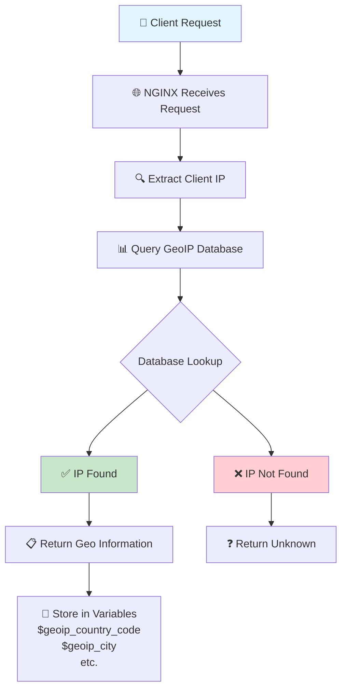

### Practical Examples

#### 1. Log Geographical Information

```nginx
http {
    geoip_country /etc/nginx/geoip/GeoIP.dat;
    geoip_city /etc/nginx/geoip/GeoLiteCity.dat;
    
    log_format geo_log '$remote_addr - $remote_user [$time_local] '
                       '"$request" $status $body_bytes_sent '
                       '"$http_referer" "$http_user_agent" '
                       'Country: $geoip_country_name '
                       'City: $geoip_city '
                       'Coordinates: $geoip_latitude,$geoip_longitude';
    
    server {
        access_log /var/log/nginx/access.log geo_log;
    }
}
```

#### 2. Pass Location to Application

```nginx
http {
    geoip_city /etc/nginx/geoip/GeoLiteCity.dat;
    
    server {
        location / {
            proxy_set_header X-Geo-Country $geoip_city_country_name;
            proxy_set_header X-Geo-City $geoip_city;
            proxy_set_header X-Geo-Latitude $geoip_latitude;
            proxy_set_header X-Geo-Longitude $geoip_longitude;
            proxy_set_header X-Geo-Postal $geoip_postal_code;
            
            proxy_pass http://backend;
        }
    }
}
```

#### 3. Route Traffic Based on Location

```nginx
http {
    geoip_country /etc/nginx/geoip/GeoIP.dat;
    
    server {
        location / {
            # Route Egyptian users to specific server
            if ($geoip_country_code = "EG") {
                proxy_pass http://egypt-server;
            }
            proxy_pass http://global-server;
        }
    }
}
```

#### 4. Customize Content by Location

```nginx
http {
    geoip_city /etc/nginx/geoip/GeoLiteCity.dat;
    
    server {
        location / {
            set $language "en";
            set $currency "USD";
            
            if ($geoip_country_code = "EG") {
                set $language "ar";
                set $currency "EGP";
            }
            
            if ($geoip_country_code = "SA") {
                set $language "ar";
                set $currency "SAR";
            }
            
            proxy_set_header Accept-Language $language;
            proxy_set_header X-Currency $currency;
            proxy_pass http://backend;
        }
    }
}
```

### Benefits of Using GeoIP

| Feature | Benefit |
|---------|---------|
| **Audience Analysis** | Know which countries visitors come from |
| **Content Personalization** | Show content in appropriate language and culture |
| **Smart Routing** | Route users to nearest server for less latency |
| **Security** | Block access from specific countries or regions |
| **Compliance** | Apply privacy laws based on location |
| **Marketing** | Offer location-specific deals and pricing |

### Important Notes

- **Database Updates**: GeoIP databases change frequently - update regularly
- **Accuracy**: IP-based location is not 100% accurate (VPNs, mobile networks)
- **Performance**: Minimal impact on NGINX performance
- **Privacy**: Must comply with privacy laws like GDPR
- **Free vs Paid**: MaxMind offers free (GeoLite2) and paid versions

### Automatic Database Updates

```bash
# Install update tool
pip install geoip2

# Setup cron job for automatic updates
0 0 * * * /usr/local/bin/geoipupdate -d /etc/nginx/geoip
```

---

## 3. Restricting Access by Country

### The Problem

You need to restrict access from particular countries for contractual or application requirements.

### The Solution

Use the GeoIP module with `map` and `if` directives.

### Basic Example

```nginx
load_module "/usr/lib64/nginx/modules/ngx_http_geoip_module.so";

http {
    geoip_country /etc/nginx/geoip/GeoIP.dat;
    
    # Map country codes to access permissions
    map $geoip_country_code $country_access {
        "US" 0;    # Allowed
        "RU" 0;    # Allowed
        default 1; # Denied
    }
    
    server {
        if ($country_access = '1') {
            return 403;
        }
        # ... rest of configuration
    }
}
```

### How It Works

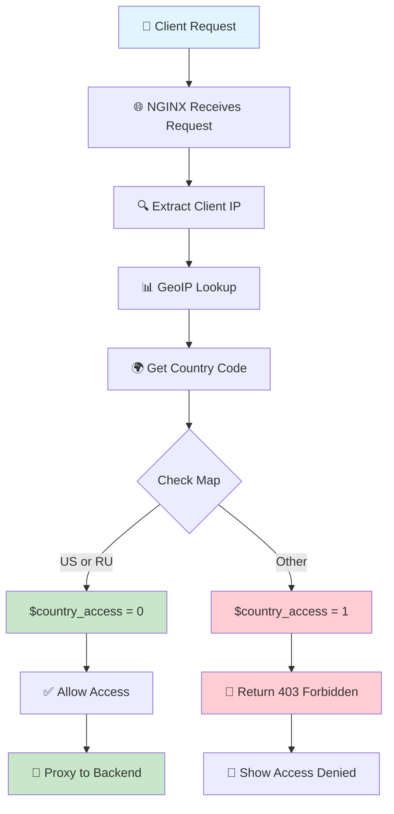

### Different Scenarios

#### Scenario 1: Whitelist (Allow Only Specific Countries)

```nginx
http {
    geoip_country /etc/nginx/geoip/GeoIP.dat;
    
    # Allow only Egypt, Saudi Arabia, and UAE
    map $geoip_country_code $allow_access {
        "EG" 1;    # Egypt - Allowed
        "SA" 1;    # Saudi Arabia - Allowed
        "AE" 1;    # UAE - Allowed
        default 0; # All others - Denied
    }
    
    server {
        if ($allow_access = 0) {
            return 403;
        }
        proxy_pass http://backend;
    }
}
```

#### Scenario 2: Blacklist (Block Specific Countries)

```nginx
http {
    geoip_country /etc/nginx/geoip/GeoIP.dat;
    
    # Block specific countries
    map $geoip_country_code $block_access {
        "KP" 1;    # North Korea - Blocked
        "IR" 1;    # Iran - Blocked
        "SY" 1;    # Syria - Blocked
        default 0; # All others - Allowed
    }
    
    server {
        if ($block_access = 1) {
            return 403;
        }
        proxy_pass http://backend;
    }
}
```

#### Scenario 3: Redirect to Custom Page

```nginx
http {
    geoip_country /etc/nginx/geoip/GeoIP.dat;
    
    map $geoip_country_code $allowed {
        "EG" 1;
        "SA" 1;
        default 0;
    }
    
    server {
        location / {
            if ($allowed = 0) {
                return 302 /restricted.html;
            }
            proxy_pass http://backend;
        }
        
        location /restricted.html {
            root /var/www/html;
            # Custom page explaining why access is denied
        }
    }
}
```

#### Scenario 4: Regular Expression for Multiple Countries

```nginx
http {
    geoip_country /etc/nginx/geoip/GeoIP.dat;
    
    # Allow Gulf countries and Egypt
    map $geoip_country_code $access {
        default 0;
        ~^(EG|SA|AE|KW|QA|BH|OM)$ 1;
    }
    
    server {
        if ($access = 0) {
            return 403;
        }
        proxy_pass http://backend;
    }
}
```

#### Scenario 5: Restrict Specific Paths Only

```nginx
http {
    geoip_country /etc/nginx/geoip/GeoIP.dat;
    
    map $geoip_country_code $admin_access {
        "EG" 1;
        "SA" 1;
        default 0;
    }
    
    server {
        # Admin area - restricted
        location /admin {
            if ($admin_access = 0) {
                return 403;
            }
            proxy_pass http://admin-backend;
        }
        
        # Public area - open to everyone
        location / {
            proxy_pass http://public-backend;
        }
    }
}
```

### Flow Diagram for Different Scenarios

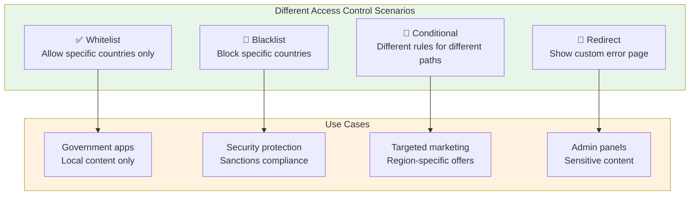

### Common Mistakes and Best Practices

#### ❌ Dangerous - Trusting All Proxies

```nginx
# UNSAFE - Anyone can forge the header
geoip_proxy 0.0.0.0/0;
```

#### ✅ Safe - Specify Trusted Proxies Only

```nginx
# SAFE - Only trusted proxy networks
geoip_proxy 10.0.16.0/26;
geoip_proxy 192.168.1.0/24;
```

### Performance Considerations

| Factor | Impact | Recommendation |
|--------|--------|----------------|
| **Memory** | Low | 10MB zone handles ~160,000 IPs |
| **CPU** | Low | Simple lookups |
| **Database** | Can grow | Update monthly |
| **If statements** | Use sparingly | Use map instead of complex ifs |

### Important Notes

1. **IP-based location is NOT 100% accurate**
   - VPNs can bypass restrictions
   - Mobile networks may show different locations
   - Proxy servers can hide original location

2. **Use `map` instead of complex `if` statements**
   ```nginx
   # ✅ Better
   map $geoip_country_code $allowed {
       default 0;
       "EG" 1;
   }
   if ($allowed = 0) { return 403; }
   
   # ❌ Worse
   if ($geoip_country_code != "EG") {
       return 403;
   }
   ```

3. **Always log blocked attempts**
   ```nginx
   log_format blocked '$remote_addr - $request - Blocked: $geoip_country_code';
   access_log /var/log/nginx/blocked.log blocked;
   ```

---

## 4. Finding the Original Client IP

### The Problem

When there are proxies in front of NGINX, NGINX sees the proxy's IP address instead of the real client IP.

### The Solution

Use `geoip_proxy` and `geoip_proxy_recursive` directives.

### Basic Configuration

```nginx
load_module "/usr/lib64/nginx/modules/ngx_http_geoip_module.so";

http {
    # Load GeoIP databases
    geoip_country /etc/nginx/geoip/GeoIP.dat;
    geoip_city /etc/nginx/geoip/GeoLiteCity.dat;
    
    # Define proxy IP ranges
    geoip_proxy 10.0.16.0/26;
    
    # Enable recursive search
    geoip_proxy_recursive on;
    
    # ... rest of configuration
}
```

### How X-Forwarded-For Works

The `X-Forwarded-For` header contains the chain of IP addresses:

```
X-Forwarded-For: client_ip, proxy1_ip, proxy2_ip, ...
```

**Example:**
```
Client (1.2.3.4) → Proxy 1 (10.0.16.10) → Proxy 2 (10.0.16.20) → NGINX
```

The `X-Forwarded-For` header becomes:
```
X-Forwarded-For: 1.2.3.4, 10.0.16.10, 10.0.16.20
```

### Flow Diagram

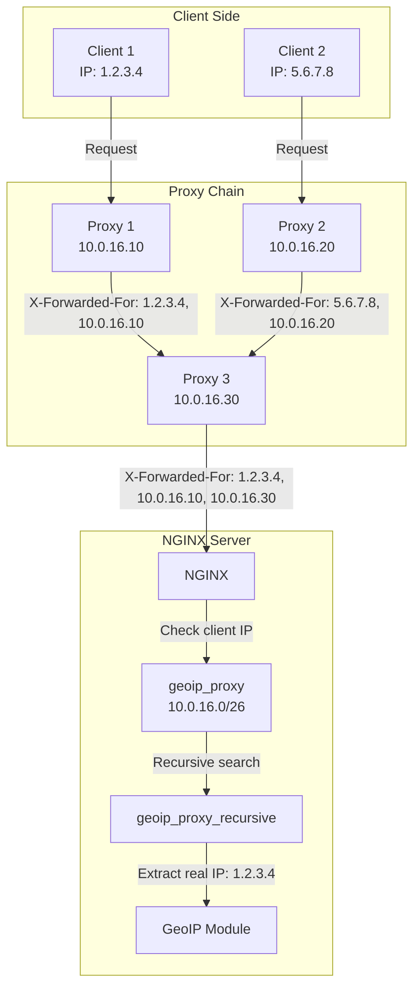

### Sequence Diagram

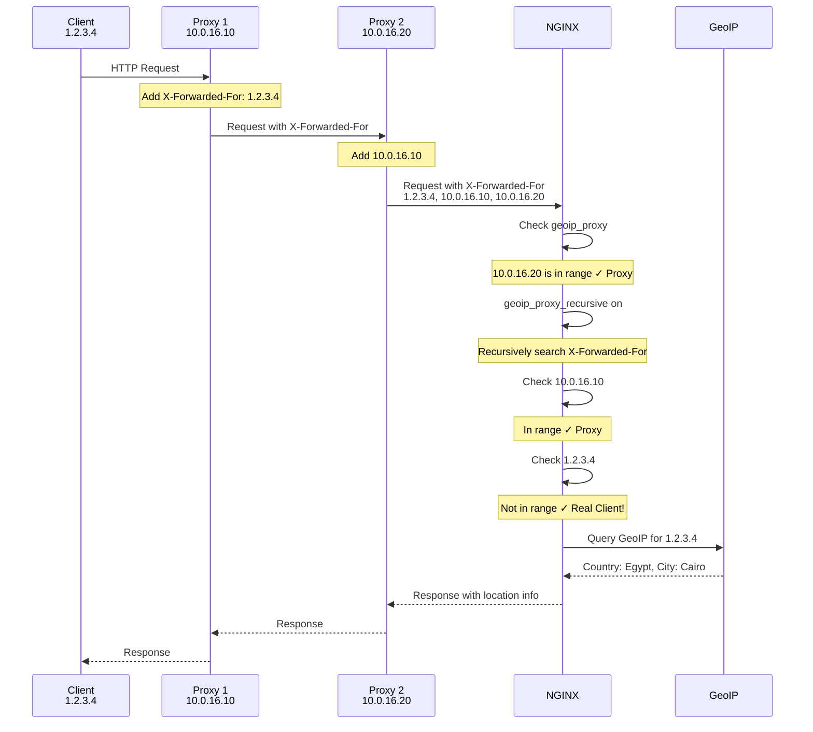

### Practical Examples

#### Example 1: AWS ELB Configuration

```nginx
http {
    geoip_country /etc/nginx/geoip/GeoIP.dat;
    geoip_city /etc/nginx/geoip/GeoLiteCity.dat;
    
    # AWS ELB uses private IP ranges
    geoip_proxy 10.0.0.0/8;
    geoip_proxy 172.16.0.0/12;
    geoip_proxy 192.168.0.0/16;
    
    geoip_proxy_recursive on;
    
    server {
        location / {
            # Set real IP for logging
            set_real_ip_from 10.0.0.0/8;
            real_ip_header X-Forwarded-For;
            real_ip_recursive on;
            
            # Pass real IP to backend
            proxy_set_header X-Real-IP $remote_addr;
            proxy_set_header X-Forwarded-For $proxy_add_x_forwarded_for;
            proxy_pass http://backend;
        }
    }
}
```

#### Example 2: Multiple Proxy Networks

```nginx
http {
    geoip_country /etc/nginx/geoip/GeoIP.dat;
    
    # Define all proxy networks
    geoip_proxy 10.0.16.0/26;     # Internal proxies
    geoip_proxy 10.0.20.0/24;     # Additional proxies
    geoip_proxy 192.168.1.0/24;   # Local proxies
    
    geoip_proxy_recursive on;
    
    # Use real IP for access control
    map $geoip_country_code $allowed {
        default 0;
        "EG" 1;
        "SA" 1;
    }
    
    server {
        if ($allowed = 0) {
            return 403;
        }
        proxy_pass http://backend;
    }
}
```

#### Example 3: Logging Real IPs

```nginx
http {
    geoip_country /etc/nginx/geoip/GeoIP.dat;
    geoip_proxy 10.0.0.0/8;
    geoip_proxy_recursive on;
    
    # Custom log format with real IP
    log_format real_ip '$remote_addr - $remote_user [$time_local] '
                       '"$request" $status $body_bytes_sent '
                       '"$http_referer" "$http_user_agent" '
                       'Real-IP: $http_x_forwarded_for '
                       'Country: $geoip_country_code';
    
    server {
        access_log /var/log/nginx/access.log real_ip;
        proxy_pass http://backend;
    }
}
```

### Comparison of Cases

| Case | geoip_proxy | geoip_proxy_recursive | Result |
|------|------------|----------------------|--------|
| No proxy | Not needed | Not needed | Client IP directly |
| Single proxy | Required | Not needed | IP from X-Forwarded-For |
| Multiple proxies | Required | Required (on) | Last non-proxy IP |
| Proxy outside range | Not needed | Not needed | Proxy IP (wrong!) |

### Security Considerations

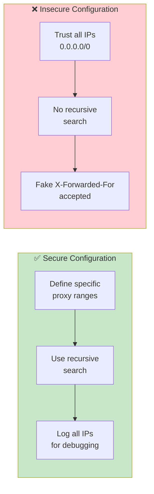

### Best Practices

1. **Never use 0.0.0.0/0** - This allows anyone to spoof IPs
2. **Define specific proxy ranges** - Only trust known proxies
3. **Always enable recursive** - For multiple proxy chains
4. **Log all headers for debugging** - Helps troubleshoot issues
5. **Use both geoip_proxy and set_real_ip** - For consistent behavior

---

## 5. Limiting Connections

### The Problem

You need to limit the number of connections based on a predefined key, such as the client's IP address.

### The Solution

```nginx
http {
    # Create shared memory zone for connection metrics
    limit_conn_zone $binary_remote_addr zone=limitbyaddr:10m;
    
    # Set response status when limit is exceeded
    limit_conn_status 429;
    
    server {
        # Apply the limit (max 40 connections)
        limit_conn limitbyaddr 40;
        proxy_pass http://backend;
    }
}
```

### How It Works

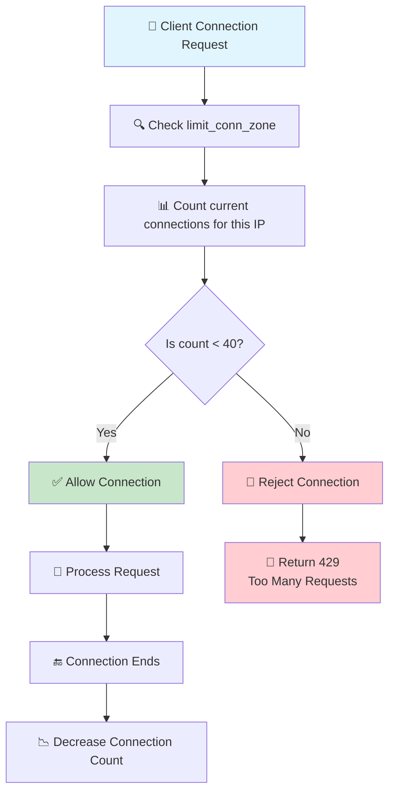

### Configuration Components

| Component | Description |
|-----------|-------------|
| `$binary_remote_addr` | Client IP in binary format (more efficient) |
| `zone=limitbyaddr:10m` | Zone name and size (10 MB) |
| `limit_conn` | Maximum number of connections allowed |
| `limit_conn_status 429` | Response code when limit is exceeded |

### Practical Examples

#### Example 1: Different Limits for Different Locations

```nginx
http {
    limit_conn_zone $binary_remote_addr zone=download:10m;
    limit_conn_zone $binary_remote_addr zone=api:10m;
    
    server {
        # API endpoints - strict limit
        location /api/ {
            limit_conn api 5;
            proxy_pass http://api-backend;
        }
        
        # Downloads - generous limit
        location /downloads/ {
            limit_conn download 10;
            root /var/www/downloads;
        }
    }
}
```

#### Example 2: Limit Based on Session Cookie

```nginx
http {
    # Use session cookie for more accurate user identification
    limit_conn_zone $cookie_sessionid zone=session:10m;
    
    server {
        location / {
            limit_conn session 3;
            proxy_pass http://backend;
        }
    }
}
```

#### Example 3: Combined with Rate Limiting

```nginx
http {
    # Connection limit
    limit_conn_zone $binary_remote_addr zone=connections:10m;
    
    # Rate limit
    limit_req_zone $binary_remote_addr zone=requests:10m rate=10r/s;
    
    server {
        location / {
            limit_conn connections 20;
            limit_req zone=requests burst=30;
            limit_req_status 429;
            
            proxy_pass http://backend;
        }
    }
}
```

#### Example 4: Dry Run Testing

```nginx
http {
    limit_conn_zone $binary_remote_addr zone=test:10m;
    
    server {
        location / {
            # Test mode - no actual limiting
            limit_conn_dry_run on;
            limit_conn test 50;
            
            # Log the status for analysis
            log_format dry_run '$remote_addr - $request - '
                               'Status: $limit_conn_status';
            access_log /var/log/nginx/dry_run.log dry_run;
            
            proxy_pass http://backend;
        }
    }
}
```

### Connection Limiting Flow

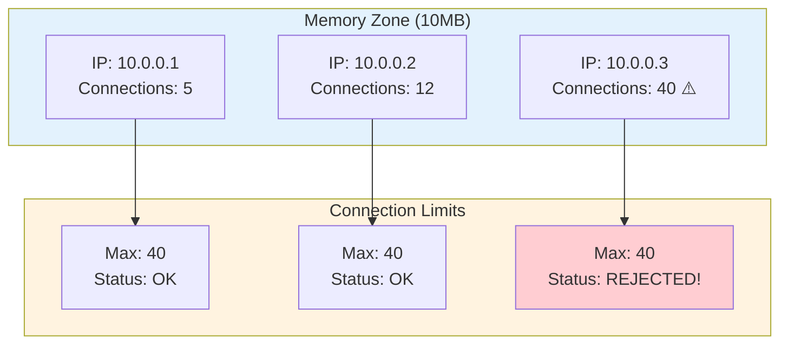

### Use Cases

| Use Case | Limit | Why |
|----------|-------|-----|
| **Download Server** | 5-10 connections | Prevent one user from using all bandwidth |
| **API Service** | 20-50 connections | Fair resource distribution |
| **Login Page** | 3-5 connections | Prevent brute force attacks |
| **File Upload** | 2-3 connections | Manage server resources |
| **Video Streaming** | 2-4 connections | Control bandwidth usage |

### Important Notes

1. **Choose the right key**:
   - `$binary_remote_addr` - Limit by IP (most common)
   - `$cookie_sessionid` - Limit by session
   - `$http_user_agent` - Limit by browser

2. **Consider NAT users**: Multiple users behind same IP will be counted together

3. **Memory calculation**:
   - Each entry uses about 32-64 bytes
   - 10MB zone holds ~160,000 IPs
   - Adjust based on expected traffic

4. **Status codes**:
   - 429 - Too Many Requests (recommended)
   - 503 - Service Unavailable (default, but less accurate)

---

## 6. Limiting Request Rate

### The Problem

You need to limit the rate of requests by a predefined key, such as the client's IP address.

### Basic Solution

```nginx
http {
    # Create rate limiting zone
    limit_req_zone $binary_remote_addr zone=limitbyaddr:10m rate=3r/s;
    
    # Set response status
    limit_req_status 429;
    
    server {
        location / {
            # Apply rate limit
            limit_req zone=limitbyaddr;
            proxy_pass http://backend;
        }
    }
}
```

### Advanced Solution with Burst

```nginx
server {
    location / {
        # Allow burst with delay
        limit_req zone=limitbyaddr burst=12 delay=9;
        proxy_pass http://backend;
    }
}
```

### Rate Limiting Parameters

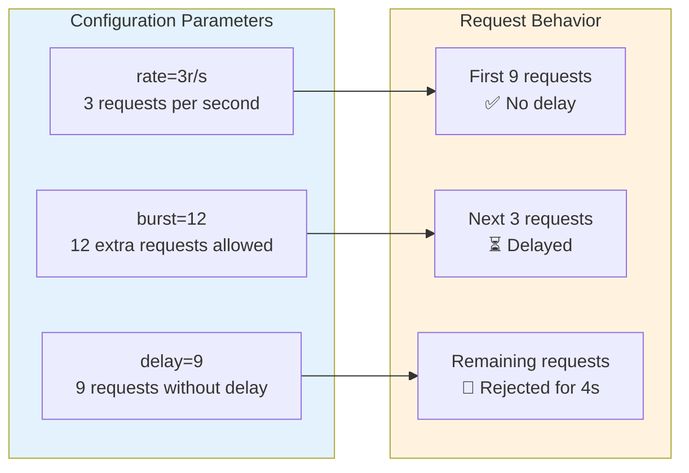

### Understanding burst and delay

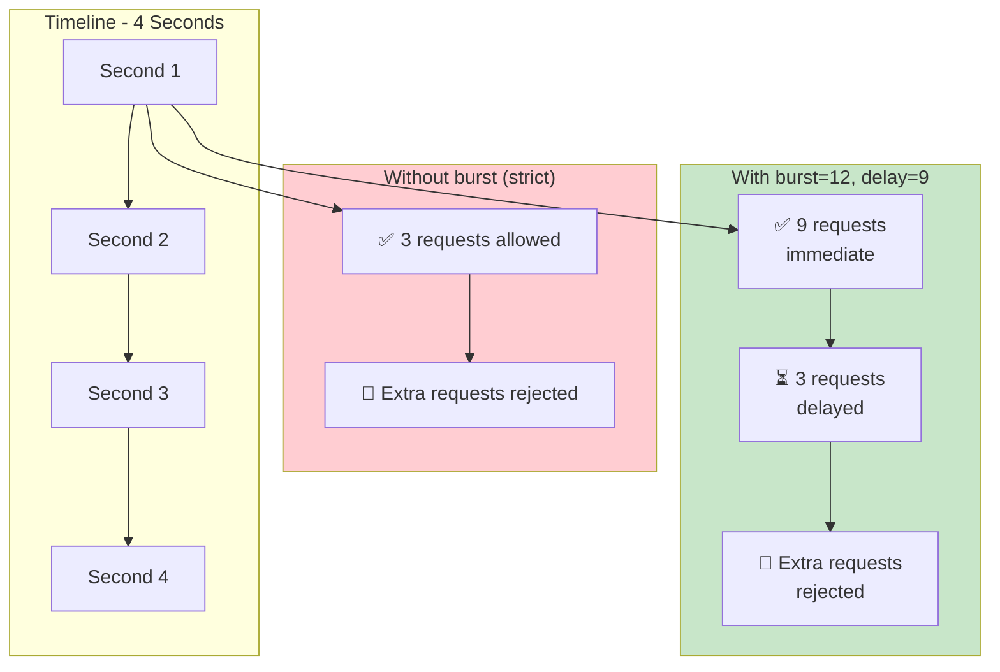

### Configuration Options Compared

```nginx
# Option 1: Strict (no burst)
limit_req zone=limitbyaddr;
# → Reject any request over 3/second

# Option 2: With burst only
limit_req zone=limitbyaddr burst=12;
# → Allow 12 burst requests (all delayed)

# Option 3: With burst and nodelay
limit_req zone=limitbyaddr burst=12 nodelay;
# → Allow 12 requests immediately, then wait 4 seconds

# Option 4: With burst and delay (best)
limit_req zone=limitbyaddr burst=12 delay=9;
# → 9 requests immediate, 3 delayed, rest rejected
```

### Practical Examples

#### Example 1: Login Page Protection

```nginx
http {
    # Strict limit for login page
    limit_req_zone $binary_remote_addr zone=login:10m rate=1r/s;
    
    server {
        location /login {
            # Small burst for user experience
            limit_req zone=login burst=5 delay=3;
            limit_req_status 429;
            
            proxy_pass http://auth-backend;
        }
    }
}
```

#### Example 2: Multiple Zones for Different Paths

```nginx
http {
    # Different zones for different needs
    limit_req_zone $binary_remote_addr zone=api:10m rate=10r/s;
    limit_req_zone $binary_remote_addr zone=admin:10m rate=2r/s;
    limit_req_zone $binary_remote_addr zone=static:10m rate=50r/s;
    
    server {
        # API - 10 requests/second
        location /api/ {
            limit_req zone=api burst=20 delay=15;
            proxy_pass http://api-backend;
        }
        
        # Admin - strict limit
        location /admin/ {
            limit_req zone=admin burst=5;
            proxy_pass http://admin-backend;
        }
        
        # Static files - generous limit
        location /static/ {
            limit_req zone=static burst=100;
            root /var/www/static;
        }
    }
}
```

#### Example 3: Layered Defense

```nginx
http {
    # Multiple zones for layered defense
    limit_req_zone $binary_remote_addr zone=global:10m rate=50r/s;
    limit_req_zone $binary_remote_addr zone=strict:10m rate=5r/s;
    
    server {
        location / {
            # Global limit for all traffic
            limit_req zone=global burst=100 nodelay;
            
            # Special protection for sensitive endpoints
            location /api/sensitive {
                limit_req zone=strict burst=10;
                proxy_pass http://sensitive-backend;
            }
            
            location /login {
                limit_req zone=strict burst=5;
                proxy_pass http://auth-backend;
            }
        }
    }
}
```

#### Example 4: Dry Run Testing

```nginx
http {
    limit_req_zone $binary_remote_addr zone=test:10m rate=10r/s;
    
    server {
        location / {
            # Test mode enabled
            limit_req_dry_run on;
            limit_req zone=test burst=20;
            
            # Log status for analysis
            log_format dry_run '$remote_addr - $request '
                               'Status: $limit_req_status';
            access_log /var/log/nginx/dry_run.log dry_run;
            
            proxy_pass http://backend;
        }
    }
}
```

### Rate Limiting Flow

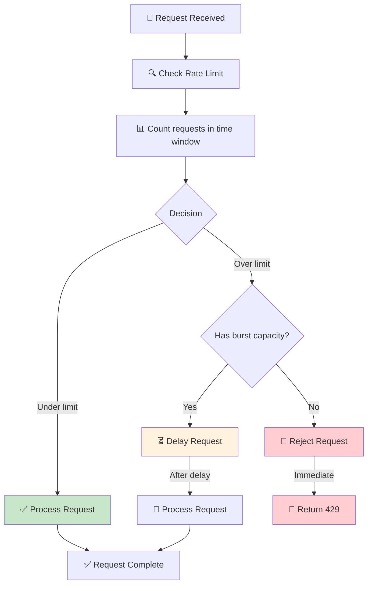

### Status Codes

| Status | Meaning | When Used |
|--------|---------|-----------|
| `PASSED` | Request allowed | Under rate limit |
| `DELAYED` | Request delayed | In burst window |
| `REJECTED` | Request rejected | Over limit (no burst) |
| `DELAYED_DRY_RUN` | Would be delayed | Test mode |
| `REJECTED_DRY_RUN` | Would be rejected | Test mode |

### Use Cases

| Use Case | Rate Limit | Why |
|----------|------------|-----|
| **Login Pages** | 1-3 r/s | Prevent brute force attacks |
| **Public API** | 10-50 r/s | Fair usage |
| **Search Endpoints** | 20-100 r/s | Resource protection |
| **Admin Panels** | 2-5 r/s | Security |
| **Static Files** | 50-200 r/s | High performance |

### Best Practices

1. **Start conservative**: Begin with lower limits, increase if needed
2. **Use dry run first**: Test limits before enforcing
3. **Monitor logs**: Check `$limit_req_status` regularly
4. **Use appropriate zones**: Different limits for different endpoints
5. **Consider user experience**: Use burst for legitimate spikes

---

## 7. Limiting Bandwidth

### The Problem

You need to limit download bandwidth per client for your assets.

### The Solution

```nginx
location /download/ {
    # Limit after 10 MB has been transferred
    limit_rate_after 10m;
    
    # Limit to 1 MB per second
    limit_rate 1m;
}
```

### How It Works

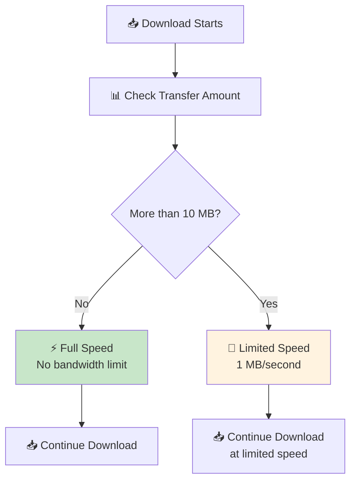

### Configuration Parameters

| Parameter | Description | Example |
|-----------|-------------|---------|
| `limit_rate_after` | Amount before limiting | `10m`, `100k`, `1g` |
| `limit_rate` | Speed limit after threshold | `1m`, `500k`, `5m` |
| `$limit_rate` | Variable for dynamic limits | `$rate_limit` |

### Practical Examples

#### Example 1: Different Limits for Different File Types

```nginx
server {
    location /download/ {
        # Default limit
        limit_rate_after 10m;
        limit_rate 1m;
        root /var/www/downloads;
    }
    
    location /download/video/ {
        # Video files - higher limit
        limit_rate_after 50m;
        limit_rate 5m;
        root /var/www/downloads/video;
    }
    
    location /download/small/ {
        # Small files - no limit
        limit_rate 0;  # 0 = no limit
        root /var/www/downloads/small;
    }
}
```

#### Example 2: Dynamic Limits Based on User

```nginx
server {
    location /download/ {
        set $rate_limit "1m";
        
        # Premium users get higher speed
        if ($cookie_user_type = "premium") {
            set $rate_limit "5m";
        }
        
        # Internal users get even higher speed
        if ($remote_addr ~* "^10\.") {
            set $rate_limit "10m";
        }
        
        # Apply limits
        limit_rate_after 10m;
        limit_rate $rate_limit;
        
        root /var/www/downloads;
    }
}
```

#### Example 3: Combined with Connection Limits

```nginx
http {
    limit_conn_zone $binary_remote_addr zone=download_zone:10m;
    
    server {
        location /download/ {
            # Connection limit
            limit_conn download_zone 3;
            
            # Bandwidth limit
            limit_rate_after 20m;
            limit_rate 2m;
            
            # Rate limit for requests
            limit_req_zone $binary_remote_addr zone=download_req:10m rate=5r/s;
            
            root /var/www/downloads;
        }
    }
}
```

#### Example 4: Mobile Users Limitation

```nginx
server {
    location /download/ {
        set $rate_after "10m";
        set $rate_limit "1m";
        
        # Mobile users get lower speed
        if ($http_user_agent ~* "(iPhone|Android|mobile)") {
            set $rate_after "5m";
            set $rate_limit "500k";
        }
        
        # Desktop users get higher speed
        if ($http_user_agent ~* "(Windows|Mac|Linux)") {
            set $rate_after "20m";
            set $rate_limit "2m";
        }
        
        limit_rate_after $rate_after;
        limit_rate $rate_limit;
        
        root /var/www/downloads;
    }
}
```

### Bandwidth Limit Flow

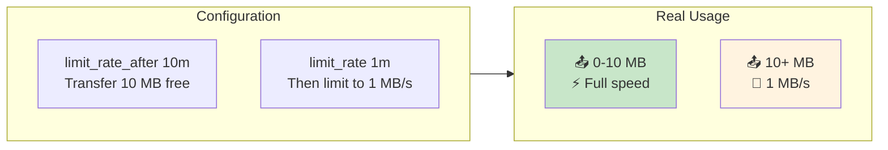

### Bandwidth Units

| Unit | Meaning | Example |
|------|---------|---------|
| `k` | Kilobytes per second | `500k` = 500 KB/s |
| `m` | Megabytes per second | `2m` = 2 MB/s |
| `g` | Gigabytes per second | `1g` = 1 GB/s |
| `0` | No limit | `limit_rate 0;` |

### Use Cases

| Use Case | Rate Limit | After Limit | Why |
|----------|------------|-------------|-----|
| **Video Download** | 5 MB/s | 50 MB | Fast start, then controlled |
| **Large Files** | 1 MB/s | 10 MB | Fair distribution |
| **Premium Content** | 10 MB/s | 100 MB | Faster for premium users |
| **Mobile Users** | 500 KB/s | 5 MB | Save mobile data |
| **Internal Network** | 50 MB/s | 1 GB | Fast internal transfers |

### Best Practices

1. **Use `limit_rate_after` wisely**: Allow fast starts for user experience
2. **Set realistic limits**: Based on your network capacity
3. **Consider connection limits**: Use with `limit_conn` for better control
4. **Test different scenarios**: Mobile, desktop, different file sizes
5. **Monitor bandwidth usage**: Check if limits are effective

### Important Notes

- **Per connection**: Limits apply to each connection separately
- **Combined limits**: Use with connection limits for better control
- **Dynamic rates**: Use `$limit_rate` variable for flexible control
- **Zero value**: `limit_rate 0` means no limit

---

## Summary: Traffic Management Features

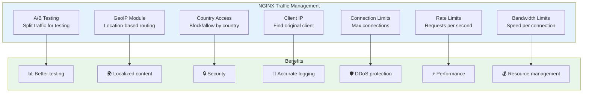

### Feature Comparison Table

| Feature | Purpose | Key Directives | Best Use Case |
|---------|---------|---------------|---------------|
| **A/B Testing** | Split traffic | `split_clients` | Testing new features |
| **GeoIP** | Location detection | `geoip_country`, `geoip_city` | Content localization |
| **Country Access** | Access control | `map`, `if` | Security compliance |
| **Client IP** | Real IP detection | `geoip_proxy`, `geoip_proxy_recursive` | Behind proxies |
| **Connection Limits** | Concurrent connections | `limit_conn_zone`, `limit_conn` | Download servers |
| **Rate Limits** | Request frequency | `limit_req_zone`, `limit_req` | API protection |
| **Bandwidth Limits** | Download speed | `limit_rate_after`, `limit_rate` | Media streaming |

### Getting Started Checklist

1. ✅ Choose what to protect
2. ✅ Select appropriate limits
3. ✅ Use dry run for testing
4. ✅ Monitor and adjust
5. ✅ Document your configuration
6. ✅ Regular review and updates

### Common Pitfalls to Avoid

1. **Too strict limits** → Bad user experience
2. **Too loose limits** → No protection
3. **Not testing** → Unexpected behavior
4. **Not monitoring** → Missed attacks
5. **Using wrong key** → Ineffective limits
6. **Not updating** → Outdated protection

---

## Resources

- [NGINX Documentation](https://nginx.org/en/docs/)
- [GeoIP Documentation](https://dev.maxmind.com/geoip/)
- [NGINX Plus Features](https://www.nginx.com/products/)
- [NGINX GitHub](https://github.com/nginx/nginx)

---

*This guide provides a comprehensive overview of NGINX traffic management features. For more detailed information, refer to the official NGINX documentation.*
