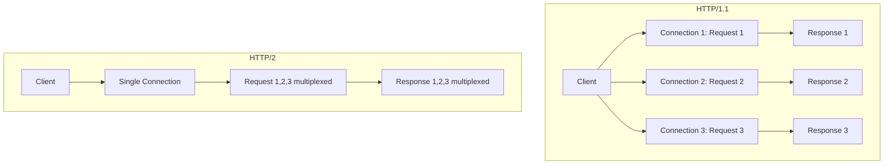
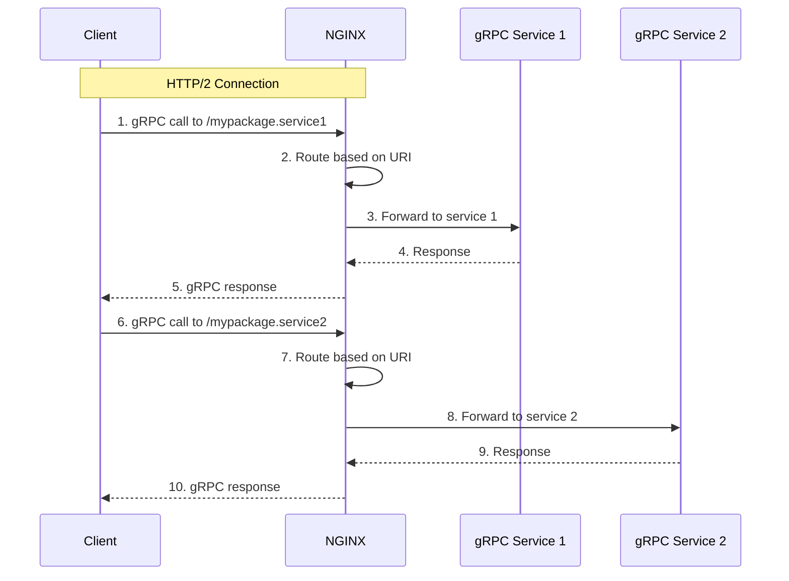
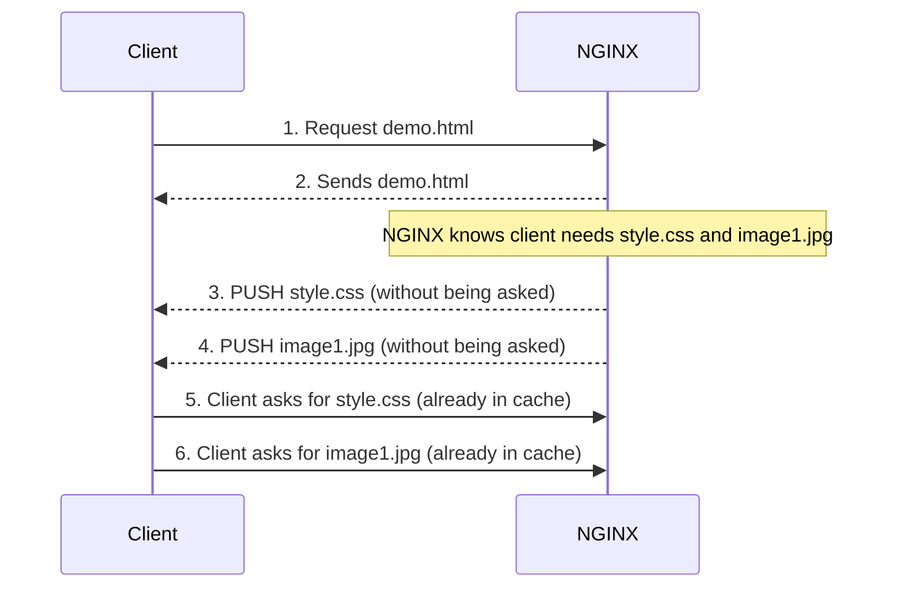

# NGINX HTTP/2 Summary

## Introduction

HTTP/2 is a major upgrade to the HTTP protocol that makes websites faster. It was designed to solve many of the problems with HTTP/1.1.

### Key Benefits of HTTP/2

| Feature | Benefit |
|---------|---------|
| **Multiplexing** | Multiple requests over a single connection (no need for multiple TCP connections) |
| **Header Compression** | Reduces bandwidth usage |
| **Request Prioritization** | Important resources load first |
| **Server Push** | Server can send resources before the client asks for them |

**Note:** While HTTP/2 doesn't require encryption, most browsers only support it over HTTPS (SSL/TLS).

---

## Traffic Diagrams

### 1. HTTP/2 Multiplexing vs HTTP/1.1



### 2. gRPC Flow with NGINX



### 3. HTTP/2 Server Push Flow



---

## Problems and Solutions

### 1. Problem: You want to enable HTTP/2 on your NGINX server

**Solution:** Add the `http2` parameter to the `listen` directive. Remember that most browsers require HTTPS for HTTP/2.

---

### 2. Problem: You need to load balance and route gRPC traffic

gRPC uses HTTP/2 and you need NGINX to handle it properly.

**Solution:** Use the `grpc_pass` directive. NGINX can route, load balance, and terminate TLS for gRPC calls.

---

### 3. Problem: You want to speed up page loads with Server Push

When a user requests a page, you want to send CSS and JavaScript files immediately without waiting for the browser to ask.

**Solution:** Use the `http2_push` directive or `http2_push_preload` with Link headers.

---

## Configuration Syntax

### 1. Basic HTTP/2 Configuration

```nginx
server {
    # Enable HTTP/2 with the "http2" parameter
    # Note: Most browsers require HTTPS for HTTP/2
    listen 443 ssl http2 default_server;

    # SSL/TLS certificates (required for HTTP/2 in most browsers)
    ssl_certificate     server.crt;
    ssl_certificate_key server.key;

    # ... rest of your configuration
}
```

**Important Notes:**
- Most browsers only support HTTP/2 over HTTPS
- Some TLS 1.2 ciphers are blocked by HTTP/2 specification
- NGINX's default ciphers are safe

**Testing your HTTP/2 setup:**
```bash
# Using nghttp utility
nghttp -v https://example.com

# Using curl
curl --http2 -I https://example.com
```

---

### 2. gRPC Configuration

#### Basic gRPC Proxy (No Encryption)

```nginx
server {
    listen 80 http2;

    location / {
        # Proxy to gRPC backend
        grpc_pass grpc://backend.local:50051;
    }
}
```

#### gRPC with TLS Termination at NGINX

```nginx
server {
    # Client to NGINX: HTTPS + HTTP/2
    listen 443 ssl http2 default_server;
    ssl_certificate     server.crt;
    ssl_certificate_key server.key;

    location / {
        # NGINX to Backend: Unencrypted HTTP/2
        grpc_pass grpc://backend.local:50051;
    }
}
```

#### End-to-End Encryption for gRPC

```nginx
server {
    listen 443 ssl http2 default_server;
    ssl_certificate     server.crt;
    ssl_certificate_key server.key;

    location / {
        # NGINX to Backend: Encrypted HTTP/2
        grpc_pass grpcs://backend.local:50051;  # Note the "s"
    }
}
```

#### Routing gRPC Calls to Different Services

```nginx
# Route based on the URI (package/service/method)
location /mypackage.service1 {
    # Send to service 1
    grpc_pass grpc://$grpc_service1;
}

location /mypackage.service2 {
    # Send to service 2
    grpc_pass grpc://$grpc_service2;
}

# Static content for non-gRPC requests
location / {
    root /usr/share/nginx/html;
    index index.html index.htm;
}
```

#### Load Balancing gRPC Traffic

```nginx
# Define an upstream group of gRPC servers
upstream grpcservers {
    server backend1.local:50051;
    server backend2.local:50051;
    # Add more servers as needed
}

server {
    listen 443 ssl http2 default_server;
    ssl_certificate     server.crt;
    ssl_certificate_key server.key;

    location / {
        # Load balance across the upstream group
        grpc_pass grpc://grpcservers;
    }
}
```

**gRPC Additional Directives:**
```nginx
# Set timeouts
grpc_connect_timeout 5s;
grpc_send_timeout 30s;
grpc_read_timeout 30s;

# Set custom headers
grpc_set_header X-Real-IP $remote_addr;

# Next upstream when backend fails
grpc_next_upstream error timeout invalid_response;
```

---

### 3. HTTP/2 Server Push

#### Basic Server Push (Static Configuration)

```nginx
server {
    listen 443 ssl http2 default_server;
    ssl_certificate     server.crt;
    ssl_certificate_key server.key;

    root /usr/share/nginx/html;

    location = /demo.html {
        # Push these files when demo.html is requested
        http2_push /style.css;
        http2_push /image1.jpg;
    }
}
```

#### Automatic Server Push with Link Headers

```nginx
server {
    listen 443 ssl http2 default_server;
    ssl_certificate     server.crt;
    ssl_certificate_key server.key;

    # Enable automatic push from Link headers
    http2_push_preload on;

    location / {
        proxy_pass http://backend;
        # Your backend can send Link headers to trigger pushes
    }
}
```

**How it works with Link headers:**
Your backend application sends this header:
```
Link: </style.css>; rel=preload; as=style
```

NGINX will automatically push `/style.css` to the client.

#### Complete Example with Server Push

```nginx
server {
    listen 443 ssl http2 default_server;
    server_name example.com;

    ssl_certificate     /etc/nginx/ssl/example.crt;
    ssl_certificate_key /etc/nginx/ssl/example.key;

    root /var/www/html;
    index index.html;

    # Enable automatic preload
    http2_push_preload on;

    # Static pushes for specific files
    location = /index.html {
        http2_push /js/main.js;
        http2_push /css/style.css;
        http2_push /images/logo.png;
    }

    # Or push dynamically from Link headers
    location /api/ {
        proxy_pass http://api_backend;
        http2_push_preload on;
        proxy_set_header X-Forwarded-For $remote_addr;
    }
}
```

---

## Full Example: HTTP/2 + gRPC + Server Push Together

```nginx
http {
    # Upstream for gRPC services
    upstream grpc_backend {
        server grpc1.local:50051;
        server grpc2.local:50051;
    }

    # Upstream for regular web traffic
    upstream web_backend {
        server web1.local:80;
        server web2.local:80;
    }

    server {
        listen 443 ssl http2 default_server;
        server_name example.com;

        ssl_certificate     /etc/nginx/ssl/example.crt;
        ssl_certificate_key /etc/nginx/ssl/example.key;

        # Enable automatic preload
        http2_push_preload on;

        root /var/www/html;

        # Static files with push
        location / {
            try_files $uri $uri/ =404;
            # Push these for the main page
            http2_push /css/main.css;
            http2_push /js/app.js;
        }

        # gRPC endpoints
        location /myapp.UserService {
            grpc_pass grpc://grpc_backend;
            grpc_set_header X-Real-IP $remote_addr;
            grpc_connect_timeout 5s;
        }

        location /myapp.ProductService {
            grpc_pass grpc://grpc_backend;
            grpc_set_header X-Real-IP $remote_addr;
        }

        # API endpoints (regular HTTP)
        location /api/ {
            proxy_pass http://web_backend;
            proxy_set_header Host $host;
            proxy_set_header X-Real-IP $remote_addr;
            # Enable push from Link headers
            http2_push_preload on;
        }
    }
}
```

---

## Summary Table

| Feature | Purpose | Syntax |
|---------|---------|--------|
| Enable HTTP/2 | Turn on HTTP/2 protocol | `listen 443 ssl http2;` |
| gRPC Proxy | Proxy gRPC calls | `grpc_pass grpc://backend:50051;` |
| gRPC with TLS | Encrypted gRPC | `grpc_pass grpcs://backend:50051;` |
| gRPC Routing | Route by service/method | `location /service.method { grpc_pass ...; }` |
| gRPC Load Balancing | Distribute gRPC calls | `upstream group { server ...; } grpc_pass grpc://group;` |
| Server Push | Pre-send resources | `http2_push /style.css;` |
| Auto Push | Push from Link headers | `http2_push_preload on;` |

---

## Key Takeaways

1. **HTTP/2 is much faster** than HTTP/1.1 because of multiplexing
2. **Always use HTTPS** with HTTP/2 for browser compatibility
3. **gRPC** is an HTTP/2-based protocol - NGINX handles it well
4. **Server Push** can significantly speed up page loads
5. **Test your HTTP/2 setup** with browser extensions or the `nghttp` tool

## Browser Testing Tools

| Tool | Type | Purpose |
|------|------|---------|
| **nghttp** | Command line | Test HTTP/2 connections |
| **HTTP/2 Indicator** | Chrome extension | Shows if site uses HTTP/2 |
| **HTTP/2 Indicator** | Firefox add-on | Shows if site uses HTTP/2 |