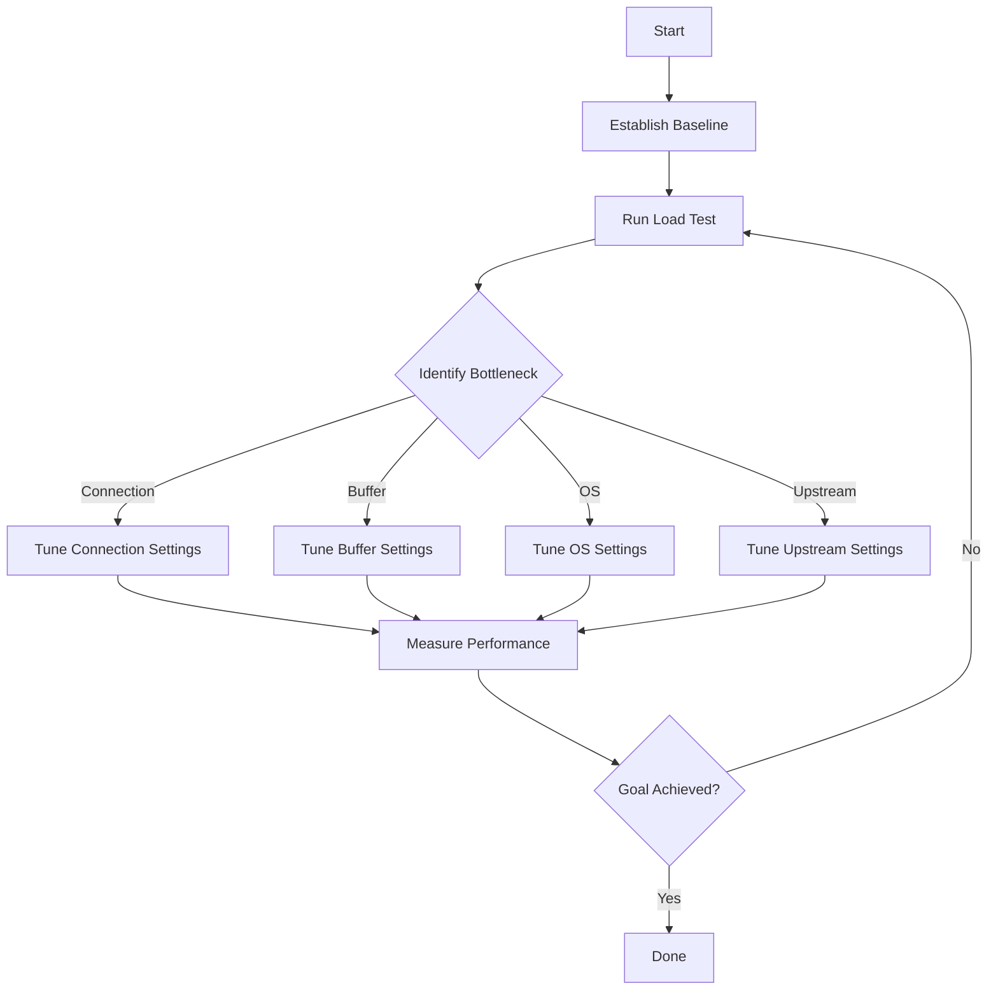
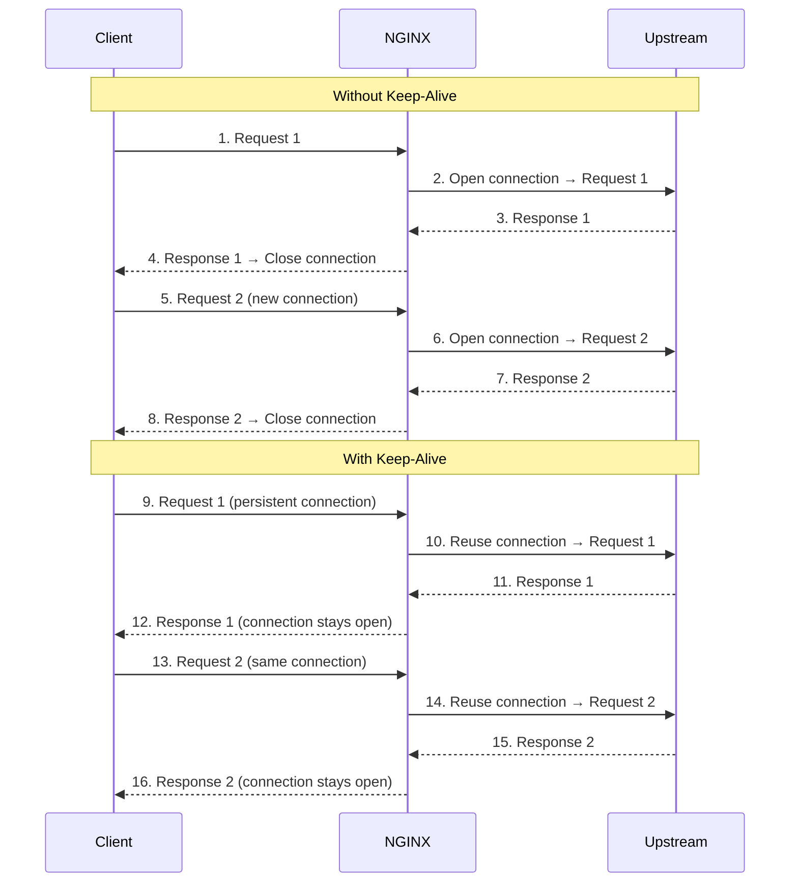

# NGINX Performance Tuning Summary

## Introduction

Performance tuning is the art of making your NGINX server faster and more efficient. It's a process of:

1. **Testing** to find bottlenecks
2. **Identifying** the bottleneck
3. **Tuning** to fix it
4. **Repeating** until performance goals are met

### Key Performance Areas

| Area | What to Tune |
|------|--------------|
| **Connections** | Keep-alive timeouts, request limits |
| **Upstream** | Keep-alive connections, load balancing |
| **Buffering** | Proxy buffers, access log buffers |
| **OS** | File descriptors, kernel parameters, ephemeral ports |
| **Testing** | Load drivers, baseline measurements |

---

## Traffic Diagrams

### 1. Performance Tuning Process



### 2. Connection Flow with Keep-Alive



---

## Problems and Solutions

### 1. Problem: You need consistent, repeatable performance testing

Manual testing is inconsistent and doesn't give reliable results.

**Solution:** Use automated load testing tools to establish a baseline and measure improvements.

---

### 2. Problem: Connections are being closed too quickly

Clients are opening and closing many connections, wasting resources.

**Solution:** Increase `keepalive_requests` and `keepalive_timeout` to keep connections open longer.

---

### 3. Problem: Upstream connections are being recreated for every request

NGINX opens a new connection to the upstream server for each request.

**Solution:** Use `keepalive` in the upstream context to reuse connections.

---

### 4. Problem: Large responses are being written to disk

NGINX is writing responses to temporary files, causing disk I/O bottlenecks.

**Solution:** Tune `proxy_buffer_size` and `proxy_buffers` to buffer responses in memory.

---

### 5. Problem: Access logs are causing disk I/O bottlenecks

Every request writes to disk, slowing down the system.

**Solution:** Enable log buffering with `buffer` and `flush` parameters.

---

### 6. Problem: The OS can't handle the number of connections

The kernel limits are too low for high-traffic applications.

**Solution:** Tune OS kernel parameters for file descriptors, connection queues, and ephemeral ports.

---

## Configuration Syntax

### 1. Load Testing Tools

#### Apache JMeter

```xml
<!-- Sample JMeter Test Plan -->
<testPlan>
    <stringProp name="TestPlan.comments">NGINX Performance Test</stringProp>
    <hashTree>
        <ThreadGroup>
            <stringProp name="ThreadGroup.num_threads">100</stringProp>
            <stringProp name="ThreadGroup.ramp_time">60</stringProp>
            <stringProp name="ThreadGroup.loops">100</stringProp>
        </ThreadGroup>
        <HTTPSamplerProxy>
            <stringProp name="HTTPSampler.domain">nginx.example.com</stringProp>
            <stringProp name="HTTPSampler.port">80</stringProp>
            <stringProp name="HTTPSampler.path">/api/test</stringProp>
        </HTTPSamplerProxy>
    </hashTree>
</testPlan>
```

#### Locust (Python)

```python
from locust import HttpUser, task, between

class NginxLoadTest(HttpUser):
    wait_time = between(1, 3)
    
    @task
    def test_endpoint(self):
        self.client.get("/api/test")
    
    @task(3)
    def test_heavy_endpoint(self):
        self.client.get("/api/heavy")
```

#### Gatling (Scala)

```scala
class NginxLoadTest extends Simulation {
  val httpProtocol = http
    .baseUrl("http://nginx.example.com")
    .acceptHeader("application/json")

  val scn = scenario("NGINX Performance Test")
    .exec(http("Request 1").get("/api/test"))
    .pause(1)
    .exec(http("Request 2").get("/api/heavy"))

  setUp(
    scn.inject(
      rampUsers(100).during(60.seconds)
    )
  ).protocols(httpProtocol)
}
```

### 2. Connection Tuning (Client)

```nginx
http {
    # Increase max requests per connection (default: 100)
    keepalive_requests 320;

    # Increase keep-alive timeout (default: 75s)
    keepalive_timeout 300s;

    # Optional: Keep connections open even during high load
    keepalive_disable none;

    # Maximum size of client request header
    client_header_buffer_size 4k;

    # Buffer for large client headers
    large_client_header_buffers 4 32k;

    server {
        listen 80;

        location / {
            proxy_pass http://backend;

            # Enable keep-alive to upstream
            proxy_http_version 1.1;
            proxy_set_header Connection "";

            # Timeouts
            proxy_connect_timeout 60s;
            proxy_send_timeout 60s;
            proxy_read_timeout 60s;
        }
    }
}
```

### 3. Upstream Connection Tuning

```nginx
http {
    # Upstream keep-alive connections
    upstream backend {
        server 10.0.0.42:80;
        server 10.0.0.43:80;

        # Max idle connections to keep open per worker
        keepalive 32;

        # Optional: Keep-alive requests
        keepalive_requests 100;
        keepalive_timeout 60s;
    }

    server {
        listen 80;

        location / {
            proxy_pass http://backend;

            # Required for keep-alive
            proxy_http_version 1.1;
            proxy_set_header Connection "";

            # Buffering
            proxy_buffering on;
            proxy_buffer_size 8k;
            proxy_buffers 8 32k;
            proxy_busy_buffers_size 64k;
        }
    }
}
```

### 4. Proxy Buffering

```nginx
http {
    server {
        location / {
            proxy_pass http://backend;

            # Enable buffering
            proxy_buffering on;

            # Buffer for response headers
            proxy_buffer_size 8k;

            # Number and size of buffers
            proxy_buffers 8 32k;

            # Busy buffer size
            proxy_busy_buffers_size 64k;

            # Temp file settings (when response is too large)
            proxy_temp_file_write_size 64k;
            proxy_max_temp_file_size 1024m;

            # Response buffering timeouts
            proxy_connect_timeout 60s;
            proxy_send_timeout 60s;
            proxy_read_timeout 60s;
        }
    }
}
```

**Buffer Settings Explained:**

| Directive | Description | Default |
|-----------|-------------|---------|
| `proxy_buffering` | Enable/disable buffering | on |
| `proxy_buffer_size` | Buffer for response headers | 4k/8k |
| `proxy_buffers` | Number and size of buffers | 8 4k/8k |
| `proxy_busy_buffers_size` | Max busy buffer size | 2x buffer size |
| `proxy_temp_file_write_size` | Temp file write size | 8k/16k |
| `proxy_max_temp_file_size` | Max temp file size | 1024m |

### 5. Access Log Buffering

```nginx
http {
    log_format main '$remote_addr - $remote_user [$time_local] '
                    '"$request" $status $body_bytes_sent '
                    '"$http_referer" "$http_user_agent"';

    # Buffer access logs
    access_log /var/log/nginx/access.log main
               buffer=32k    # Buffer size
               flush=1m      # Flush every minute
               gzip=1;       # Compress logs (1=fast, 9=best)

    # Different buffering for error logs
    error_log /var/log/nginx/error.log warn;
}
```

**Buffer Parameters:**

| Parameter | Description | Default |
|-----------|-------------|---------|
| `buffer=size` | Memory buffer size | None |
| `flush=time` | Max time before writing | None |
| `gzip=level` | Compression level (1-9) | None |

### 6. OS Tuning

#### System-wide Limits (`/etc/sysctl.conf`)

```bash
# Maximum connection queue size
net.core.somaxconn = 65535

# Maximum file descriptors
fs.file-max = 200000

# Ephemeral port range
net.ipv4.ip_local_port_range = 1024 65535

# TCP tuning
net.ipv4.tcp_tw_reuse = 1
net.ipv4.tcp_fin_timeout = 30

# TCP keep-alive
net.ipv4.tcp_keepalive_time = 120
net.ipv4.tcp_keepalive_intvl = 30
net.ipv4.tcp_keepalive_probes = 3

# Buffer sizes
net.core.rmem_max = 16777216
net.core.wmem_max = 16777216
net.ipv4.tcp_rmem = 4096 87380 16777216
net.ipv4.tcp_wmem = 4096 65536 16777216
```

#### User Limits (`/etc/security/limits.conf`)

```bash
# Hard and soft limits for NGINX user
nginx   soft    nofile  100000
nginx   hard    nofile  100000
```

#### Apply Kernel Settings

```bash
# Apply sysctl settings
sudo sysctl -p

# Check current limits
ulimit -n

# Check open file handles
lsof | wc -l
```

#### NGINX Configuration for High Connections

```nginx
# Main context
user nginx;
worker_processes auto;  # Auto detect CPU cores

# Increase worker process limit
worker_rlimit_nofile 100000;

events {
    # Max connections per worker
    worker_connections 50000;

    # Accept multiple connections at once
    multi_accept on;

    # Efficient event processing
    use epoll;  # Linux
    # use kqueue;  # BSD/OSX
}

http {
    # Keep-alive settings
    keepalive_requests 320;
    keepalive_timeout 300s;

    # Timeout settings
    client_body_timeout 60s;
    client_header_timeout 60s;
    send_timeout 60s;

    # Buffer settings
    client_body_buffer_size 128k;
    client_header_buffer_size 8k;
    large_client_header_buffers 4 32k;

    # Response settings
    sendfile on;
    tcp_nopush on;
    tcp_nodelay on;

    # Gzip compression
    gzip on;
    gzip_vary on;
    gzip_proxied any;
    gzip_comp_level 6;
    gzip_types text/plain text/css text/xml text/javascript
               application/json application/javascript application/xml+rss
               application/rss+xml image/svg+xml;

    # Upstream settings
    upstream backend {
        server 10.0.0.42:80;
        server 10.0.0.43:80;

        keepalive 32;
        keepalive_requests 100;
        keepalive_timeout 60s;
    }

    # Server context
    server {
        listen 80 backlog=65535;  # Match somaxconn
        listen 443 ssl backlog=65535;

        # Timeouts
        client_body_timeout 30s;
        client_header_timeout 30s;
        send_timeout 30s;

        location / {
            proxy_pass http://backend;

            # HTTP/1.1 for keep-alive
            proxy_http_version 1.1;
            proxy_set_header Connection "";

            # Buffering
            proxy_buffering on;
            proxy_buffer_size 8k;
            proxy_buffers 8 32k;
            proxy_busy_buffers_size 64k;

            # Timeouts
            proxy_connect_timeout 30s;
            proxy_send_timeout 30s;
            proxy_read_timeout 30s;
        }
    }
}
```

---

## Performance Tuning Checklist

### 1. Connection Tuning

| Parameter | Recommended | Default | Notes |
|-----------|-------------|---------|-------|
| `keepalive_requests` | 320 | 100 | More requests per connection |
| `keepalive_timeout` | 300s | 75s | Keep connections alive longer |
| `worker_connections` | 50000 | 1024 | More connections per worker |
| `worker_rlimit_nofile` | 100000 | None | More file descriptors |

### 2. Buffer Tuning

| Parameter | Recommended | Default | Notes |
|-----------|-------------|---------|-------|
| `proxy_buffer_size` | 8k | 4k/8k | Buffer for headers |
| `proxy_buffers` | 8 32k | 8 4k/8k | More/larger buffers |
| `proxy_busy_buffers_size` | 64k | 2x buffer | Busy buffer limit |
| `client_body_buffer_size` | 128k | 8k/16k | Client body buffer |
| `client_header_buffer_size` | 8k | 1k | Client header buffer |

### 3. OS Tuning

| Parameter | Recommended | Default | Notes |
|-----------|-------------|---------|-------|
| `net.core.somaxconn` | 65535 | 128 | Connection queue |
| `fs.file-max` | 200000 | Varies | File descriptors |
| `net.ipv4.ip_local_port_range` | 1024 65535 | Varies | Ephemeral ports |
| `worker_rlimit_nofile` | 100000 | None | FD limit for NGINX |

### 4. Log Tuning

| Parameter | Recommended | Default | Notes |
|-----------|-------------|---------|-------|
| `access_log buffer` | 32k | None | Reduce disk I/O |
| `access_log flush` | 1m | None | Batch writes |
| `access_log gzip` | 1 | None | Compress logs |

---

## Load Testing Scenario

### Step 1: Establish Baseline

```bash
# Run test with default configuration
locust -f nginx_load_test.py --headless -u 100 -r 10 -t 5m

# Record results
# Requests/sec: 500
# Average latency: 50ms
# Error rate: 0.1%
```

### Step 2: Apply Tuning

```nginx
# Add tuning to nginx.conf
keepalive_requests 320;
keepalive_timeout 300s;
```

### Step 3: Rerun Test

```bash
# Run test with tuned configuration
locust -f nginx_load_test.py --headless -u 100 -r 10 -t 5m

# Compare results
# Requests/sec: 750 (+50%)
# Average latency: 35ms (-30%)
# Error rate: 0.0%
```

### Step 4: Repeat for Other Areas

```bash
# Continue tuning: buffers, OS, etc.
# Track improvements in each step
```

---

## Troubleshooting Performance Issues

### Issue 1: High Connection Time

**Check logs:**
```bash
grep "connect() failed" /var/log/nginx/error.log
```

**Solution:**
```nginx
# Increase upstream keep-alive
upstream backend {
    keepalive 64;
    keepalive_timeout 120s;
}
```

### Issue 2: High CPU Usage

**Check:**
```bash
top -p $(pgrep nginx)
```

**Solution:**
```nginx
# Enable gzip compression
gzip on;
gzip_comp_level 2;  # Lower level = less CPU

# Use sendfile for static files
sendfile on;
tcp_nopush on;
```

### Issue 3: High Memory Usage

**Check:**
```bash
ps aux | grep nginx
```

**Solution:**
```nginx
# Reduce buffer sizes
proxy_buffers 4 16k;
client_body_buffer_size 64k;

# Reduce worker processes
worker_processes 2;  # Instead of auto
```

### Issue 4: Error: "Too many open files"

**Check:**
```bash
# View file descriptor limit
ulimit -n

# Check error log
grep "too many open files" /var/log/nginx/error.log
```

**Solution:**
```bash
# Increase system limit
echo "nginx soft nofile 100000" >> /etc/security/limits.conf
echo "nginx hard nofile 100000" >> /etc/security/limits.conf

# Increase NGINX limit
worker_rlimit_nofile 100000;
```

### Issue 5: Error: "Cannot assign requested address"

**Check:**
```bash
# View current port range
cat /proc/sys/net/ipv4/ip_local_port_range
```

**Solution:**
```bash
# Expand port range
echo "1024 65535" > /proc/sys/net/ipv4/ip_local_port_range
```

---

## Performance Tuning Summary Table

| Area | Tuning Goal | Key Settings |
|------|-------------|--------------|
| **Client Connections** | Keep connections open | `keepalive_requests`, `keepalive_timeout` |
| **Upstream Connections** | Reuse connections | `keepalive`, `proxy_http_version 1.1` |
| **Proxy Buffers** | Keep responses in memory | `proxy_buffer_size`, `proxy_buffers` |
| **Log Buffers** | Reduce disk I/O | `access_log buffer`, `flush` |
| **OS Limits** | Handle more connections | `net.core.somaxconn`, `fs.file-max`, `ulimit` |
| **Ephemeral Ports** | More source ports | `net.ipv4.ip_local_port_range` |
| **Workers** | Match CPU cores | `worker_processes auto` |
| **Timeouts** | Prevent hanging connections | `proxy_connect_timeout`, `proxy_read_timeout` |
| **Compression** | Reduce bandwidth | `gzip on`, `gzip_comp_level` |

---

## Key Takeaways

1. **Always establish a baseline** before making changes
2. **Make one change at a time** and measure the impact
3. **Use automated load testing** for consistent results
4. **Keep connections alive** to reduce connection overhead
5. **Buffer responses** to avoid disk I/O
6. **Buffer access logs** to reduce write operations
7. **Tune the OS** for high concurrency
8. **Monitor performance** during tuning to avoid over-tuning
9. **Document changes** and their effects
10. **Test in production-like environments** for accurate results

## Performance Testing Tools

| Tool | Type | Language | Features |
|------|------|----------|----------|
| **Apache JMeter** | GUI/CLI | Java | Rich features, reporting |
| **Locust** | Python | Python | Scriptable, scalable |
| **Gatling** | Scala | Scala | High performance, DSL |
| **wrk** | CLI | C | Very fast, simple |
| **ab (Apache Bench)** | CLI | C | Simple, included with Apache |
| **hey** | CLI | Go | Simple, fast |