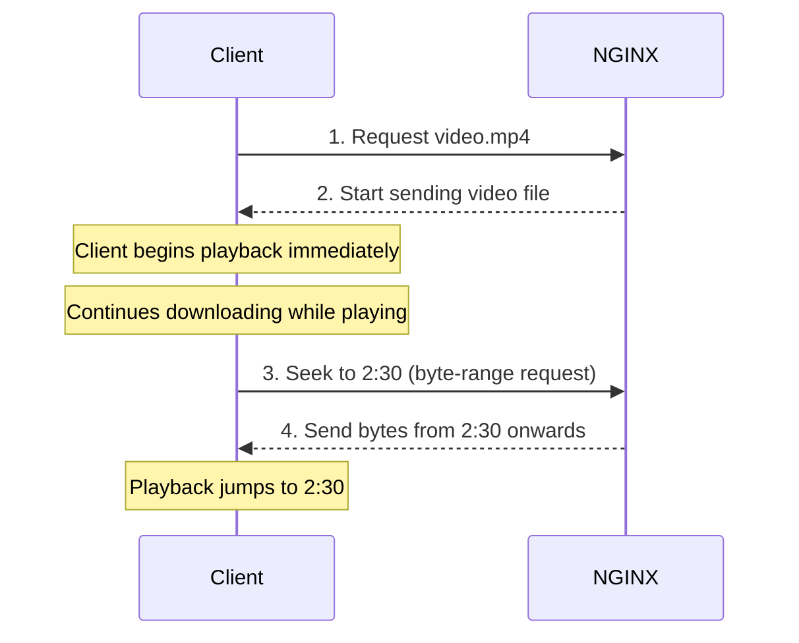
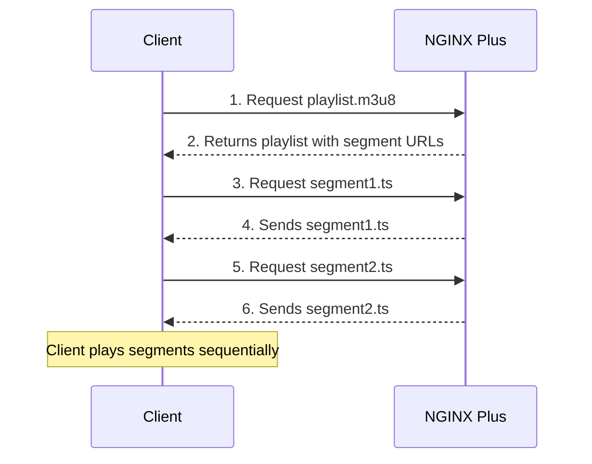
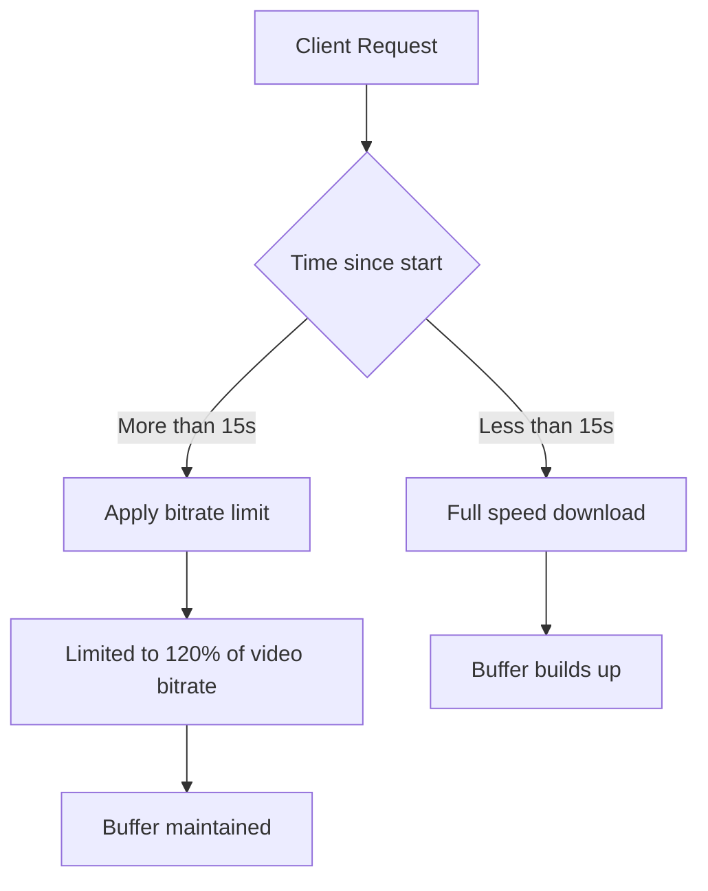

# NGINX Sophisticated Media Streaming Summary

## Introduction

This chapter covers streaming video and audio with NGINX. NGINX is widely used to deliver media content to large audiences because it's fast and efficient.

### Supported Formats and Technologies

| Format/Technology | Description | Version |
|-------------------|-------------|---------|
| **MP4** | MPEG-4 video format | Open Source |
| **FLV** | Flash Video format | Open Source |
| **HLS** | HTTP Live Streaming (Apple) | NGINX Plus |
| **HDS** | HTTP Dynamic Streaming (Adobe) | NGINX Plus |
| **Bandwidth Limiting** | Control download speeds | NGINX Plus |

---

## Traffic Diagrams

### 1. Progressive Download (MP4/FLV)



### 2. HLS Streaming (NGINX Plus)



### 3. Bandwidth Limiting Flow



---

## Problems and Solutions

### 1. Problem: You need to stream MP4 or FLV videos

Users should be able to watch videos while they download and seek to any position.

**Solution:** Use the `mp4` and `flv` directives. NGINX supports progressive download and seeking.

---

### 2. Problem: You need to support HLS streaming (Apple devices, iOS)

You need to serve HLS-compatible streams for iPhones, iPads, and other Apple devices.

**Solution (NGINX Plus):** Use the HLS module. NGINX creates segments on the fly from MP4 files.

---

### 3. Problem: You need to support HDS streaming (Adobe Flash)

You have already fragmented media and need to serve it to Flash players.

**Solution (NGINX Plus):** Use the F4F module to serve fragmented FLV files.

---

### 4. Problem: You need to limit bandwidth for media streaming

You want to control how much bandwidth each user consumes without ruining their viewing experience.

**Solution (NGINX Plus):** Use `mp4_limit_rate_after` and `mp4_limit_rate` to limit bandwidth based on the video's bitrate.

---

## Configuration Syntax

### 1. Serving MP4 and FLV Files

```nginx
http {
    server {
        # ...

        # For MP4 files in /videos/ directory
        location /videos/ {
            mp4;  # Enable MP4 streaming
        }

        # For FLV files anywhere
        location ~ \.flv$ {
            flv;  # Enable FLV streaming
        }
    }
}
```

**How it works:**
- **Progressive Download:** Client can start playing before the file is fully downloaded
- **Seeking:** Client can jump to any part of the video even if it hasn't downloaded yet
- NGINX handles byte-range requests automatically

**Example URL:**
```
http://example.com/videos/movie.mp4
```

---

### 2. HLS Streaming (NGINX Plus)

#### Basic HLS Configuration

```nginx
location /hls/ {
    # Enable HLS streaming
    hls;

    # Where the MP4 files are stored
    alias /var/www/video;

    # HLS parameters
    hls_fragment            4s;   # 4-second segments
    hls_buffers         10 10m;   # 10 buffers of 10MB each
    hls_mp4_buffer_size     1m;   # Initial buffer size
    hls_mp4_max_buffer_size 5m;   # Maximum buffer size
}
```

**Explanation of Directives:**

| Directive | Description |
|-----------|-------------|
| `hls` | Enables HLS handler for this location |
| `alias` | Directory where MP4 files are stored |
| `hls_fragment` | Length of each segment (e.g., `4s` = 4 seconds) |
| `hls_buffers` | Number and size of buffers (e.g., `10 10m`) |
| `hls_mp4_buffer_size` | Initial buffer for MP4 metadata |
| `hls_mp4_max_buffer_size` | Maximum buffer size for MP4 metadata |

#### HLS with Additional Options

```nginx
location /hls/ {
    hls;
    alias /var/www/video;

    # Fragment settings
    hls_fragment            2s;   # Shorter segments for live streaming
    hls_mp4_buffer_size     2m;
    hls_mp4_max_buffer_size 8m;

    # Forward arguments to the HLS handler
    hls_forward_args on;

    # CORS headers for cross-domain access
    add_header Access-Control-Allow-Origin *;
}
```

**How HLS Works:**
1. Client requests the playlist file (`.m3u8`)
2. NGINX creates segments (`.ts` files) from the MP4 on demand
3. Client downloads and plays each segment sequentially
4. Seeking is supported via byte-range requests

**Example URLs:**
```
# Playlist file
http://example.com/hls/movie.m3u8

# Segment file (generated automatically)
http://example.com/hls/movie-0001.ts
```

---

### 3. HDS Streaming (NGINX Plus)

```nginx
location /video/ {
    # Where fragmented files are stored
    alias /var/www/transformed_video;

    # Enable F4F (HDS) streaming
    f4f;

    # Buffer size for index file (.f4x)
    f4f_buffer_size 512k;
}
```

**What You Need:**
- Already fragmented FLV files (F4F format)
- Index file (`.f4x`) describing the fragments
- NGINX Plus serves these to Adobe Flash players

**Example URL:**
```
http://example.com/video/movie.f4f
```

---

### 4. Bandwidth Limiting (NGINX Plus)

#### Basic Bandwidth Limit

```nginx
location /video/ {
    # Enable MP4 streaming
    mp4;

    # Start limiting after 15 seconds
    mp4_limit_rate_after 15s;

    # Limit to 120% of video bitrate
    mp4_limit_rate 1.2;
}
```

**How it Works:**
- First 15 seconds: Full speed download (builds buffer)
- After 15 seconds: Speed limited to percentage of video bitrate
- A value of `1.0` = 100% of video bitrate (just enough to watch)
- A value of `1.2` = 120% of video bitrate (faster than playback)

#### Example Scenarios

```nginx
location /video/ {
    mp4;

    # Scenario 1: Quick buffering then limit
    mp4_limit_rate_after 5s;
    mp4_limit_rate 1.5;

    # Scenario 2: Long buffering then tight limit
    mp4_limit_rate_after 30s;
    mp4_limit_rate 1.0;

    # Scenario 3: No limit
    # mp4_limit_rate_after 0s;
    # mp4_limit_rate 10;  # Very high limit
}
```

| Setting | Best For |
|---------|----------|
| `5s` + `1.5` | Users with good connections, quick start |
| `30s` + `1.0` | Users with poor connections, more buffering |
| No limit | Internal networks, high bandwidth |

---

## Complete Media Streaming Example

```nginx
http {
    # Video streaming server
    server {
        listen 80;
        server_name video.example.com;

        # Common headers for all video
        add_header Access-Control-Allow-Origin *;
        add_header Cache-Control public;

        # 1. MP4 streaming (Open Source)
        location /mp4/ {
            mp4;
            alias /var/www/mp4_videos/;
        }

        # 2. FLV streaming (Open Source)
        location /flv/ {
            flv;
            alias /var/www/flv_videos/;
        }

        # 3. HLS streaming (NGINX Plus)
        location /hls/ {
            hls;
            alias /var/www/hls_videos/;
            hls_fragment            4s;
            hls_buffers         10 10m;
            hls_mp4_buffer_size     1m;
            hls_mp4_max_buffer_size 5m;

            # Allow caching on client
            add_header Cache-Control "public, max-age=31536000";
        }

        # 4. HDS streaming (NGINX Plus)
        location /hds/ {
            f4f;
            alias /var/www/hds_videos/;
            f4f_buffer_size 512k;
        }

        # 5. MP4 with bandwidth limits (NGINX Plus)
        location /limited/ {
            mp4;
            alias /var/www/limited_videos/;

            # Limit after 15 seconds to 120% of bitrate
            mp4_limit_rate_after 15s;
            mp4_limit_rate 1.2;

            # Enable bandwidth logging
            access_log /var/log/nginx/limited_access.log;
        }

        # 6. Secure video streaming (with referer check)
        location /secure/ {
            mp4;
            alias /var/www/secure_videos/;

            # Only allow from our website
            valid_referers none blocked example.com *.example.com;
            if ($invalid_referer) {
                return 403;
            }
        }
    }
}
```

---

## Advanced HLS Configuration

### HLS with Multiple Bitrates (Adaptive Bitrate Streaming)

```nginx
location /hls/ {
    hls;
    alias /var/www/video;

    # Master playlist configuration
    hls_fragment 4s;
    hls_mp4_buffer_size 2m;
    hls_mp4_max_buffer_size 10m;

    # Different quality versions
    # Files: movie_1080p.mp4, movie_720p.mp4, movie_480p.mp4
    # Client selects based on bandwidth
}
```

**Directory Structure:**
```
/var/www/video/
├── movie_1080p.mp4
├── movie_720p.mp4
├── movie_480p.mp4
└── movie.m3u8 (generated automatically)
```

### HLS with DRM (Digital Rights Management)

```nginx
location /hls/ {
    hls;
    alias /var/www/video;

    # Check for valid token in query string
    if ($arg_token != "secret123") {
        return 403;
    }

    hls_fragment 4s;
}
```

**Example URL with Token:**
```
http://example.com/hls/movie.m3u8?token=secret123
```

---

## Performance Tuning

### Buffer Sizes Based on Video Types

| Video Type | hls_fragment | hls_mp4_buffer_size | hls_mp4_max_buffer_size |
|------------|--------------|---------------------|------------------------|
| Short clips (30s) | 2s | 1m | 3m |
| Movies (2h) | 4s | 2m | 8m |
| Live streaming | 2s | 2m | 10m |
| 4K videos | 4s | 4m | 16m |

### Bandwidth Limit Recommendations

| Content Type | mp4_limit_rate_after | mp4_limit_rate |
|--------------|---------------------|----------------|
| Standard quality (720p) | 15s | 1.2 |
| HD quality (1080p) | 20s | 1.3 |
| 4K quality | 30s | 1.5 |
| Audio only | 5s | 1.0 |

---

## Summary Table

| Feature | Directive | Version | Purpose |
|---------|-----------|---------|---------|
| MP4 streaming | `mp4;` | Open Source | Stream MP4 files with seeking |
| FLV streaming | `flv;` | Open Source | Stream FLV files with seeking |
| HLS streaming | `hls;` | NGINX Plus | HTTP Live Streaming for Apple devices |
| HDS streaming | `f4f;` | NGINX Plus | HTTP Dynamic Streaming for Adobe |
| HLS fragment length | `hls_fragment 4s;` | NGINX Plus | Length of each HLS segment |
| HLS buffering | `hls_buffers 10 10m;` | NGINX Plus | Buffer size and count for HLS |
| HLS MP4 buffer | `hls_mp4_buffer_size 1m;` | NGINX Plus | Initial buffer for MP4 metadata |
| HLS max buffer | `hls_mp4_max_buffer_size 5m;` | NGINX Plus | Maximum MP4 metadata buffer |
| F4F buffer | `f4f_buffer_size 512k;` | NGINX Plus | Buffer for HDS index files |
| Rate limit start | `mp4_limit_rate_after 15s;` | NGINX Plus | When to start bandwidth limiting |
| Rate limit speed | `mp4_limit_rate 1.2;` | NGINX Plus | Speed relative to video bitrate |

---

## Key Takeaways

1. **MP4 and FLV streaming** are easy to enable with single directives
2. **Progressive download** lets users start watching before download finishes
3. **Seeking** works automatically with byte-range requests
4. **HLS and HDS** require NGINX Plus for on-the-fly fragmentation
5. **Bandwidth limiting** should be based on video bitrate to maintain quality
6. **Buffer sizes** should be tuned based on your content and audience