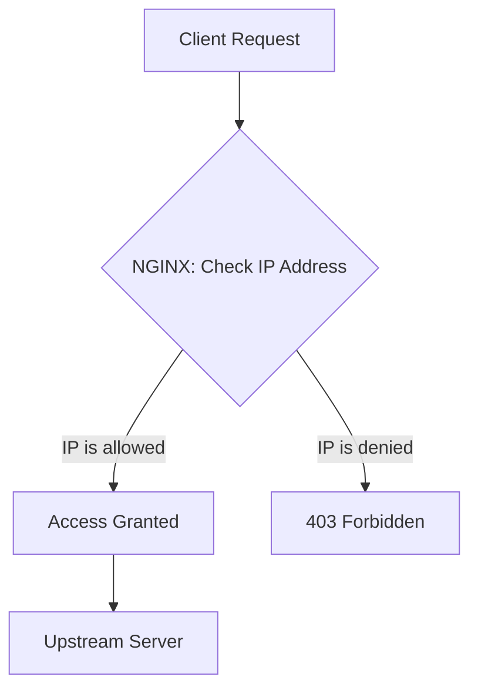
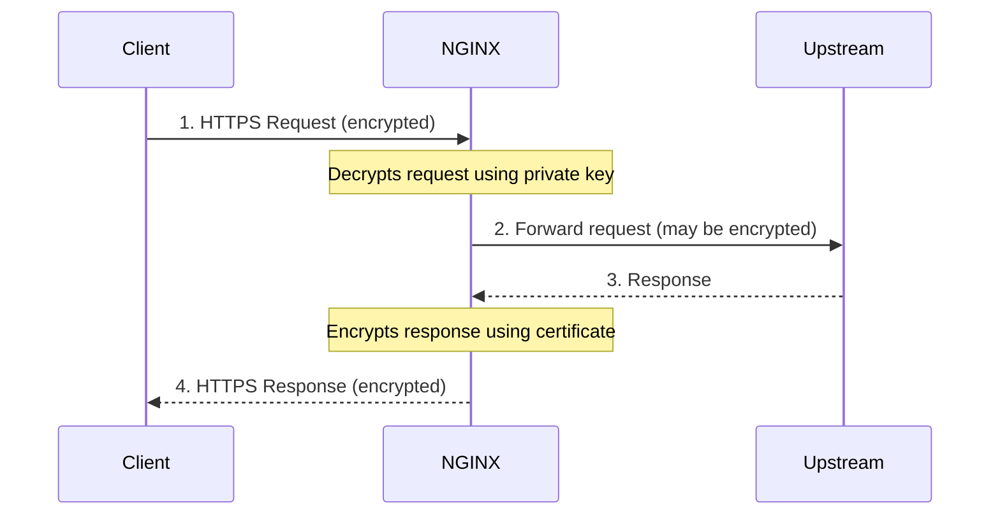
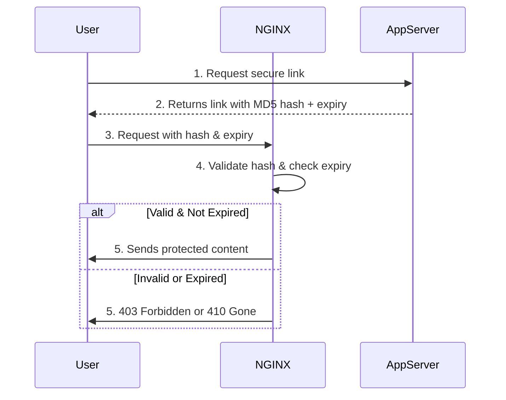

# NGINX Security Controls Summary

## Introduction

Security is like an onion - it has many layers. This chapter covers multiple ways to secure your web applications with NGINX. You can use these methods together for stronger protection.

> **Note:** This chapter does not cover ModSecurity (Web Application Firewall). For that, check the ModSecurity 3.0 and NGINX Quick Start Guide.

---

## Security Features Overview

| Feature | Purpose | Version |
|---------|---------|---------|
| IP Access Control | Block/allow based on IP address | Open Source |
| CORS | Allow cross-domain resource sharing | Open Source |
| SSL/TLS Encryption | Encrypt client-server traffic | Open Source |
| Upstream Encryption | Encrypt NGINX to backend traffic | Open Source |
| Secure Links | Generate expiring, secret links | Open Source |
| HTTPS Redirects | Force encrypted connections | Open Source |
| HSTS | Tell browsers to always use HTTPS | Open Source |
| Satisfy Directive | Combine multiple security methods | Open Source |
| DDoS Mitigation | Rate limiting + blocklist | NGINX Plus |
| App Protect WAF | Web Application Firewall | NGINX Plus |

---

## Traffic Diagrams

### 1. IP Access Control Flow



### 2. SSL/TLS Encryption Flow



### 3. Secure Link Flow



### 4. Rate Limiting + DDoS Mitigation Flow (NGINX Plus)

```mermaid
graph TD
    A[Client Request] --> B{Check if client in sin bin?};
    B -- Yes --> C[Apply bandwidth limit (50bps)];
    B -- No --> D{Check rate limit (100 req/s)};
    D -- Under limit --> E[Forward to Upstream];
    D -- Over limit --> F[Add to sin bin];
    F --> G[Return 429 Too Many Requests];
    C --> E;
```

---

## Problems and Solutions

### 1. Problem: You need to block access from certain IP addresses

You want to allow only specific IPs (like office IPs) and block everyone else.

**Solution:** Use the `allow` and `deny` directives. Rules are checked in order until a match is found.

---

### 2. Problem: Your website uses resources from another domain

Browsers block cross-origin requests by default. You need to allow them.

**Solution:** Use CORS (Cross-Origin Resource Sharing) headers. Tell browsers which domains are allowed.

---

### 3. Problem: You need to encrypt traffic between client and server

Sensitive data (passwords, credit cards, etc.) must be encrypted in transit.

**Solution:** Use SSL/TLS certificates with NGINX. Configure `listen` with `ssl` and provide certificate and key.

---

### 4. Problem: You need advanced SSL/TLS configuration

You want to control which protocols and ciphers are used, support multiple certificate types, or cache SSL sessions.

**Solution:** Use advanced SSL directives like `ssl_protocols`, `ssl_ciphers`, and `ssl_session_cache`.

---

### 5. Problem: You need to encrypt traffic between NGINX and your backend

Backend servers might be in a different network or across the internet.

**Solution:** Use proxy SSL directives. Set `proxy_pass` with `https://` and enable certificate verification.

---

### 6. Problem: You want to protect a file with a secret link

Only users with the correct link should access certain resources.

**Solution:** Use the `secure_link_secret` directive. NGINX validates an MD5 hash in the URL.

---

### 7. Problem: You need links that expire after a certain time

You want users to access resources for a limited time only (like a temporary download).

**Solution:** Use `secure_link` and `secure_link_md5` with an expiry timestamp. NGINX checks both the hash and the time.

---

### 8. Problem: You need to redirect all HTTP traffic to HTTPS

You want to force all users to use encrypted connections.

**Solution:** Use a `return 301 https://$host$request_uri;` on port 80. This redirects HTTP to HTTPS.

---

### 9. Problem: SSL/TLS is terminated before NGINX (like on a load balancer)

NGINX receives HTTP traffic but you still want to redirect to HTTPS.

**Solution:** Check the `X-Forwarded-Proto` header. If it says `http`, redirect to HTTPS.

---

### 10. Problem: You want browsers to always use HTTPS

Even if the user types `http://`, the browser should automatically switch to `https://`.

**Solution:** Use HSTS (Strict-Transport-Security) header. Browsers will remember to only use HTTPS for your domain.

---

### 11. Problem: You want multiple ways to authenticate

Some users should be allowed by IP, others by username/password.

**Solution:** Use the `satisfy` directive with `any` or `all`. Users must match one or all security methods.

---

### 12. Problem: You need to protect against DDoS attacks (NGINX Plus)

Attackers are overwhelming your servers with requests.

**Solution:** Use synchronized rate limiting + key-value store to identify and slow down attackers.

---

### 13. Problem: You need a Web Application Firewall (NGINX Plus)

You want to detect and block SQL injection, XSS, and other attacks.

**Solution:** Install and configure NGINX Plus App Protect Module. Create a security policy.

---

## Configuration Syntax

### 1. IP Access Control

```nginx
location /admin/ {
    # Deny a specific IP
    deny  10.0.0.1;

    # Allow a range of IPs
    allow 10.0.0.0/20;

    # Allow IPv6 range
    allow 2001:0db8::/32;

    # Deny everyone else
    deny  all;
}
```

---

### 2. Cross-Origin Resource Sharing (CORS)

```nginx
# Group request methods
map $request_method $cors_method {
    OPTIONS 11;
    GET     1;
    POST    1;
    default 0;
}

server {
    location / {
        # For GET and POST requests
        if ($cors_method ~ '1') {
            add_header 'Access-Control-Allow-Methods' 'GET,POST,OPTIONS';
            add_header 'Access-Control-Allow-Origin' '*.example.com';
            add_header 'Access-Control-Allow-Headers' 'DNT,Keep-Alive,User-Agent,X-Requested-With,If-Modified-Since,Cache-Control,Content-Type';
        }

        # For OPTIONS (preflight) requests
        if ($cors_method = '11') {
            add_header 'Access-Control-Max-Age' 1728000;  # 20 days
            add_header 'Content-Type' 'text/plain; charset=UTF-8';
            add_header 'Content-Length' 0;
            return 204;
        }
    }
}
```

---

### 3. Basic SSL/TLS Configuration

```nginx
http {
    server {
        # Listen on port 443 with SSL
        listen 8443 ssl;

        # Path to certificate and key
        ssl_certificate     /etc/nginx/ssl/example.crt;
        ssl_certificate_key /etc/nginx/ssl/example.key;
    }
}
```

---

### 4. Advanced SSL/TLS Configuration

```nginx
http {
    server {
        listen 8443 ssl;

        # Set accepted protocols (no SSL, only TLS)
        ssl_protocols TLSv1.2 TLSv1.3;

        # Set accepted ciphers
        ssl_ciphers HIGH:!aNULL:!MD5;

        # RSA certificate
        ssl_certificate     /etc/nginx/ssl/example.crt;
        ssl_certificate_key /etc/nginx/ssl/example.pem;

        # Or ECC certificate from a variable
        # ssl_certificate $ecdsa_cert;
        # ssl_certificate_key data:$ecdsa_key_path;

        # Cache SSL session for better performance
        ssl_session_cache shared:SSL:10m;
        ssl_session_timeout 10m;
    }
}
```

---

### 5. Upstream Encryption

```nginx
location / {
    # Use HTTPS to talk to upstream
    proxy_pass https://upstream.example.com;

    # Verify upstream certificate
    proxy_ssl_verify on;
    proxy_ssl_verify_depth 2;

    # Only use TLS 1.2
    proxy_ssl_protocols TLSv1.2;
}
```

---

### 6. Secure Links with a Secret (Simple)

```nginx
location /resources {
    # The secret used to validate links
    secure_link_secret mySecret;

    # If link is invalid, $secure_link is empty
    if ($secure_link = "") {
        return 403;
    }

    # Rewrite to internal location
    rewrite ^ /secured/$secure_link;
}

# Internal location - not accessible directly
location /secured/ {
    internal;
    root /var/www;
}
```

**Generating a secure link:**
```bash
# Format: echo -n 'FILENAMEyoursecret' | openssl md5 -hex
echo -n 'index.htmlmySecret' | openssl md5 -hex
# Output: a53bee08a4bf0bbea978ddf736363a12

# Use in URL:
# www.example.com/resources/a53bee08a4bf0bbea978ddf736363a12/index.html
```

---

### 7. Secure Links with Expiry (More Flexible)

```nginx
location /resources {
    root /var/www;

    # First param: MD5 hash variable, Second: expiry time variable
    secure_link $arg_md5,$arg_expires;

    # Format of the hashed string
    secure_link_md5 "$secure_link_expires$uri$remote_addr mySecret";

    # Invalid hash = empty string
    if ($secure_link = "") {
        return 403;
    }

    # Valid hash but expired = "0"
    if ($secure_link = "0") {
        return 410;  # Gone
    }
}
```

**Generating an expiring link:**
```bash
# Step 1: Generate expiry timestamp
date -d "2020-12-31 00:00" +%s --utc
# Output: 1609372800

# Step 2: Generate MD5 hash
echo -n '1609372800/resources/index.html127.0.0.1 mySecret' \
  | openssl md5 -binary \
  | openssl base64 \
  | tr +/ -_ \
  | tr -d =
# Output: TG6ck3OpAttQ1d7jW3JOcw

# Step 3: Use in URL
# /resources/index.html?md5=TG6ck3OpAttQ1d7jW3JOcw&expires=1609372800
```

---

### 8. HTTPS Redirect

```nginx
# Redirect all HTTP to HTTPS
server {
    listen 80 default_server;
    listen [::]:80 default_server;
    server_name _;

    # 301 Permanent redirect to HTTPS
    return 301 https://$host$request_uri;
}
```

---

### 9. HTTPS Redirect with X-Forwarded-Proto

Use this when SSL/TLS is terminated before NGINX (e.g., on a load balancer).

```nginx
server {
    listen 80 default_server;
    listen [::]:80 default_server;
    server_name _;

    # Only redirect if the original request was HTTP
    if ($http_x_forwarded_proto = 'http') {
        return 301 https://$host$request_uri;
    }
}
```

---

### 10. HSTS (HTTP Strict Transport Security)

```nginx
# Tell browsers to always use HTTPS for 1 year
add_header Strict-Transport-Security "max-age=31536000";
```

---

### 11. Satisfy Directive (Multiple Security Methods)

```nginx
location / {
    # Allow EITHER method
    satisfy any;

    # Method 1: IP-based access
    allow 192.168.1.0/24;
    deny  all;

    # Method 2: Username/password
    auth_basic           "closed site";
    auth_basic_user_file conf/htpasswd;
}
```

**Options:**
- `satisfy any` → User must match ONE security method
- `satisfy all` → User must match ALL security methods

---

### 12. NGINX Plus DDoS Mitigation

```nginx
# Synchronized rate limit (100 requests/second per IP)
limit_req_zone $remote_addr zone=per_ip:1M rate=100r/s sync;

limit_req_status 429;  # Too Many Requests

# "Sin bin" - stores bad clients (10 minute TTL)
keyval_zone zone=sinbin:1M timeout=600 sync;
keyval $remote_addr $in_sinbin zone=sinbin;

server {
    listen 80;

    location / {
        # If client is in sin bin, limit bandwidth
        if ($in_sinbin) {
            set $limit_rate 50;  # 50 bytes/second
        }

        # Apply rate limit
        limit_req zone=per_ip;

        # Move excessive clients to sin bin
        error_page 429 = @send_to_sinbin;

        proxy_pass http://my_backend;
    }

    # Sin bin location
    location @send_to_sinbin {
        rewrite ^ /api/3/http/keyvals/sinbin break;
        proxy_method POST;
        proxy_set_body '{"$remote_addr":"1"}';
        proxy_pass http://127.0.0.1:80;
    }

    # Enable the API
    location /api/ {
        api write=on;
    }
}
```

---

### 13. NGINX Plus App Protect (WAF)

**Step 1: Load the module**
```nginx
user nginx;
worker_processes auto;

load_module modules/ngx_http_app_protect_module.so;
```

**Step 2: Basic configuration**
```nginx
http {
    # Enable App Protect
    app_protect_enable on;

    # Policy file (defines what to block)
    app_protect_policy_file "/etc/nginx/AppProtectPolicy.json";

    # Enable security logging
    app_protect_security_log_enable on;
    app_protect_security_log "/etc/nginx/log-default.json" syslog:server=127.0.0.1:515;

    # ... rest of configuration
}
```

**Step 3: Create a policy file (`/etc/nginx/AppProtectPolicy.json`)**

**Transparent Mode (log only, no blocking):**
```json
{
    "policy": {
        "name": "transparent_policy",
        "template": { "name": "POLICY_TEMPLATE_NGINX_BASE" },
        "applicationLanguage": "utf-8",
        "enforcementMode": "transparent"
    }
}
```

**Blocking Mode (log and block):**
```json
{
    "policy": {
        "name": "blocking_policy",
        "template": { "name": "POLICY_TEMPLATE_NGINX_BASE" },
        "applicationLanguage": "utf-8",
        "enforcementMode": "blocking",
        "blocking-settings": {
            "violations": [
                {
                    "name": "VIOL_JSON_FORMAT",
                    "alarm": true,
                    "block": true
                },
                {
                    "name": "VIOL_PARAMETER_VALUE_METACHAR",
                    "alarm": true,
                    "block": false
                }
            ]
        }
    }
}
```

**Step 4: Logging configuration (`/etc/nginx/log-default.json`)**
```json
{
    "filter": {
        "request_type": "all"
    },
    "content": {
        "format": "default",
        "max_request_size": "any",
        "max_message_size": "5k"
    }
}
```

---

## Summary Table

| Security Method | When to Use | Complexity |
|----------------|-------------|------------|
| IP Access Control | Allow internal IPs only | Simple |
| CORS | Share resources across domains | Medium |
| SSL/TLS | Always for production | Medium |
| Advanced SSL | PCI compliance, specific requirements | Complex |
| Upstream Encryption | Backend in different network | Medium |
| Secure Links | Share private files | Medium |
| HTTPS Redirect | Force HTTPS | Simple |
| HSTS | Prevent HTTP downgrade attacks | Simple |
| Satisfy | Multiple auth methods | Medium |
| DDoS Mitigation (Plus) | High-traffic public sites | Complex |
| App Protect (Plus) | Block attacks like SQL injection, XSS | Complex |

---

## Security Best Practices

1. **Always use HTTPS** in production
2. **Redirect HTTP to HTTPS** with `return 301` or HSTS
3. **Use strong SSL/TLS protocols** (TLS 1.2 or higher)
4. **Disable weak ciphers** (like MD5, DES)
5. **Verify upstream certificates** with `proxy_ssl_verify on`
6. **Use secure links** for private files
7. **Combine security methods** with `satisfy`
8. **Rate limit** public endpoints
9. **Use a WAF** (App Protect or ModSecurity) for production
10. **Always test new WAF policies** in transparent mode first
