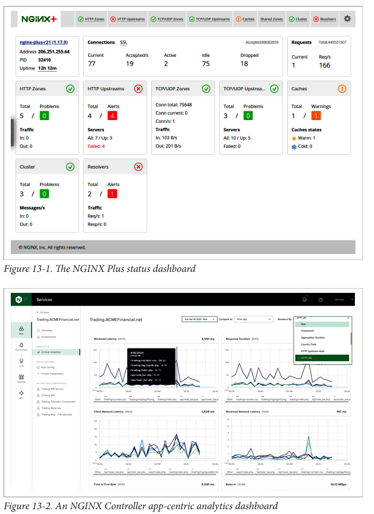
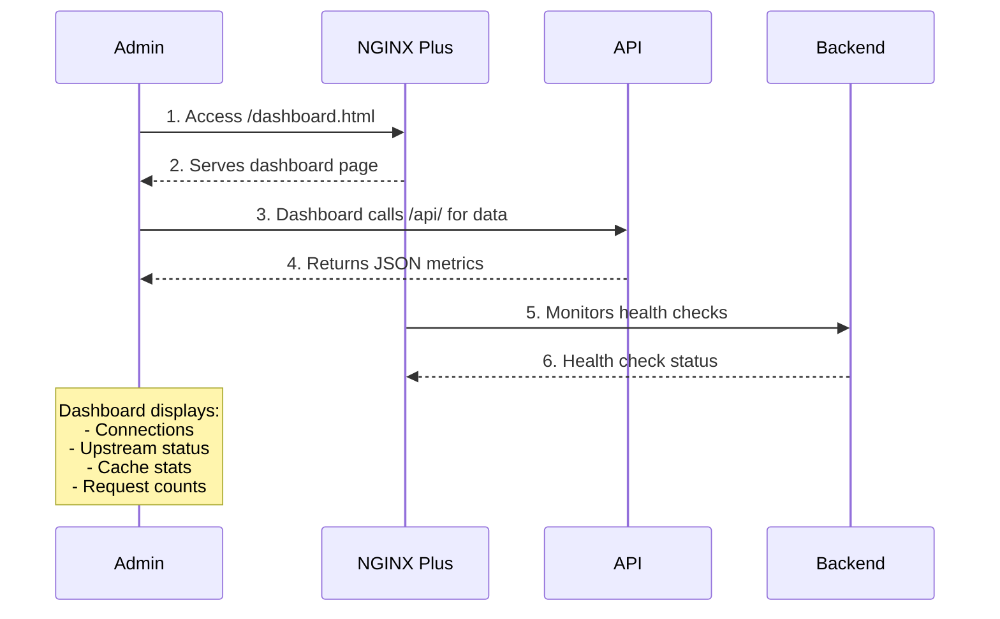
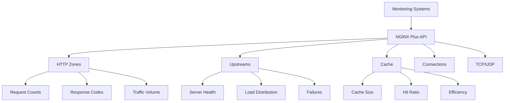

# NGINX Advanced Activity Monitoring Summary

## Introduction

To ensure your application runs at optimal performance, you need insight into what's happening. NGINX Plus offers advanced monitoring tools that give you visibility into:

- **Active connections** and traffic flow
- **Upstream server health** and performance
- **Cache efficiency** and hit ratios
- **HTTP and TCP/UDP** traffic statistics
- **Real-time metrics** through a dashboard and API

---

## NGINX Plus Dashboard Overview (from your image)



### Dashboard Summary

| Section | Metrics |
|---------|---------|
| **Connections** | Total: 5, Problems: 0, Traffic In/Out: 0 |
| **HTTP Zones** | Total: 4, Alerts: 4 |
| **HTTP Upstreams** | All: 7, Up: 3, Failed: 4 |
| **TCP/UDP Upstreams** | Connections: 75,648, Current: 0, Connection %: 1% |
| **TCP/UDP Servers** | All: 10, Up: 5, Failed: 0 |
| **Cache** | Total: 1, Warnings: 1, Warm: 1, Cold: 0 |

### What This Dashboard Tells You

| Metric | What It Means |
|--------|---------------|
| **Connections Total** | Total active connections |
| **Problems** | Issues that need attention |
| **Traffic In/Out** | Current data throughput |
| **HTTP Zones Alerts** | Issues in HTTP server zones |
| **Upstream Servers Failed** | Backend servers that are down |
| **Cache Warm/Cold** | Whether cache is primed and ready |

---

## Monitoring Options Comparison

| Feature | NGINX Open Source (stub_status) | NGINX Plus Dashboard | NGINX Plus API |
|---------|--------------------------------|---------------------|----------------|
| **Real-time Metrics** | Basic | Advanced | Advanced |
| **Upstream Health** | ❌ No | ✅ Yes | ✅ Yes |
| **Cache Stats** | ❌ No | ✅ Yes | ✅ Yes |
| **Per-Server Metrics** | ❌ No | ✅ Yes | ✅ Yes |
| **JSON Export** | ❌ No | ❌ No | ✅ Yes |
| **Dashboard UI** | ❌ No | ✅ Yes | ❌ No |

---

## Traffic Diagrams

### 1. NGINX Plus Monitoring Flow



### 2. Metrics Collection Flow



---

## Problems and Solutions

### 1. Problem: You need basic monitoring for NGINX Open Source

You want to see how many connections and requests your NGINX server is handling.

**Solution:** Enable the `stub_status` module. It provides basic connection and request metrics.

---

### 2. Problem: You need in-depth monitoring for NGINX Plus

You want real-time visibility into connections, upstream servers, caching, and more.

**Solution:** Enable the NGINX Plus API and dashboard. The dashboard shows everything in a single view.

---

### 3. Problem: You need to collect metrics programmatically

You want to feed NGINX metrics into your own monitoring system.

**Solution:** Use the NGINX Plus RESTful API. It provides all dashboard data in JSON format.

---

## Configuration Syntax

### 1. Enable NGINX Open Source Stub Status

```nginx
# /etc/nginx/conf.d/status.conf
server {
    listen 80;
    server_name monitoring.example.com;

    location /stub_status {
        stub_status;

        # Restrict access for security
        allow 127.0.0.1;      # Allow localhost
        allow 192.168.1.0/24; # Allow internal network
        deny all;             # Deny everyone else

        # Optional: turn off logging for this endpoint
        access_log off;
    }
}
```

**Stub Status Output:**
```bash
$ curl localhost/stub_status
Active connections: 1
server accepts handled requests
 1 1 1
Reading: 0 Writing: 1 Waiting: 0
```

**Metrics Explained:**

| Metric | Description |
|--------|-------------|
| **Active connections** | Current open connections |
| **Accepts** | Total connections accepted |
| **Handled** | Total connections handled (should match accepts) |
| **Requests** | Total requests served |
| **Reading** | Connections reading request headers |
| **Writing** | Connections writing response |
| **Waiting** | Keep-alive connections waiting |

**Embedded Variables for Logging:**
```nginx
log_format extended '$remote_addr - $remote_user [$time_local] '
                    '"$request" $status $body_bytes_sent '
                    '"$http_referer" "$http_user_agent" '
                    'Active: $connections_active '
                    'Reading: $connections_reading '
                    'Writing: $connections_writing '
                    'Waiting: $connections_waiting';
```

---

### 2. Enable NGINX Plus Monitoring Dashboard

```nginx
# /etc/nginx/conf.d/dashboard.conf
server {
    listen 80;
    server_name monitoring.example.com;

    # NGINX Plus API endpoint
    location /api {
        # Enable API with write capability (optional)
        api write=on;

        # Restrict access for security
        allow 127.0.0.1;
        allow 192.168.1.0/24;
        deny all;

        # Optional: authentication (see Chapter 7)
        # auth_basic "NGINX Plus API";
        # auth_basic_user_file /etc/nginx/conf.d/htpasswd;
    }

    # NGINX Plus Dashboard
    location = /dashboard.html {
        root /usr/share/nginx/html;
        # Dashboard is static HTML that calls the API
    }

    # Redirect root to dashboard
    location = / {
        return 301 /dashboard.html;
    }
}
```

**Accessing the Dashboard:**
```
http://monitoring.example.com/dashboard.html
```

---

### 3. Using the NGINX Plus API

#### Basic API Structure

```
/api/{version}/
├── nginx/              # NGINX server info
├── processes/          # Process information
├── connections/        # Connection statistics
├── ssl/                # SSL/TLS statistics
├── slabs/              # Shared memory usage
├── http/               # HTTP metrics
│   ├── requests/       # HTTP request stats
│   ├── server_zones/   # Per-server stats
│   ├── upstreams/      # Upstream server stats
│   └── cache/          # Cache statistics
└── stream/             # TCP/UDP metrics
```

#### API Examples

**1. Get API Versions:**
```bash
curl http://monitoring.example.com/api/
```

**2. Get NGINX Server Info:**
```bash
curl http://monitoring.example.com/api/3/nginx
```

**Response:**
```json
{
  "version": "1.15.2",
  "build": "nginx-plus-r16",
  "pid": 77242,
  "ppid": 79909,
  "generation": 2,
  "timestamp": "2018-09-29T23:12:20.525Z"
}
```

**3. Get Connection Statistics:**
```bash
curl http://monitoring.example.com/api/3/connections
```

**Response:**
```json
{
  "active": 3,
  "idle": 34,
  "dropped": 0,
  "accepted": 33614951
}
```

**4. Get HTTP Request Statistics:**
```bash
curl http://monitoring.example.com/api/3/http/requests
```

**Response:**
```json
{
  "total": 52107833,
  "current": 2
}
```

**5. Get Specific Server Zone Statistics:**
```bash
curl http://monitoring.example.com/api/3/http/server_zones/example.com
```

**Response:**
```json
{
  "requests": 25252,
  "discarded": 7,
  "received": 5758103,
  "sent": 359428196,
  "processing": 0,
  "responses": {
    "1xx": 0,
    "2xx": 23966,
    "3xx": 938,
    "4xx": 341,
    "5xx": 0,
    "total": 25245
  }
}
```

**6. Get Upstream Server Statistics:**
```bash
curl http://monitoring.example.com/api/3/http/upstreams/backend
```

**Response:**
```json
{
  "zone": "backend_zone",
  "peers": [
    {
      "id": 0,
      "server": "10.0.0.1:80",
      "state": "up",
      "active": 0,
      "requests": 1234,
      "responses": {
        "total": 1234,
        "2xx": 1200,
        "4xx": 20,
        "5xx": 14
      },
      "health_checks": {
        "checks": 300,
        "fails": 0,
        "unhealthy": 0
      }
    }
  ]
}
```

**7. Get Cache Statistics:**
```bash
curl http://monitoring.example.com/api/3/http/caches/my_cache
```

**Response:**
```json
{
  "size": 1073741824,
  "max_size": 2147483648,
  "used": 536870912,
  "cold": false,
  "hit_ratio": 0.85
}
```

**8. Filter API Results (Fields Parameter):**
```bash
curl "http://monitoring.example.com/api/3/nginx?fields=version,build"
```

**Response:**
```json
{
  "build": "nginx-plus-r16",
  "version": "1.15.2"
}
```

---

### 4. Integrating with Monitoring Systems

#### Prometheus Integration with NGINX Plus Exporter

```bash
# Run the NGINX Prometheus Exporter
docker run -p 9113:9113 \
    nginx/nginx-prometheus-exporter:0.8.0 \
    -nginx.plus \
    -nginx.scrape-uri http://monitoring.example.com:8080/api
```

#### Collecting Metrics with Curl Script

```bash
#!/bin/bash
# collect_nginx_metrics.sh

API_URL="http://monitoring.example.com/api/3"

# Get connections
curl -s "$API_URL/connections" | json_pp

# Get requests
curl -s "$API_URL/http/requests" | json_pp

# Get upstream health
curl -s "$API_URL/http/upstreams" | json_pp

# Get cache stats
curl -s "$API_URL/http/caches" | json_pp
```

#### Sending Metrics to Splunk

```bash
#!/bin/bash
# send_to_splunk.sh

API_URL="http://monitoring.example.com/api/3"
SPLUNK_URL="http://splunk.example.com:8088/services/collector"
SPLUNK_TOKEN="your-token-here"

# Collect metrics
METRICS=$(curl -s "$API_URL/connections")

# Send to Splunk
curl -X POST "$SPLUNK_URL" \
    -H "Authorization: Splunk $SPLUNK_TOKEN" \
    -H "Content-Type: application/json" \
    -d "{\"event\": $METRICS}"
```

---

## Dashboard Features (from your image)

### Connections Panel
- **Total**: Total active connections
- **Problems**: Issues detected
- **Traffic In**: Incoming traffic rate
- **Traffic Out**: Outgoing traffic rate

### HTTP Zones Panel
- **Total**: Number of HTTP server zones
- **Alerts**: Issues requiring attention

### HTTP Upstreams Panel
- **Servers**: Total servers / Up (healthy) servers
- **Failed**: Unhealthy servers

### TCP/UDP Zones Panel
- **Conn total**: Total TCP/UDP connections
- **Conn current**: Current active connections
- **Conn%**: Percentage of connection capacity used

### TCP/UDP Upstreams Panel
- **Total**: Number of upstream groups
- **Problems**: Issues detected
- **Servers**: Total / Up / Failed

### Cache Panel
- **Total**: Cache size / zones
- **Warnings**: Cache issues
- **Cache states**: Warm (ready) / Cold (not ready)

---

## Complete Monitoring Configuration

```nginx
# /etc/nginx/conf.d/monitoring.conf

server {
    listen 80;
    server_name monitoring.example.com;

    # Access logs for monitoring (optional)
    access_log /var/log/nginx/monitoring_access.log combined;
    error_log /var/log/nginx/monitoring_error.log warn;

    # NGINX Plus API
    location /api {
        api write=on;

        # Security: Restrict access
        allow 127.0.0.1;
        allow 10.0.0.0/8;
        allow 172.16.0.0/12;
        allow 192.168.0.0/16;
        deny all;

        # Optional: Basic auth
        auth_basic "NGINX Plus Monitoring";
        auth_basic_user_file /etc/nginx/conf.d/monitoring.htpasswd;

        # Security headers
        add_header X-Content-Type-Options nosniff;
        add_header X-Frame-Options DENY;
    }

    # NGINX Plus Dashboard
    location = /dashboard.html {
        root /usr/share/nginx/html;

        # Same security as API
        auth_basic "NGINX Plus Monitoring";
        auth_basic_user_file /etc/nginx/conf.d/monitoring.htpasswd;

        # Cache control for dashboard
        expires -1;
        add_header Cache-Control "no-store, no-cache, must-revalidate";
    }

    # Redirect root to dashboard
    location = / {
        return 301 /dashboard.html;
    }

    # Health check endpoint (for load balancers)
    location /health {
        access_log off;
        return 200 "NGINX Plus healthy\n";
        add_header Content-Type text/plain;
    }

    # Stub status for compatibility with existing tools
    location /stub_status {
        stub_status;
        allow 127.0.0.1;
        deny all;
        access_log off;
    }
}
```

---

## Comparison: Monitoring Features

| Feature | stub_status | NGINX Plus Dashboard | NGINX Plus API |
|---------|-------------|---------------------|----------------|
| Active connections | ✅ | ✅ | ✅ |
| Total requests | ✅ | ✅ | ✅ |
| Response codes | ❌ | ✅ | ✅ |
| Upstream health | ❌ | ✅ | ✅ |
| Per-server metrics | ❌ | ✅ | ✅ |
| Cache statistics | ❌ | ✅ | ✅ |
| TCP/UDP metrics | ❌ | ✅ | ✅ |
| SSL/TLS metrics | ❌ | ✅ | ✅ |
| JSON format | ❌ | ❌ | ✅ |
| Human-readable UI | ❌ | ✅ | ❌ |
| Programmatic access | ❌ | ❌ | ✅ |

---

## Summary Table

| Use Case | Solution | Configuration |
|----------|----------|---------------|
| Basic connection monitoring | stub_status | `stub_status;` |
| Full monitoring dashboard | NGINX Plus Dashboard | `api;` + dashboard.html |
| Programmatic access | NGINX Plus API | `api;` + curl requests |
| Monitoring integration | Prometheus Exporter | `nginx-prometheus-exporter` |
| Security for monitoring | IP restrictions + auth | `allow`/`deny` + `auth_basic` |

---

## Key Takeaways

1. **stub_status** provides basic metrics for NGINX Open Source
2. **NGINX Plus Dashboard** gives a comprehensive real-time view
3. **NGINX Plus API** provides all dashboard data in JSON format
4. **Always secure your monitoring endpoints** with IP restrictions or authentication
5. **Cache statistics** help you optimize caching strategy
6. **Upstream health monitoring** helps you identify failing backends
7. **HTTP and TCP/UDP metrics** provide complete visibility
8. **Monitor both active connections and request rates** for capacity planning

## Monitoring Best Practices

1. **Secure monitoring endpoints** with authentication
2. **Use monitoring data for capacity planning**
3. **Set up alerts** for failed upstream servers
4. **Monitor cache hit ratios** to optimize performance
5. **Track request rates** to identify traffic patterns
6. **Monitor SSL/TLS handshake** performance
7. **Regularly review upstream health** statistics
8. **Integrate with your existing monitoring system** (Prometheus, Splunk, etc.)