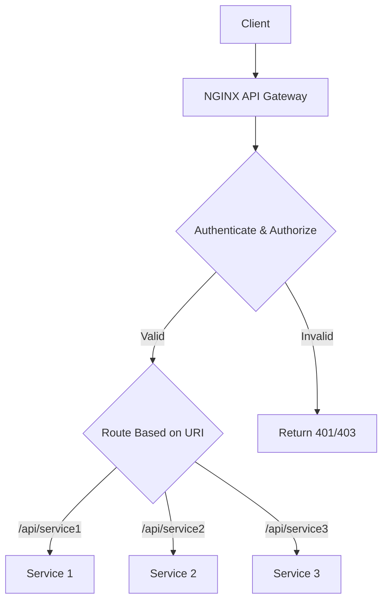
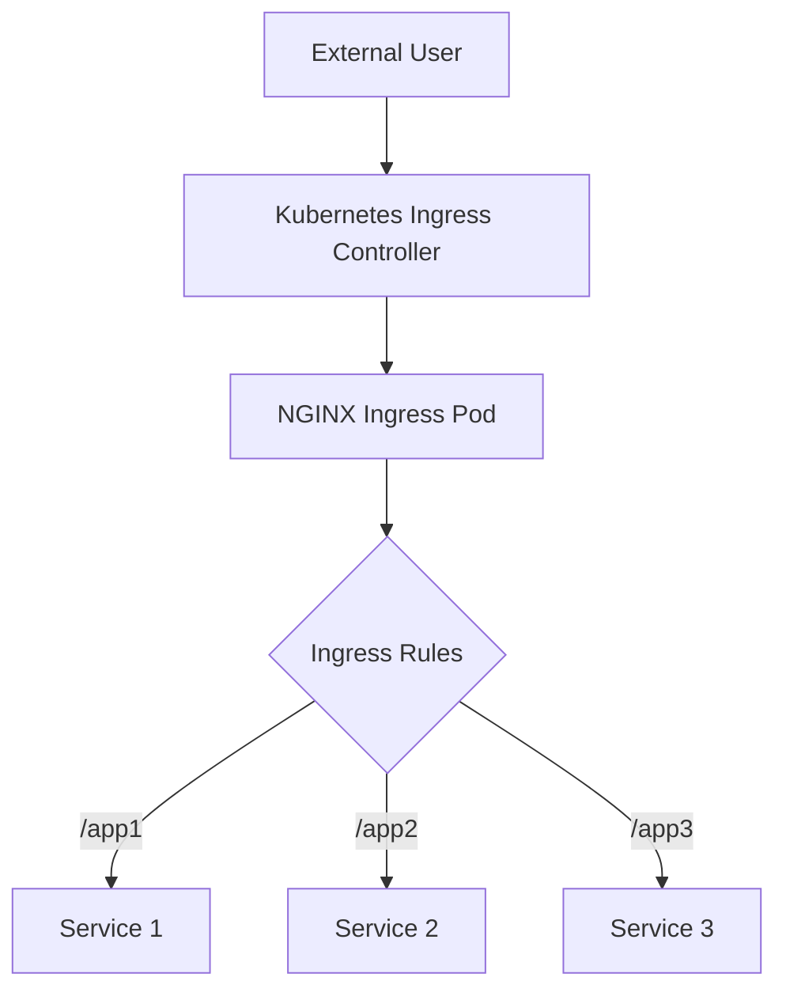

# NGINX Containers and Microservices Summary

## Introduction

Containers package applications with everything they need to run. This makes deployments consistent and reliable across different environments.

### Key Concepts

| Concept | Description |
|---------|-------------|
| **Containerization** | Packaging code + dependencies together |
| **Microservices** | Breaking applications into small, independent services |
| **API Gateway** | Single entry point for all API requests |
| **Kubernetes** | Container orchestration platform |
| **Ingress Controller** | Routes external traffic to services in Kubernetes |

### Container Best Practices

1. **Log to stdout/stderr** - For Docker log driver integration
2. **Run NGINX in foreground** - Use `daemon off;`
3. **Use environment variables** - For configuration flexibility
4. **Use DNS SRV records** - For dynamic service discovery

---

## Traffic Diagrams

### 1. API Gateway Flow



### 2. Kubernetes Ingress Flow



---

## Problems and Solutions

### 1. Problem: You need an API gateway for microservices

You have multiple microservices and need a single entry point for all API calls.

**Solution:** Use NGINX as an API gateway. It can authenticate, validate, rate limit, and route requests to the right services.

---

### 2. Problem: You need to use DNS SRV records for dynamic service discovery

Your containerized services register themselves via DNS SRV records.

**Solution (NGINX Plus):** Use the `service=http` parameter with `resolve`. NGINX Plus automatically discovers and load balances across all servers in the SRV record.

---

### 3. Problem: You need to get started quickly with NGINX in Docker

You want to run NGINX with minimal setup.

**Solution:** Use the official NGINX image from Docker Hub. Mount configuration and content as volumes.

---

### 4. Problem: You need to create a custom NGINX Docker image

You want full control over the NGINX installation and configuration.

**Solution:** Create a Dockerfile that installs NGINX and adds your configuration files.

---

### 5. Problem: You need an NGINX Plus Docker image

You want to use NGINX Plus features in a containerized environment.

**Solution:** Build a Docker image that includes your NGINX Plus repository certificates and installs NGINX Plus.

---

### 6. Problem: You need to use environment variables in NGINX configuration

You want to use the same Docker image for different environments (dev, staging, production).

**Solution:** Use the `ngx_http_perl_module` with `perl_set` to read environment variables.

---

### 7. Problem: You need a Kubernetes Ingress Controller

You're running applications on Kubernetes and need to route external traffic.

**Solution:** Deploy the NGINX Ingress Controller. Use Deployment for dynamic scaling or DaemonSet for one pod per node.

---

### 8. Problem: You need to monitor NGINX with Prometheus

You use Prometheus for monitoring and want NGINX metrics.

**Solution:** Use the NGINX Prometheus Exporter module. It collects metrics from stub_status (Open Source) or the API (NGINX Plus).

---

## Configuration Syntax

### 1. NGINX as API Gateway

#### Basic Gateway Configuration

```nginx
# /etc/nginx/api_gateway.conf
server {
    listen 443 ssl;
    server_name api.company.com;

    # SSL Settings (see Chapter 7)
    ssl_certificate /etc/nginx/ssl/api.crt;
    ssl_certificate_key /etc/nginx/ssl/api.key;

    default_type application/json;

    # Error handling with JSON responses
    proxy_intercept_errors on;

    error_page 400 = @400;
    location @400 {
        return 400 '{"status":400,"message":"Bad request"}\n';
    }

    error_page 401 = @401;
    location @401 {
        return 401 '{"status":401,"message":"Unauthorized"}\n';
    }

    error_page 403 = @403;
    location @403 {
        return 403 '{"status":403,"message":"Forbidden"}\n';
    }

    error_page 404 = @404;
    location @404 {
        return 404 '{"status":404,"message":"Resource not found"}\n';
    }

    error_page 429 = @429;
    location @429 {
        return 429 '{"status":429,"message":"Too many requests"}\n';
    }
}
```

#### Upstream Service Definitions

```nginx
# /etc/nginx/conf.d/upstreams.conf
upstream service_1 {
    server 10.0.0.12:80;
    server 10.0.0.13:80;
    keepalive 32;
}

upstream service_2 {
    server 10.0.0.14:80;
    server 10.0.0.15:80;
    keepalive 32;
}

upstream service_3 {
    server 10.0.0.16:80;
    server 10.0.0.17:80;
    keepalive 32;
}
```

#### Internal Service Locations

```nginx
# Internal locations for each service (common configuration)
location = /_service_1 {
    internal;
    proxy_pass http://service_1$request_uri;
    proxy_set_header Host $host;
    proxy_set_header X-Real-IP $remote_addr;
    proxy_set_header X-Forwarded-For $proxy_add_x_forwarded_for;
}

location = /_service_2 {
    internal;
    proxy_pass http://service_2$request_uri;
    proxy_set_header Host $host;
    proxy_set_header X-Real-IP $remote_addr;
    proxy_set_header X-Forwarded-For $proxy_add_x_forwarded_for;
}

location = /_service_3 {
    internal;
    proxy_pass http://service_3$request_uri;
    proxy_set_header Host $host;
    proxy_set_header X-Real-IP $remote_addr;
    proxy_set_header X-Forwarded-For $proxy_add_x_forwarded_for;
}
```

#### API Route Definitions

```nginx
# /etc/nginx/api_conf.d/service1.conf
# API Key authentication using map directive (in http context)
map $http_apikey $api_client_name {
    default "";
    "j7UqLLB+yRv2VTCXXDZ1M/N4" "client_one";
    "6B2kbyrrTiIN8S8JhSAxb63R" "client_two";
    "KcVgIDSY4Nm46m3tXVY3vbgA" "client_three";
}

# Rate limiting (in http context)
limit_req_zone $http_apikey zone=limitbyapikey:10m rate=100r/s;
limit_req_status 429;

# In server context
location /api/service_1/objects {
    # Apply rate limit
    limit_req zone=limitbyapikey;

    # Require API key
    if ($http_apikey = "") {
        return 401;
    }

    # Validate API key
    if ($api_client_name = "") {
        return 403;
    }

    # Restrict HTTP methods
    limit_except GET POST {
        deny all;
    }

    # Route to internal service location
    rewrite ^ /_service_1 last;
}

location /api/service_1/objects/[^/]*$ {
    limit_req zone=limitbyapikey;

    if ($http_apikey = "") {
        return 401;
    }

    if ($api_client_name = "") {
        return 403;
    }

    limit_except GET PUT DELETE {
        deny all;
    }

    rewrite ^ /_service_1 last;
}
```

#### Complete API Gateway Example

```nginx
http {
    # Upstream definitions
    upstream auth_service {
        server auth.internal:8080;
    }

    upstream user_service {
        server users.internal:8080;
    }

    upstream product_service {
        server products.internal:8080;
    }

    # Rate limiting zones
    limit_req_zone $remote_addr zone=global_limit:10m rate=1000r/s;
    limit_req_zone $http_apikey zone=api_limit:10m rate=100r/s;

    # API key mapping
    map $http_apikey $api_client_name {
        default "";
        "key123" "client_a";
        "key456" "client_b";
    }

    server {
        listen 443 ssl http2;
        server_name api.example.com;

        ssl_certificate /etc/nginx/ssl/api.crt;
        ssl_certificate_key /etc/nginx/ssl/api.key;

        default_type application/json;

        # Global rate limit
        limit_req zone=global_limit burst=100 nodelay;

        # Authentication for all API endpoints
        auth_request /auth;

        # Internal auth location
        location = /auth {
            internal;
            proxy_pass http://auth_service/validate;
            proxy_pass_request_body off;
            proxy_set_header Content-Length "";
            proxy_set_header X-Original-URI $request_uri;
            proxy_set_header X-API-Key $http_apikey;
        }

        # Internal service locations
        location = /_users {
            internal;
            proxy_pass http://user_service$request_uri;
        }

        location = /_products {
            internal;
            proxy_pass http://product_service$request_uri;
        }

        # API routes
        location /api/v1/users {
            limit_req zone=api_limit;
            rewrite ^ /_users last;
        }

        location /api/v1/products {
            limit_req zone=api_limit;
            rewrite ^ /_products last;
        }

        # Health check
        location /health {
            access_log off;
            return 200 '{"status":"healthy"}';
        }
    }
}
```

#### Testing the API Gateway

```bash
# Valid request
curl -H "apikey: 6B2kbyrrTiIN8S8JhSAxb63R" \
     https://api.company.com/api/service_1/objects

# Invalid API key (403)
curl -H "apikey: invalid_key" \
     https://api.company.com/api/service_1/objects

# No API key (401)
curl https://api.company.com/api/service_1/objects

# Rate limit (429) - too many requests
for i in {1..200}; do
    curl -H "apikey: 6B2kbyrrTiIN8S8JhSAxb63R" \
         https://api.company.com/api/service_1/objects
done
```

---

### 2. DNS SRV Records with NGINX Plus

```nginx
http {
    # DNS resolver
    resolver 10.0.0.2 valid=30s;

    upstream backend {
        zone backends 64k;

        # Use SRV record for service discovery
        server api.example.internal service=http resolve;
    }

    server {
        listen 80;

        location / {
            proxy_pass http://backend;
            proxy_set_header Host $host;
            proxy_set_header X-Real-IP $remote_addr;
        }
    }
}
```

**DNS SRV Record Example:**
```
_service._proto.name.  TTL  class  SRV  priority  weight  port  target
_http._tcp.api.example.internal.  60  IN  SRV  10  5  8080  server1.example.internal.
_http._tcp.api.example.internal.  60  IN  SRV  10  5  8080  server2.example.internal.
```

**Benefits:**
- Dynamic service discovery
- Supports variable ports
- Auto-scaling integration
- NGINX Plus re-resolves based on TTL

---

### 3. Official NGINX Docker Image

```bash
# Run NGINX with static content
docker run --name my-nginx -p 80:80 \
    -v /path/to/content:/usr/share/nginx/html:ro \
    -d nginx

# Run with custom configuration
docker run --name my-nginx -p 80:80 \
    -v /path/to/nginx.conf:/etc/nginx/nginx.conf:ro \
    -v /path/to/content:/usr/share/nginx/html:ro \
    -d nginx

# Run and test
curl http://localhost
```

---

### 4. Creating an NGINX Dockerfile

```dockerfile
# Dockerfile for NGINX Open Source
FROM centos:7

# Install EPEL repo and NGINX
RUN yum -y install epel-release && \
    yum -y install nginx

# Add configuration files
ADD /nginx-conf /etc/nginx

# Make NGINX run in foreground
RUN echo "daemon off;" >> /etc/nginx/nginx.conf

# Forward logs to Docker log collector
RUN ln -sf /dev/stdout /var/log/nginx/access.log && \
    ln -sf /dev/stderr /var/log/nginx/error.log

EXPOSE 80 443

CMD ["nginx"]
```

**Directory Structure:**
```
.
├── Dockerfile
└── nginx-conf/
    ├── nginx.conf
    ├── conf.d/
    │   └── default.conf
    ├── mime.types
    ├── fastcgi_params
    └── ...
```

**Build and Run:**
```bash
# Build the image
docker build -t custom-nginx .

# Run the container
docker run -d -p 80:80 custom-nginx
```

---

### 5. Building an NGINX Plus Docker Image

```dockerfile
# Dockerfile for NGINX Plus
FROM debian:stretch-slim

LABEL maintainer="NGINX <docker-maint@nginx.com>"

# Copy NGINX Plus repo certificates
COPY nginx-repo.crt /etc/ssl/nginx/
COPY nginx-repo.key /etc/ssl/nginx/

# Install NGINX Plus
RUN set -x \
    && apt-get update && apt-get upgrade -y \
    && apt-get install -y apt-transport-https ca-certificates gnupg1 \
    && NGINX_GPGKEY=573BFD6B3D8FBC641079A6ABABF5BD827BD9BF62 \
    && apt-key adv --keyserver keyserver.ubuntu.com --recv-keys $NGINX_GPGKEY \
    && echo "Acquire::https::plus-pkgs.nginx.com::Verify-Peer \"true\";" >> /etc/apt/apt.conf.d/90nginx \
    && echo "Acquire::https::plus-pkgs.nginx.com::Verify-Host \"true\";" >> /etc/apt/apt.conf.d/90nginx \
    && echo "Acquire::https::plus-pkgs.nginx.com::SslCert \"/etc/ssl/nginx/nginx-repo.crt\";" >> /etc/apt/apt.conf.d/90nginx \
    && echo "Acquire::https::plus-pkgs.nginx.com::SslKey \"/etc/ssl/nginx/nginx-repo.key\";" >> /etc/apt/apt.conf.d/90nginx \
    && echo "deb https://plus-pkgs.nginx.com/debian stretch nginx-plus" > /etc/apt/sources.list.d/nginx-plus.list \
    && apt-get update \
    && apt-get install -y nginx-plus \
    && rm -rf /var/lib/apt/lists/*

# Forward logs to Docker log collector
RUN ln -sf /dev/stdout /var/log/nginx/access.log && \
    ln -sf /dev/stderr /var/log/nginx/error.log

EXPOSE 80 443

STOPSIGNAL SIGTERM

CMD ["nginx", "-g", "daemon off;"]
```

**Build:**
```bash
# Download certificates from NGINX Plus customer portal
# Place nginx-repo.crt and nginx-repo.key in build directory

docker build --no-cache -t nginxplus .
```

---

### 6. Using Environment Variables in NGINX

```nginx
# nginx.conf
daemon off;

# Allow NGINX to access environment variables
env APP_DNS;
env APP_PORT;
env API_KEY;

# Load Perl module
load_module modules/ngx_http_perl_module.so;

http {
    # Set NGINX variables from environment
    perl_set $upstream_app 'sub { return $ENV{"APP_DNS"} || "default.app.local"; }';
    perl_set $upstream_port 'sub { return $ENV{"APP_PORT"} || "80"; }';
    perl_set $api_key 'sub { return $ENV{"API_KEY"} || ""; }';

    server {
        listen 80;

        location / {
            # Use the environment variables
            set $upstream_endpoint "$upstream_app:$upstream_port";
            proxy_pass http://$upstream_endpoint;

            # Pass API key if set
            if ($api_key != "") {
                proxy_set_header X-API-Key $api_key;
            }

            proxy_set_header Host $host;
            proxy_set_header X-Real-IP $remote_addr;
        }
    }
}
```

**Docker Run with Environment Variables:**
```bash
docker run -d -p 80:80 \
    -e APP_DNS=backend.example.com \
    -e APP_PORT=8080 \
    -e API_KEY=secret123 \
    custom-nginx
```

---

### 7. Kubernetes Ingress Controller

#### Step 1: Create Namespace and Service Account

```bash
# common/ns-and-sa.yaml
kubectl apply -f common/ns-and-sa.yaml
```

#### Step 2: Create Secret with TLS Certificate

```bash
# common/default-server-secret.yaml
kubectl apply -f common/default-server-secret.yaml
```

#### Step 3: Create Config Map

```bash
# common/nginx-config.yaml
kubectl apply -f common/nginx-config.yaml
```

#### Step 4: Set Up RBAC

```bash
# rbac/rbac.yaml
kubectl apply -f rbac/rbac.yaml
```

#### Step 5: Deploy Ingress Controller

**For NGINX Open Source (Deployment):**
```bash
kubectl apply -f deployment/nginx-ingress.yaml
```

**For NGINX Plus (Deployment):**
```bash
# Edit nginx-plus-ingress.yaml to specify your registry and image
kubectl apply -f deployment/nginx-plus-ingress.yaml
```

**For DaemonSet (one pod per node):**
```bash
kubectl apply -f daemon-set/nginx-ingress.yaml
```

#### Step 6: Expose the Ingress Controller

**NodePort Service:**
```bash
kubectl create -f service/nodeport.yaml
```

**LoadBalancer Service (AWS, Azure, GCP):**
```bash
kubectl create -f service/loadbalancer.yaml
```

**AWS-specific LoadBalancer with PROXY Protocol:**
```bash
kubectl create -f service/loadbalancer-aws-elb.yaml
```

#### Step 7: Ingress Resource Definition

```yaml
# ingress.yaml
apiVersion: networking.k8s.io/v1
kind: Ingress
metadata:
  name: app-ingress
  annotations:
    kubernetes.io/ingress.class: "nginx"
    nginx.ingress.kubernetes.io/ssl-redirect: "true"
    nginx.ingress.kubernetes.io/rewrite-target: /
spec:
  tls:
  - hosts:
    - api.example.com
    secretName: tls-secret
  rules:
  - host: api.example.com
    http:
      paths:
      - path: /service1
        pathType: Prefix
        backend:
          service:
            name: service1
            port:
              number: 80
      - path: /service2
        pathType: Prefix
        backend:
          service:
            name: service2
            port:
              number: 80
```

#### Verify Deployment

```bash
# Check pods
kubectl get pods --namespace=nginx-ingress

# Check services
kubectl get svc --namespace=nginx-ingress

# Test the ingress
curl -k https://api.example.com/service1/health
```

---

### 8. NGINX Prometheus Exporter

#### For NGINX Open Source

**Step 1: Enable stub_status in NGINX:**
```nginx
location /stub_status {
    stub_status;
    access_log off;
    allow 127.0.0.1;
    deny all;
}
```

**Step 2: Run the exporter:**
```bash
docker run -p 9113:9113 \
    nginx/nginx-prometheus-exporter:0.8.0 \
    -nginx.scrape-uri http://nginx:8080/stub_status
```

#### For NGINX Plus

**Step 1: Enable the API in NGINX Plus:**
```nginx
location /api {
    api write=on;
    # Add authentication
}
```

**Step 2: Run the exporter:**
```bash
docker run -p 9113:9113 \
    nginx/nginx-prometheus-exporter:0.8.0 \
    -nginx.plus \
    -nginx.scrape-uri http://nginxplus:8080/api
```

#### Prometheus Configuration

```yaml
# prometheus.yml
scrape_configs:
  - job_name: 'nginx'
    static_configs:
      - targets: ['nginx-exporter:9113']
```

#### Metrics Collected

| Metric | Description |
|--------|-------------|
| `nginx_connections_active` | Active connections |
| `nginx_connections_reading` | Reading connections |
| `nginx_connections_writing` | Writing connections |
| `nginx_connections_waiting` | Waiting connections |
| `nginx_connections_accepted` | Total accepted connections |
| `nginx_connections_handled` | Total handled connections |
| `nginx_requests_total` | Total requests |
| `nginx_upstream_*` | Upstream metrics (NGINX Plus only) |

---

## Complete Docker Compose Example

```yaml
# docker-compose.yml
version: '3'

services:
  nginx:
    image: nginx:alpine
    ports:
      - "80:80"
    volumes:
      - ./nginx.conf:/etc/nginx/nginx.conf:ro
      - ./content:/usr/share/nginx/html:ro
    environment:
      - APP_DNS=app:8080
    networks:
      - app-network

  app:
    image: your-app:latest
    ports:
      - "8080"
    networks:
      - app-network

  prometheus:
    image: prom/prometheus
    ports:
      - "9090:9090"
    volumes:
      - ./prometheus.yml:/etc/prometheus/prometheus.yml
    networks:
      - app-network

  nginx-exporter:
    image: nginx/nginx-prometheus-exporter
    ports:
      - "9113:9113"
    command:
      - -nginx.scrape-uri
      - http://nginx:80/stub_status
    networks:
      - app-network

networks:
  app-network:
    driver: bridge
```

---

## Summary Table

| Use Case | Solution | Version |
|----------|----------|---------|
| API Gateway | NGINX with locations, auth, rate limiting | Open Source/Plus |
| Dynamic Service Discovery | DNS SRV records with `service=http` | NGINX Plus |
| Quick Docker Start | Official nginx image from Docker Hub | Open Source |
| Custom Docker Image | Dockerfile with NGINX installation | Open Source |
| NGINX Plus in Docker | Dockerfile with Plus repo certificates | NGINX Plus |
| Environment Variables | `perl_set` + `env` directives | Open Source |
| Kubernetes Ingress | NGINX Ingress Controller | Open Source/Plus |
| Prometheus Monitoring | NGINX Prometheus Exporter | Open Source/Plus |

---

## Key Takeaways

1. **API Gateway** is the entry point for microservices - NGINX is perfect for this role
2. **Always run NGINX in foreground** in containers (`daemon off;`)
3. **Log to stdout/stderr** for Docker log driver integration
4. **Use environment variables** for configuration flexibility
5. **DNS SRV records** provide dynamic service discovery (NGINX Plus)
6. **Kubernetes Ingress Controller** is the standard way to expose services
7. **Prometheus Exporter** provides monitoring integration
8. **Partially baked images** (with environment-based configuration) are the best approach