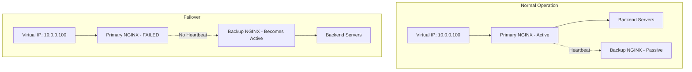
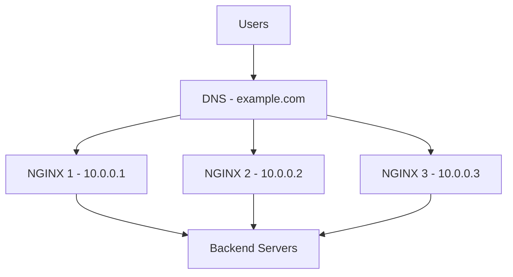
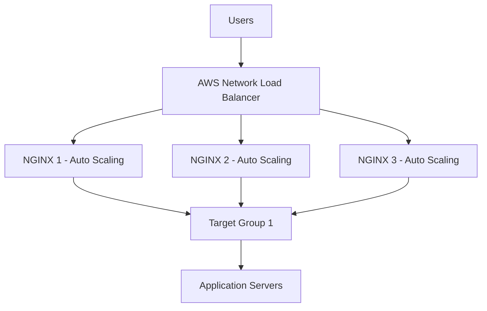

# NGINX High-Availability Deployment Modes Summary

## Introduction

High Availability (HA) means your application stays online even if some servers fail. The core concepts are:

- **Active-Active:** Multiple servers share the load
- **Active-Passive:** One server handles traffic, the backup takes over if it fails

### Key Principles

| Principle | Description |
|-----------|-------------|
| **No Single Point of Failure** | Every component must have redundancy |
| **Load Balancing** | Distribute traffic across multiple nodes |
| **Failover** | Automatic switching to backup when primary fails |
| **State Sharing** | Synchronize session data across nodes |

---

## Traffic Diagrams

### 1. Active-Passive HA with Keepalived



### 2. Active-Active HA with DNS Round Robin



### 3. AWS HA with NLB



---

## Problems and Solutions

### 1. Problem: You need an HA load-balancing solution with floating IP

You want a simple active-passive setup where a virtual IP automatically moves to the backup server.

**Solution:** Use NGINX Plus HA mode with keepalived. It uses VRRP to send heartbeats between servers.

---

### 2. Problem: You need to distribute load between multiple NGINX servers

You want to use all your NGINX servers actively.

**Solution:** Use DNS round robin. Add multiple IP addresses to a single A record.

---

### 3. Problem: Keepalived doesn't work on AWS

AWS doesn't support floating virtual IP addresses.

**Solution:** Put NGINX behind an AWS Network Load Balancer (NLB) with Auto Scaling groups.

---

### 4. Problem: You need to synchronize configuration across multiple NGINX Plus servers

You have multiple NGINX Plus servers and want them all to have the same configuration.

**Solution:** Use the NGINX Plus configuration synchronization feature (`nginx-sync`).

---

### 5. Problem: You need to share session state across NGINX Plus servers

Users should maintain their session even if they connect to different NGINX servers.

**Solution:** Use NGINX Plus zone synchronization. Synchronize shared memory zones across the cluster.

---

## Configuration Syntax

### 1. NGINX Plus HA Mode with Keepalived

#### Installation

```bash
# For RHEL/CentOS
sudo yum install nginx-ha-keepalived

# For Ubuntu/Debian
sudo apt-get install nginx-ha-keepalived
```

#### Configuration

The `nginx-ha-keepalived` package installs and configures keepalived to manage a virtual IP.

**Default Configuration Location:**
```
/etc/keepalived/keepalived.conf
```

**Example keepalived.conf:**

```conf
vrrp_script chk_nginx {
    script "/etc/keepalived/check_nginx.sh"
    interval 2
    weight 2
}

vrrp_instance VI_1 {
    interface eth0
    state MASTER
    virtual_router_id 51
    priority 100
    advert_int 1
    authentication {
        auth_type PASS
        auth_pass secret
    }
    virtual_ipaddress {
        192.168.1.100/24
    }
    track_script {
        chk_nginx
    }
}
```

**NGINX Health Check Script (`/etc/keepalived/check_nginx.sh`):**
```bash
#!/bin/bash
if killall -0 nginx; then
    exit 0
else
    exit 1
fi
```

**On the Backup Server:**
```conf
vrrp_instance VI_1 {
    interface eth0
    state BACKUP
    virtual_router_id 51
    priority 90
    advert_int 1
    authentication {
        auth_type PASS
        auth_pass secret
    }
    virtual_ipaddress {
        192.168.1.100/24
    }
    track_script {
        chk_nginx
    }
}
```

---

### 2. DNS Round Robin

**DNS A Record with Multiple IPs:**
```
example.com.    300    IN    A    10.0.0.1
example.com.    300    IN    A    10.0.0.2
example.com.    300    IN    A    10.0.0.3
```

**Weighted DNS Records:**
```
example.com.    300    IN    A    10.0.0.1  weight=70
example.com.    300    IN    A    10.0.0.2  weight=20
example.com.    300    IN    A    10.0.0.3  weight=10
```

**Removing a Server Gracefully:**
1. Remove the IP from DNS record
2. Wait for TTL to expire
3. Allow existing connections to drain
4. Shut down the server

---

### 3. AWS HA with NLB

#### Step 1: Create Target Group

```bash
aws elbv2 create-target-group \
    --name nginx-targets \
    --protocol TCP \
    --port 80 \
    --vpc-id vpc-12345 \
    --health-check-protocol HTTP \
    --health-check-port 80 \
    --health-check-path /health
```

#### Step 2: Create NLB

```bash
aws elbv2 create-load-balancer \
    --name nginx-nlb \
    --type network \
    --subnets subnet-123 subnet-456 \
    --scheme internet-facing
```

#### Step 3: Create Listener

```bash
aws elbv2 create-listener \
    --load-balancer-arn arn:aws:elbv2:... \
    --protocol TCP \
    --port 80 \
    --default-actions Type=forward,TargetGroupArn=arn:aws:elbv2:...
```

#### Step 4: Create Auto Scaling Group with Target Group

```yaml
# launch-template.yaml
AWSTemplateFormatVersion: '2010-09-09'
Resources:
  NGINXLaunchTemplate:
    Type: AWS::EC2::LaunchTemplate
    Properties:
      LaunchTemplateData:
        ImageId: ami-0abcdef1234567890
        InstanceType: t3.medium
        UserData:
          Fn::Base64: |
            #!/bin/bash
            yum update -y
            amazon-linux-extras enable nginx1
            yum install -y nginx
            systemctl enable nginx
            systemctl start nginx

  NGINXAutoScalingGroup:
    Type: AWS::AutoScaling::AutoScalingGroup
    Properties:
      LaunchTemplate:
        LaunchTemplateId: !Ref NGINXLaunchTemplate
      MinSize: 2
      MaxSize: 10
      DesiredCapacity: 2
      TargetGroupARNs:
        - !Ref NGINXTargetGroup
      VPCZoneIdentifier:
        - subnet-123
        - subnet-456
```

---

### 4. NGINX Plus Configuration Synchronization

#### Installation

```bash
# For RHEL/CentOS
sudo yum install nginx-sync

# For Ubuntu/Debian
sudo apt-get install nginx-sync
```

#### Step 1: Setup SSH Keys on Primary Node

```bash
# Generate SSH key for root
sudo ssh-keygen -t rsa -b 2048

# View public key
sudo cat /root/.ssh/id_rsa.pub
# Output: ssh-rsa AAAAB3Nz4rFgt...vgaD root@node1
```

#### Step 2: Distribute Public Key to Peer Nodes

On each peer node:

```bash
# Add the primary's public key to authorized_keys
sudo echo 'from="192.168.1.2" ssh-rsa AAAAB3Nz4rFgt...vgaD root@node1' \
    >> /root/.ssh/authorized_keys
```

#### Step 3: Configure SSH for Passwordless Login

```bash
# On all nodes
sudo echo 'PermitRootLogin without-password' >> /etc/ssh/sshd_config
sudo service sshd reload

# On primary, test SSH to peers
sudo ssh root@node2.example.com
```

#### Step 4: Create Sync Configuration

**Primary Node Configuration (`/etc/nginx-sync.conf`):**

```bash
# List of peer nodes
NODES="node2.example.com node3.example.com node4.example.com"

# Files and directories to sync
CONFPATHS="/etc/nginx/nginx.conf /etc/nginx/conf.d"

# Files to exclude from sync
EXCLUDE="default.conf"

# Optional: Binary paths
NGINX_BIN="/usr/sbin/nginx"
RSYNC_BIN="/usr/bin/rsync"
SSH_BIN="/usr/bin/ssh"
DIFF_BIN="/usr/bin/diff"

# Optional: Backup directory
BACKUP_DIR="/var/backups/nginx-sync"
```

#### Step 5: Test and Sync

```bash
# Display usage
nginx-sync.sh -h

# Compare config to a specific node
nginx-sync.sh -c node2.example.com

# Compare config to all peers
nginx-sync.sh -C

# Sync config to all peers
nginx-sync.sh
```

**What Happens During Sync:**
1. Tests configuration on primary
2. Creates backups on peers
3. Validates configuration on peers
4. Reloads NGINX on peers

#### Advanced Configuration - Template Substitution

```bash
# In /etc/nginx-sync.conf
NODES="node2.example.com node3.example.com"
CONFPATHS="/etc/nginx/conf.d/app.conf"
SED_SCRIPT="s/PRIMARY_IP/${PRIMARY_IP}/g"
```

---

### 5. NGINX Plus Zone Synchronization (State Sharing)

#### Basic Zone Sync Configuration

```nginx
stream {
    # DNS resolver for dynamic cluster discovery
    resolver 10.0.0.2 valid=20s;

    server {
        listen 9000;

        # Enable zone synchronization
        zone_sync;

        # Define cluster peers
        zone_sync_server nginx-cluster.example.com:9000 resolve;

        # Optional: SSL for secure communication
        # zone_sync_ssl on;
        # zone_sync_ssl_certificate /etc/nginx/ssl/cert.pem;
        # zone_sync_ssl_certificate_key /etc/nginx/ssl/key.pem;
    }
}
```

#### HTTP Context with Zone Sync

```nginx
http {
    # DNS resolver for dynamic discovery
    resolver 10.0.0.2 valid=20s;

    # Upstream with sticky sessions using zone sync
    upstream my_backend {
        zone my_backend 64k;

        # Dynamic backend discovery
        server backends.example.com resolve;

        # Sticky sessions using cookies
        sticky learn zone=sessions:1m
                     create=$upstream_cookie_session
                     lookup=$cookie_session
                     sync;  # <- Sync across cluster!
    }

    # Rate limiting with zone sync
    limit_req_zone $remote_addr zone=global_limit:10m rate=100r/s sync;

    # Key-value store with zone sync
    keyval_zone zone=blocklist:1M timeout=600 sync;

    server {
        listen 80;

        location / {
            # Apply rate limit (sync across cluster)
            limit_req zone=global_limit;

            # Use key-value store (sync across cluster)
            keyval $remote_addr $blocked zone=blocklist;
            if ($blocked) {
                return 403;
            }

            proxy_pass http://my_backend;
            proxy_set_header Host $host;
            proxy_set_header X-Real-IP $remote_addr;
        }
    }
}
```

#### Sync Configuration with Multiple Zone Sync Servers

```nginx
stream {
    resolver 10.0.0.2 valid=20s;

    server {
        listen 9000;
        zone_sync;

        # Multiple peers for redundancy
        zone_sync_server peer1.example.com:9000;
        zone_sync_server peer2.example.com:9000;
        zone_sync_server peer3.example.com:9000;
    }
}
```

#### Securing Zone Sync with TLS

```nginx
stream {
    resolver 10.0.0.2 valid=20s;

    server {
        listen 9000 ssl;
        zone_sync;

        # TLS configuration
        ssl_certificate /etc/nginx/ssl/zone-sync.crt;
        ssl_certificate_key /etc/nginx/ssl/zone-sync.key;

        # Mutual TLS (optional)
        ssl_client_certificate /etc/nginx/ssl/ca.crt;
        ssl_verify_client on;

        zone_sync_server peer1.example.com:9000;
    }
}
```

---

## Comparison: HA Solutions

| Solution | Type | Platform | Pros | Cons |
|----------|------|----------|------|------|
| **Keepalived** | Active-Passive | On-premise | Simple, reliable | Doesn't work on AWS |
| **DNS Round Robin** | Active-Active | All | Simple, works everywhere | TTL delays, no health checks |
| **AWS NLB** | Active-Active | AWS | Auto Scaling integration, health checks | AWS-specific |
| **Zone Sync** | Active-Active | NGINX Plus | State sharing, clustering | NGINX Plus only |

---

## Complete HA Architecture Example

### On-Premise with Keepalived + Zone Sync

```nginx
# Primary Node (10.0.0.1)
stream {
    resolver 10.0.0.2 valid=20s;

    server {
        listen 9000;
        zone_sync;
        zone_sync_server 10.0.0.2:9000;  # Secondary
    }
}

http {
    # Shared rate limiting across cluster
    limit_req_zone $remote_addr zone=global:10m rate=100r/s sync;

    # Shared sticky sessions across cluster
    upstream backend {
        zone backend 64k;
        server app1.internal:80;
        server app2.internal:80;
        sticky learn zone=sessions:1m
                     create=$upstream_cookie_session
                     lookup=$cookie_session
                     sync;
    }

    server {
        listen 80;

        location / {
            limit_req zone=global;
            proxy_pass http://backend;
            proxy_set_header Host $host;
            proxy_set_header X-Real-IP $remote_addr;
        }
    }
}
```

```nginx
# Secondary Node (10.0.0.2)
stream {
    resolver 10.0.0.2 valid=20s;

    server {
        listen 9000;
        zone_sync;
        zone_sync_server 10.0.0.1:9000;  # Primary
    }
}

http {
    # Same HTTP configuration
    # (Synchronized via zone_sync)
}
```

### AWS HA with NLB + Auto Scaling

```bash
# Create the Auto Scaling group with NGINX
aws autoscaling create-auto-scaling-group \
    --auto-scaling-group-name nginx-asg \
    --launch-template LaunchTemplateName=nginx-template \
    --min-size 2 \
    --max-size 10 \
    --desired-capacity 2 \
    --target-group-arns arn:aws:elbv2:.../nginx-targets \
    --vpc-zone-identifier subnet-123,subnet-456
```

---

## Summary Table

| Feature | On-Premise | AWS | NGINX Plus |
|---------|------------|-----|------------|
| **Floating IP** | ✅ Keepalived | ❌ Not supported | ✅ With keepalived |
| **DNS Round Robin** | ✅ | ✅ | ✅ |
| **Load Balancer HA** | Manual | ✅ NLB | ✅ With NLB |
| **Config Sync** | Manual/Puppet | Manual/Puppet | ✅ nginx-sync |
| **State Sharing** | Manual | Manual | ✅ Zone Sync |
| **Auto Scaling** | Manual | ✅ Auto Scaling | ✅ With NLB |

---

## Key Takeaways

1. **Keepalived** is great for on-premise active-passive HA
2. **DNS round robin** is simple but has TTL and health check limitations
3. **AWS NLB** is the recommended solution for AWS environments
4. **NGINX Plus sync** keeps configuration consistent across servers
5. **Zone sync** enables state sharing (rate limiting, sessions, key-value)
6. **Always test your HA setup** by simulating failures
7. **Monitor your HA components** with health checks and alerts

## HA Best Practices

1. **Deploy across multiple availability zones** (AWS)
2. **Use health checks** to detect failures
3. **Test failover regularly** (Chaos Engineering)
4. **Monitor all nodes** and alert on failures
5. **Keep configurations synchronized**
6. **Use session sharing** for sticky sessions
7. **Document your HA architecture** and failover procedures