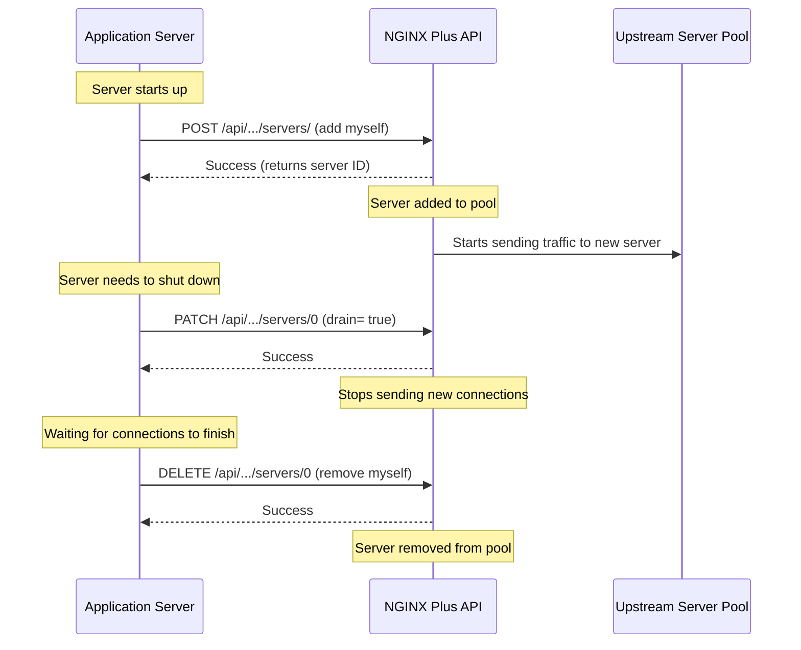

# NGINX Programmability and Automation Summary

## Introduction

Programmability means you can control NGINX using code, not just by hand. This chapter covers how to make NGINX dynamic and automated.

**NGINX Plus (Paid Version)** gives you:
- An **API** to change settings while the server is running
- A **key-value store** to make smart traffic decisions

**Open Source Tools** help you:
- **Install and configure NGINX** automatically using tools like Puppet, Chef, Ansible, and SaltStack
- **Write custom code** using JavaScript, Lua, or Perl
- **Update configurations automatically** when your environment changes

---

## Traffic Diagram

This diagram shows how the NGINX Plus API lets servers add or remove themselves automatically.



---

## Problems and Solutions

### 1. Problem: You need to add/remove servers without restarting NGINX

In a cloud environment, servers come and go constantly. Restarting NGINX for every change is not practical.

**Solution:** Use the NGINX Plus API to add or remove servers dynamically.

### 2. Problem: You need NGINX to make decisions based on external data

Sometimes you need NGINX to block IPs, redirect traffic, or make other decisions based on information from your application.

**Solution:** Use the key-value store with NGINX Plus. Your app can push data to NGINX, and NGINX can use it to make real-time decisions.

### 3. Problem: You need NGINX to run custom logic

Sometimes you need NGINX to do something that the standard configuration can't handle.

**Solution:** Use scripting languages like JavaScript (njs), Lua, or Perl to add custom functionality.

### 4. Problem: You have many servers and need to manage them consistently

Manually configuring each NGINX server is error-prone and time-consuming.

**Solution:** Use configuration management tools like Puppet, Chef, Ansible, or SaltStack to automate installation and configuration.

### 5. Problem: Your environment changes constantly

Servers come and go, and you need NGINX to keep up automatically.

**Solution:** Use Consul with consul-template to automatically update NGINX configurations when your environment changes.

---

## Configuration Syntax

### 1. NGINX Plus API

This enables the API so you can make changes without restarting.

```nginx
# Define an upstream group with a shared memory zone
upstream backend {
    zone http_backend 64k;  # Shared memory zone for dynamic config
}

server {
    # ...

    # Enable the API - this is where you send API requests
    location /api {
        api write=on;  # Allow write operations
        # Add authentication here (see Chapter 7)
    }

    # Optional: NGINX Plus dashboard
    location = /dashboard.html {
        root /usr/share/nginx/html;
    }
}
```

**Using the API to add a server:**
```bash
curl -X POST -d '{"server":"172.17.0.3"}' \
  'http://nginx.local/api/3/http/upstreams/backend/servers/'
```

**Using the API to remove a server:**
```bash
curl -X DELETE \
  'http://nginx.local/api/3/http/upstreams/backend/servers/0'
```

---

### 2. Key-Value Store (NGINX Plus)

This lets your application send data to NGINX for dynamic decisions.

```nginx
# Create a shared memory zone for the key-value store
keyval_zone zone=blocklist:1M;

# Map the remote IP address to a variable using the key-value store
keyval $remote_addr $blocked zone=blocklist;

server {
    # ...

    location / {
        # If the IP is in the blocklist, return 403 Forbidden
        if ($blocked) {
            return 403 'Forbidden';
        }
        return 200 'OK';
    }
}

# Enable the API (needed to update the key-value store)
server {
    location /api {
        api write=on;
    }
}
```

**Adding an IP to the blocklist:**
```bash
curl -X POST -d '{"127.0.0.1":"1"}' \
  'http://127.0.0.1/api/3/http/keyvals/blocklist'
```

**Removing an IP from the blocklist:**
```bash
curl -X PATCH -d '{"127.0.0.1":null}' \
  'http://127.0.0.1/api/3/http/keyvals/blocklist'
```

---

### 3. Extending NGINX with JavaScript (njs)

This lets you write custom logic in JavaScript.

**Step 1: Create a JavaScript file (`hello_world.js`)**
```javascript
function hello(request) {
    request.return(200, "Hello world!");
}
```

**Step 2: Configure NGINX**
```nginx
# Load the JavaScript module
load_module modules/ngx_http_js_module.so;

events {}

http {
    # Include the JavaScript file
    js_include hello_world.js;

    server {
        listen 8000;

        location / {
            # Call the hello function
            js_content hello;
        }
    }
}
```

---

### 4. Extending NGINX with Lua

This lets you write custom logic in Lua.

```nginx
# Load the Lua module
load_module modules/ngx_http_lua_module.so;

events {}

http {
    server {
        listen 8080;

        location / {
            default_type text/html;

            # Run Lua code directly in the configuration
            content_by_lua_block {
                ngx.say("hello, world")
            }
        }
    }
}
```

---

### 5. Installing with Puppet

This defines a server's configuration as code.

```ruby
class nginx {
    # Install NGINX
    package {"nginx":
        ensure => 'installed',
    }

    # Ensure NGINX is running
    service {"nginx":
        ensure => 'true',
        hasrestart => 'true',
        restart => '/etc/init.d/nginx reload',
    }

    # Manage the configuration file
    file { "nginx.conf":
        path    => '/etc/nginx/nginx.conf',
        require => Package['nginx'],
        notify  => Service['nginx'],
        content => template('nginx/templates/nginx.conf.erb'),
        user    => 'root',
        group   => 'root',
        mode    => '0644',
    }
}
```

---

### 6. Installing with Chef

This also defines a server's configuration as code.

```ruby
# Install NGINX
package 'nginx' do
    action :install
end

# Ensure NGINX is running
service 'nginx' do
    supports :status => true, :restart => true, :reload => true
    action [ :start, :enable ]
end

# Manage the configuration file
template 'nginx.conf' do
    path   "/etc/nginx.conf"
    source "nginx.conf.erb"
    owner  'root'
    group  'root'
    mode   '0644'
    notifies :reload, 'service[nginx]', :delayed
end
```

---

### 7. Installing with Ansible

Ansible uses YAML for configuration.

```yaml
- name: NGINX | Installing NGINX
  package: name=nginx state=present

- name: NGINX | Starting NGINX
  service:
    name: nginx
    state: started
    enabled: yes

- name: Copy nginx configuration in place
  template:
    src: nginx.conf.j2
    dest: "/etc/nginx/nginx.conf"
    owner: root
    group: root
    mode: 0644
  notify:
    - reload nginx
```

---

### 8. Installing with SaltStack

SaltStack also uses YAML for configuration.

```yaml
nginx:
  pkg:
    - installed
  service:
    - name: nginx
    - running
    - enable: True
    - reload: True
    - watch:
      - file: /etc/nginx/nginx.conf

/etc/nginx/nginx.conf:
  file:
    - managed
    - source: salt://path/to/nginx.conf
    - user: root
    - group: root
    - template: jinja
    - mode: 644
    - require:
      - pkg: nginx
```

---

### 9. Automating with Consul

This automatically updates NGINX when your environment changes.

**Step 1: Create a Consul template file**
```
upstream backend {
    {{range service "app.backend"}}
    server {{.Address}};{{end}}
}
```

**Step 2: Run the consul-template daemon**
```bash
consul-template -consul consul.example.internal -template \
  template:/etc/nginx/conf.d/upstream.conf:"nginx -s reload"
```

This command:
1. Connects to Consul at `consul.example.internal`
2. Processes the template file
3. Saves the result to `/etc/nginx/conf.d/upstream.conf`
4. Reloads NGINX when the template changes

---

## Summary Table

| Problem | Solution | Tool/Feature |
|---------|----------|--------------|
| Dynamic server management | NGINX Plus API | Built-in API |
| External data for decisions | Key-value store | NGINX Plus |
| Custom logic | Scripting | njs, Lua, Perl |
| Automated installation | Configuration Management | Puppet, Chef, Ansible, SaltStack |
| Reactive configuration | Service Discovery + Templating | Consul + consul-template |
