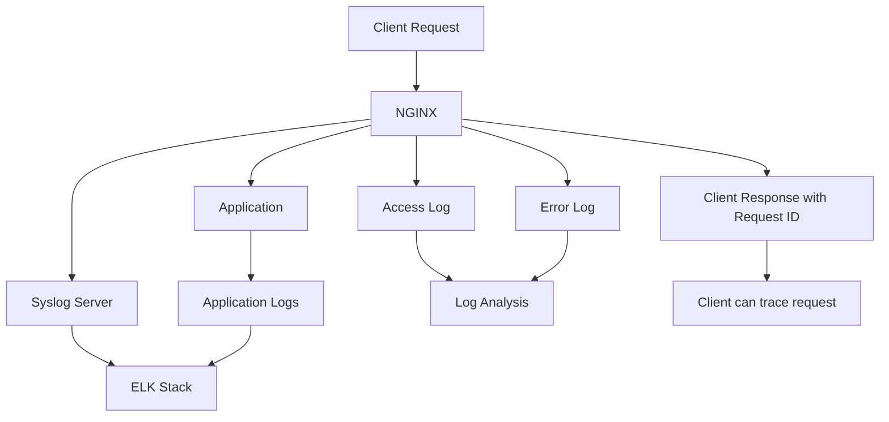
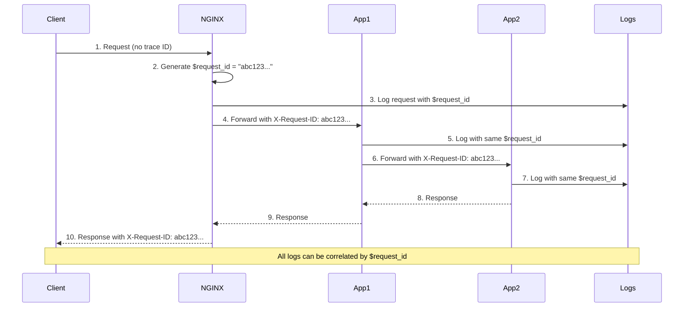
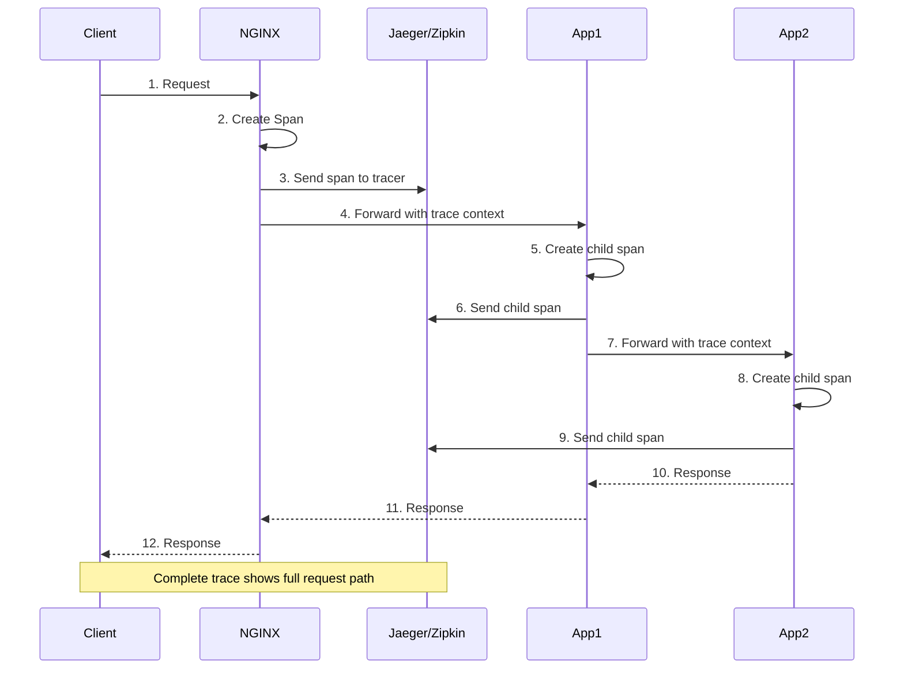

# NGINX Debugging and Troubleshooting Summary

## Introduction

Logging is the foundation of understanding your application. NGINX gives you powerful control over logging, allowing you to:

- **Customize access logs** with any variables you need
- **Set error log levels** to get the right amount of detail
- **Forward logs to Syslog** for centralized logging
- **Trace requests** from end to end across your entire system

---

## Logging Options Comparison

| Feature | Access Logs | Error Logs | Syslog | Request Tracing | OpenTracing |
|---------|-------------|------------|--------|-----------------|-------------|
| **Purpose** | Track requests | Track issues | Centralize logs | Correlate logs | Distributed tracing |
| **Custom Format** | ✅ Yes | ❌ No | ✅ Yes | ✅ Yes | ✅ Yes |
| **Log Levels** | ❌ No | ✅ Yes | ✅ Yes | ❌ No | ❌ No |
| **Real-time** | ✅ Yes | ✅ Yes | ✅ Yes | ✅ Yes | ✅ Yes |
| **Complexity** | Low | Low | Medium | Medium | High |

---

## Traffic Diagrams

### 1. Complete Logging Flow



### 2. Request Tracing Flow



### 3. OpenTracing Flow



---

## Problems and Solutions

### 1. Problem: You need custom access logs for debugging

The default access log doesn't have enough information for troubleshooting.

**Solution:** Create custom log formats using the `log_format` directive with any embedded variables you need.

---

### 2. Problem: You need more detailed error information

Error logs are too vague and don't help you find the root cause.

**Solution:** Increase the error log level to `debug` or `info` to see more details.

---

### 3. Problem: You have multiple NGINX servers and need centralized logs

Checking logs on each server individually is time-consuming and error-prone.

**Solution:** Use Syslog to forward all logs to a centralized logging server.

---

### 4. Problem: You need to trace a request through your entire system

NGINX logs, application logs, and other system logs are not connected.

**Solution:** Use `$request_id` to generate a unique ID for each request and pass it to all services.

---

### 5. Problem: You need distributed tracing across microservices

You need to see the full path of a request through multiple services.

**Solution:** Use OpenTracing with NGINX to send trace data to Jaeger or Zipkin.

---

## Configuration Syntax

### 1. Configuring Access Logs

#### Basic Log Format

```nginx
http {
    # Define a log format
    log_format main '$remote_addr - $remote_user [$time_local] '
                    '"$request" $status $body_bytes_sent '
                    '"$http_referer" "$http_user_agent"';

    server {
        # Use the log format
        access_log /var/log/nginx/access.log main;
    }
}
```

#### Advanced Log Format with Many Variables

```nginx
http {
    log_format geoproxy '[$time_local] $remote_addr '
                        '$realip_remote_addr $remote_user '
                        '$proxy_protocol_server_addr $proxy_protocol_server_port '
                        '$request_method $server_protocol '
                        '$scheme $server_name $uri $status '
                        '$request_time $body_bytes_sent '
                        '$geoip_city_country_code3 $geoip_region '
                        '"$geoip_city" $http_x_forwarded_for '
                        '$upstream_status $upstream_response_time '
                        '"$http_referer" "$http_user_agent"';

    server {
        access_log /var/log/nginx/access.log geoproxy;
    }
}
```

**Sample Log Entry:**
```
[25/Nov/2016:16:20:42 +0000] 10.0.1.16 192.168.0.122 Derek 
GET HTTP/1.1 http www.example.com / 200 0.001 370 USA MI
"Ann Arbor" - 200 0.001 "-" "curl/7.47.0"
```

#### JSON Log Format

```nginx
http {
    log_format json escape=json '{'
        '"time_local":"$time_local",'
        '"remote_addr":"$remote_addr",'
        '"remote_user":"$remote_user",'
        '"request":"$request",'
        '"status":$status,'
        '"body_bytes_sent":$body_bytes_sent,'
        '"request_time":$request_time,'
        '"http_referrer":"$http_referer",'
        '"http_user_agent":"$http_user_agent",'
        '"upstream_addr":"$upstream_addr",'
        '"upstream_response_time":"$upstream_response_time"'
    '}';

    server {
        access_log /var/log/nginx/access.json.log json;
    }
}
```

#### Conditional Logging

```nginx
http {
    # Don't log health checks
    location /health {
        access_log /var/log/nginx/access.log main if=$health_check;
        # ...
    }
}
```

#### Logging Options

```nginx
# Buffer logs (write in batches)
access_log /var/log/nginx/access.log main buffer=32k;

# Flush logs every 5 seconds
access_log /var/log/nginx/access.log main flush=5s;

# Gzip logs
access_log /var/log/nginx/access.log main gzip=9;

# Log to different files for different contexts
server {
    access_log /var/log/nginx/server_access.log main;
    location /api/ {
        access_log /var/log/nginx/api_access.log main;
    }
}
```

---

### 2. Configuring Error Logs

#### Basic Error Log

```nginx
# Set error log level
error_log /var/log/nginx/error.log warn;
```

#### All Error Log Levels

```nginx
# Most detailed (requires --with-debug)
error_log /var/log/nginx/error.log debug;

# Less detailed
error_log /var/log/nginx/error.log info;
error_log /var/log/nginx/error.log notice;
error_log /var/log/nginx/error.log warn;

# Default (moderate detail)
error_log /var/log/nginx/error.log error;

# Minimal detail (only critical errors)
error_log /var/log/nginx/error.log crit;
error_log /var/log/nginx/error.log alert;
error_log /var/log/nginx/error.log emerg;
```

#### Error Log Levels Explained

| Level | Severity | Use Case |
|-------|----------|----------|
| **debug** | Lowest | Development, detailed debugging |
| **info** | Low | General information |
| **notice** | Low | Important information |
| **warn** | Medium | Warnings that may need attention |
| **error** | Medium | Errors that should be investigated |
| **crit** | High | Critical errors |
| **alert** | Very High | Immediate action required |
| **emerg** | Highest | System is unusable |

#### Different Error Logs for Different Contexts

```nginx
http {
    # Global error log
    error_log /var/log/nginx/error.log warn;

    server {
        # Server-specific error log
        error_log /var/log/nginx/server_error.log error;

        location /api/ {
            # Location-specific error log
            error_log /var/log/nginx/api_error.log debug;
        }
    }
}
```

#### Debug Logging for Specific Clients

```nginx
events {
    debug_connection 192.168.1.100;
    debug_connection 10.0.0.0/24;
}

http {
    error_log /var/log/nginx/error.log debug;
}
```

---

### 3. Forwarding to Syslog

#### Basic Syslog Configuration

```nginx
http {
    # Send access logs to Syslog
    access_log syslog:server=10.0.1.42,tag=nginx,severity=info main;

    # Send error logs to Syslog
    error_log syslog:server=10.0.1.42 debug;
}
```

#### Advanced Syslog Options

```nginx
http {
    # Full Syslog configuration
    access_log syslog:server=10.0.1.42:514,facility=local7,tag=nginx,severity=info,hostname main;

    # Multiple Syslog servers (for redundancy)
    access_log syslog:server=10.0.1.42:514,tag=nginx main;
    access_log syslog:server=10.0.1.43:514,tag=nginx main;

    # Unix socket
    access_log syslog:server=/dev/log main;
}
```

#### Syslog Options Explained

| Option | Description | Default |
|--------|-------------|---------|
| **server** | Syslog server IP, DNS, or Unix socket | Required |
| **port** | Syslog server port | 514 |
| **facility** | Syslog facility (local0-local7) | local7 |
| **tag** | Message tag | nginx |
| **severity** | Message severity | info |
| **hostname** | Include hostname | (included) |
| **nohostname** | Disable hostname | (no) |

#### Complete Syslog Setup

```nginx
http {
    log_format json '{"timestamp":"$time_iso8601",'
                    '"remote_addr":"$remote_addr",'
                    '"request":"$request",'
                    '"status":$status,'
                    '"upstream_addr":"$upstream_addr"}';

    # Send JSON logs to Syslog
    access_log syslog:server=logstash.example.com:514,tag=nginx,severity=info json;

    # Send error logs to Syslog
    error_log syslog:server=logstash.example.com:514,tag=nginx,severity=error error;
}
```

---

### 4. Request Tracing with $request_id

#### Basic Request Tracing

```nginx
http {
    log_format trace '$remote_addr - $remote_user [$time_local] '
                     '"$request" $status $body_bytes_sent '
                     '"$http_referer" "$http_user_agent" '
                     '"$http_x_forwarded_for" $request_id';

    upstream backend {
        server 10.0.0.42:80;
    }

    server {
        listen 80;

        # Add request ID to response for client
        add_header X-Request-ID $request_id;

        location / {
            # Pass request ID to upstream application
            proxy_set_header X-Request-ID $request_id;
            proxy_pass http://backend;

            access_log /var/log/nginx/access_trace.log trace;
        }
    }
}
```

#### Tracing with Response Headers

```nginx
server {
    listen 80;

    # Add request ID to all responses
    add_header X-Request-ID $request_id;
    add_header X-Debug-Time $request_time;
    add_header X-Upstream-Status $upstream_status;

    location / {
        proxy_set_header X-Request-ID $request_id;
        proxy_set_header X-Request-Start $time_iso8601;
        proxy_pass http://backend;
    }
}
```

#### Application Integration Example

**Python Flask Application:**
```python
from flask import Flask, request
import logging

app = Flask(__name__)

@app.route('/')
def index():
    # Get request ID from NGINX header
    request_id = request.headers.get('X-Request-ID', 'unknown')
    
    # Log with request ID
    app.logger.info(f'Request ID: {request_id}')
    
    return f'Request ID: {request_id}'
```

---

### 5. OpenTracing for NGINX

#### Installation

**NGINX Plus:**
```bash
# Install from NGINX Plus repository
sudo yum install nginx-plus-module-opentracing
```

**NGINX Open Source:**
```bash
# Download prebuilt module or compile from source
wget https://github.com/opentracing-contrib/nginx-opentracing/releases/latest/...
```

#### Configuration Files

**Jaeger Configuration (`/etc/jaeger/jaeger-config.json`):**
```json
{
    "service_name": "nginx",
    "sampler": {
        "type": "const",
        "param": 1
    },
    "reporter": {
        "localAgentHostPort": "jaeger-server:6831"
    }
}
```

**Zipkin Configuration (`/etc/zipkin/zipkin-config.json`):**
```json
{
    "service_name": "nginx",
    "collector_host": "zipkin-server",
    "collector_port": 9411
}
```

#### NGINX OpenTracing Configuration

```nginx
# Load OpenTracing module (main context)
load_module modules/ngx_http_opentracing_module.so;

http {
    # Load tracer plugin (Jaeger or Zipkin)
    # Jaeger
    opentracing_load_tracer /usr/local/lib/libjaegertracing_plugin.so
                             /etc/jaeger/jaeger-config.json;

    # Zipkin (alternative)
    # opentracing_load_tracer /usr/local/lib/libzipkin_opentracing_plugin.so
    #                          /etc/zipkin/zipkin-config.json;

    # Enable tracing
    opentracing on;

    # Add tags with NGINX variables
    opentracing_tag bytes_sent $bytes_sent;
    opentracing_tag http_user_agent $http_user_agent;
    opentracing_tag request_time $request_time;
    opentracing_tag upstream_addr $upstream_addr;
    opentracing_tag upstream_cache_status $upstream_cache_status;
    opentracing_tag upstream_connect_time $upstream_connect_time;
    opentracing_tag upstream_response_time $upstream_response_time;

    server {
        listen 80;

        location / {
            # Custom operation name (optional)
            # opentracing_operation_name $uri;

            # Propagate trace context to upstream
            opentracing_propagate_context;

            # Proxy to backend
            proxy_pass http://backend;
        }
    }
}
```

#### Sample OpenTracing Tags

| Tag | Description |
|-----|-------------|
| `bytes_sent` | Bytes sent to client |
| `request_time` | Request processing time |
| `upstream_addr` | Upstream server address |
| `upstream_response_time` | Upstream response time |
| `upstream_connect_time` | Upstream connection time |
| `upstream_cache_status` | Cache status (HIT/MISS) |
| `http_user_agent` | Client browser |

---

## Complete Logging Configuration Example

```nginx
# /etc/nginx/nginx.conf

# Load OpenTracing module (if used)
load_module modules/ngx_http_opentracing_module.so;

events {
    worker_connections 1024;
    # Debug specific IPs
    debug_connection 192.168.1.100;
}

http {
    # Global error log
    error_log /var/log/nginx/error.log warn;

    # Custom JSON log format
    log_format json escape=json '{"time":"$time_iso8601",'
                                '"remote_addr":"$remote_addr",'
                                '"remote_user":"$remote_user",'
                                '"request":"$request",'
                                '"status":$status,'
                                '"body_bytes_sent":$body_bytes_sent,'
                                '"request_time":$request_time,'
                                '"http_referer":"$http_referer",'
                                '"http_user_agent":"$http_user_agent",'
                                '"upstream_addr":"$upstream_addr",'
                                '"upstream_status":"$upstream_status",'
                                '"upstream_response_time":"$upstream_response_time",'
                                '"request_id":"$request_id"}';

    # Access log with buffering
    access_log /var/log/nginx/access.log json buffer=32k flush=5s;

    # Send to Syslog
    access_log syslog:server=10.0.1.42:514,tag=nginx,severity=info json;
    error_log syslog:server=10.0.1.42:514,tag=nginx,severity=error;

    # Enable request tracing
    opentracing on;
    opentracing_load_tracer /usr/local/lib/libjaegertracing_plugin.so
                             /etc/jaeger/jaeger-config.json;

    server {
        listen 80;
        server_name example.com;

        # Add request ID to responses
        add_header X-Request-ID $request_id;
        add_header X-Debug-Time $request_time;

        location / {
            # Trace this location
            opentracing_operation_name "/";
            opentracing_propagate_context;

            proxy_pass http://backend;
            proxy_set_header X-Request-ID $request_id;
            proxy_set_header X-Request-Start $time_iso8601;
        }

        # Don't log health checks
        location /health {
            access_log off;
            return 200 "OK\n";
        }

        # Detailed logging for API
        location /api/ {
            error_log /var/log/nginx/api_error.log debug;
            access_log /var/log/nginx/api_access.log json;

            opentracing_operation_name "/api";
            proxy_pass http://api_backend;
        }
    }

    upstream backend {
        server 10.0.0.42:80;
        server 10.0.0.43:80;
    }

    upstream api_backend {
        server 10.0.0.44:80;
        server 10.0.0.45:80;
    }
}
```

---

## Troubleshooting Scenarios

### Scenario 1: Configuration Errors

**Problem:** NGINX won't start after configuration changes.

**Solution:** Check error logs for syntax errors.

```bash
# Check configuration syntax
nginx -t

# View error logs
tail -f /var/log/nginx/error.log

# Look for specific errors
grep "emerg" /var/log/nginx/error.log
```

### Scenario 2: Slow Requests

**Problem:** Some requests are taking too long.

**Solution:** Add timing variables to access logs.

```nginx
log_format timing '$remote_addr - $remote_user [$time_local] '
                  '"$request" $status '
                  '$request_time '
                  '$upstream_response_time '
                  '$upstream_connect_time';
```

### Scenario 3: Upstream Failures

**Problem:** Upstream servers are failing.

**Solution:** Log upstream details.

```nginx
log_format upstream_debug '$remote_addr - $remote_user [$time_local] '
                          '"$request" $status '
                          'upstream: $upstream_addr '
                          'upstream_status: $upstream_status '
                          'upstream_response_time: $upstream_response_time';
```

### Scenario 4: Missing Requests

**Problem:** Some requests aren't being logged.

**Solution:** Check conditional logging and log levels.

```nginx
# Ensure logging is enabled
access_log /var/log/nginx/access.log main;

# Disable conditional logging for debugging
# access_log /var/log/nginx/access.log main if=$skip_log;
```

---

## Summary Table

| Task | Directive | Example |
|------|-----------|---------|
| Define custom log format | `log_format` | `log_format main '...';` |
| Set access log | `access_log` | `access_log /var/log/nginx/access.log main;` |
| Set error log | `error_log` | `error_log /var/log/nginx/error.log warn;` |
| Send to Syslog | `syslog:` | `access_log syslog:server=10.0.0.1:514 main;` |
| Generate request ID | `$request_id` | `proxy_set_header X-Request-ID $request_id;` |
| Enable OpenTracing | `opentracing on;` | `opentracing on;` |
| Load tracer plugin | `opentracing_load_tracer` | `opentracing_load_tracer /path/to/plugin.so config.json;` |
| Propagate trace context | `opentracing_propagate_context` | `opentracing_propagate_context;` |
| Add trace tag | `opentracing_tag` | `opentracing_tag request_time $request_time;` |

---

## Key Takeaways

1. **Custom log formats** give you exactly the information you need
2. **Error log levels** help you control verbosity
3. **Syslog** enables centralized logging across multiple servers
4. **$request_id** provides end-to-end request tracing
5. **OpenTracing** gives distributed tracing across microservices
6. **JSON logging** makes logs easier to parse and analyze
7. **Conditional logging** helps you reduce log noise
8. **Always use request IDs** for debugging production issues

## Logging Best Practices

1. **Use JSON format** for easier parsing by log analysis tools
2. **Log request IDs** for tracing requests through the system
3. **Use appropriate error levels** (warn in production, debug in dev)
4. **Centralize logs** with Syslog or ELK stack
5. **Buffer access logs** for better performance (`buffer=32k`)
6. **Don't log sensitive information** (passwords, tokens)
7. **Rotate logs** to prevent disk space issues
8. **Include timing variables** for performance analysis
9. **Use OpenTracing** for distributed systems
10. **Test log configurations** before deploying to production